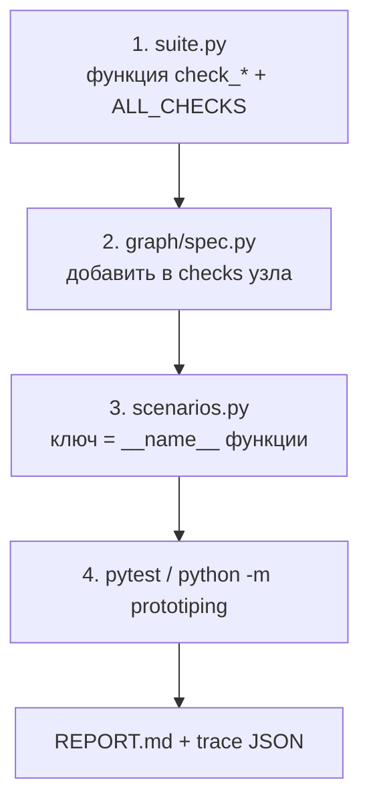

# Как добавить свой сценарий (проверку)

**Полный пошаговый гайд** с примерами, диаграммами и чек-листом: **[QUICKSTART.md](QUICKSTART.md)**.

Ниже — **краткая схема** и **минимальный пример** без дублирования длинных инструкций.

## Четыре шага (схема)



- Забыть шаг **3** → при сборке отчёта `KeyError` в `SCENARIO_META`.
- Разойтись **1** и **2** → `verify_spec_matches_all_checks()` сообщит о несовпадении множеств.

## Минимальный пример кода

**`suite.py`:**

```python
def check_example_math() -> dict:
    if 2 + 2 != 4:
        return _result("example_math", False, "expected 4")
    return _result("example_math", True, "2+2=4")
```

Добавьте `check_example_math` в **`ALL_CHECKS`** в том порядке, как она должна идти в графе.

**`graph/spec.py`:** в список `checks` нужного узла — `chk.check_example_math`.

**`scenarios.py`:** ключ `"check_example_math"`, следующий **`id`** (например **S16** после текущего **S15**).

## Где смотреть эталон

- Простая проверка: `check_parse_api_datetime`, `check_normalize_plate`
- С БД: `check_import_api_operations_dry_run`, `check_tokens_flow`
- Узлы: `graph/spec.py`
- API проверок: [MODULES/CHECKS.md](MODULES/CHECKS.md)

---

← [Структура по папкам](STRUCTURE.md) · [Оглавление](README.md) · [QUICKSTART →](QUICKSTART.md)
