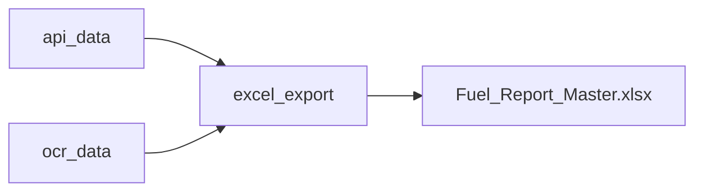
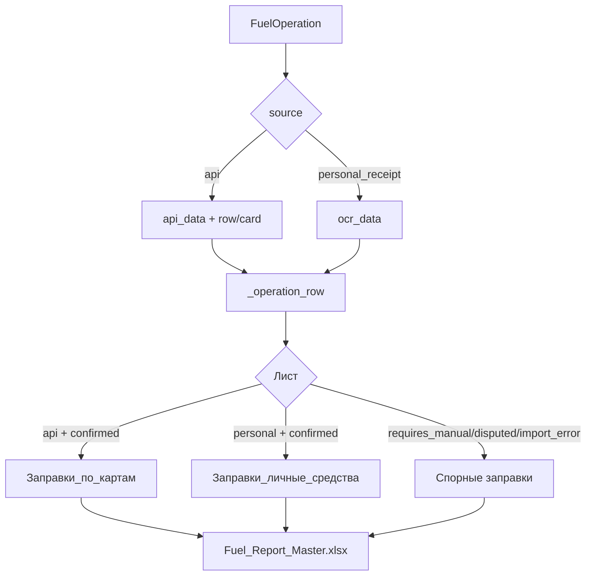

# BOT SRC EXCEL AND DATA

## Экспорт

- Файл: `exports/Fuel_Report_Master.xlsx`
- Логика: `src/app/excel_export.py`

## Источники операций

- `api` (топливные карты)
- `personal_receipt` (личные средства, OCR)



Связанный документ:
- [PERSONAL_FUNDS_SCENARIO](PERSONAL_FUNDS_SCENARIO.md)

## Какие функции реально формируют Excel

Ключевой файл: `src/app/excel_export.py`.

Основные точки:

- `export_to_excel_final(op_id)` — основной production-путь записи одной операции в master-файл.
- `_ensure_workbook(path)` — гарантирует наличие нужных листов и заголовков.
- `_operation_row(db, op)` — строит нормализованную строку из 23 колонок по операции.
- `_first_confirmation_sender_name(db, op_id)` — определяет инициатора цепочки подтверждений.
- `_ocr_text(op)` — извлекает OCR-текст для колонки "Данные OCR".

### Пример: как строится строка экспорта

```python
# src/app/excel_export.py (смысловой фрагмент)
def _operation_row(db, op):
    api = op.api_data if isinstance(op.api_data, dict) else {}
    row_inner = api.get("row") if isinstance(api.get("row"), dict) else {}
    ocr = op.ocr_data if isinstance(op.ocr_data, dict) else {}

    if op.source == "personal_receipt":
        fuel = ocr.get("fuel_type") or "—"
        qty = ocr.get("quantity") or "—"
    else:
        fuel = api.get("productName") or row_inner.get("productName") or "—"
        qty = api.get("productQuantity") or row_inner.get("productQuantity") or 0

    return [op.id, fuel, qty, ...]
```

Что важно:

- Логика ветвится по `op.source` (`api` vs `personal_receipt`).
- Для API-операций данные берутся из `api_data`/`row`.
- Для личных чеков данные берутся из `ocr_data`.
- В любом случае выход — строго фиксированная ширина строки под `HEADERS`.

## Полная схема данных в Excel-пайплайне



## Правила маршрутизации по листам

1. Если статус спорный (`requires_manual`, `rejected_by_other`, `import_error`, `disputed`) -> лист "Спорные заправки".
2. Если статус `confirmed` и `source == "api"` -> лист "Заправки_по_картам".
3. Если статус `confirmed` и `source == "personal_receipt"` -> лист "Заправки_личные_средства".
4. Остальные статусы (`new`, `pending`, `loaded_from_api`) обычно не попадают в итоговый export_path `export_to_excel_final`.

## Контракт колонок (упрощенно)

Колонки формируются в `HEADERS` и должны соответствовать данным `_operation_row`.

- Идентификаторы: `ID`, `Источник`, `Чек`.
- Временные поля: `Дата`, `Время`, `Дата и время подтверждения`.
- Признаки участников: `Предполагаемый`, `Фактический`, `Инициатор`, `Кто окончательно подтвердил`.
- OCR-поля: `Данные OCR` (сырое/debug текстовое поле).
- Итоговый флаг: `Готовность к путевому листу`.

## Где и как вызывается экспорт

### Пользовательский путь (чек личных средств)

В `src/app/bot/handlers/user.py` после подтверждения чека вызывается:

```python
export_to_excel_final(op_id)
```

Если запись в Excel не удалась (файл занят, ошибка I/O):

- в Telegram пользователю отправляется сообщение о частичном успехе (операция подтверждена в БД, но не выгружена в Excel);
- операция в БД остается, админ может повторить export отдельно.

### Админский путь

В `admin_import.py` есть массовая выгрузка в новый workbook (как отчет по всем операциям), это отдельный поток от `export_to_excel_final`.

## Частые edge-cases и как код их обрабатывает

### 1) Пустой `api_data` или `ocr_data`

- Код использует безопасные значения по умолчанию (`—`, `0`, пустая строка).
- Экспорт не падает на отсутствующем ключе в JSON.

### 2) Одинаковая операция экспортируется повторно

- Проверки `exported_to_excel` / `exported_disputed_excel` и `_sheet_has_id` защищают от дубля в листе.

### 3) Файл Excel открыт в другой программе

- При `PermissionError` выбрасывается ошибка, логируется; вызывающий обработчик формирует понятный ответ.

### 4) Переход статуса операции

- Если операция была спорной и стала подтвержденной, важно контролировать флаги экспорта и целевой лист.
- Текущее поведение ориентировано на однократный маршрут в зависимости от статуса в момент экспорта.

## Разбор функции `_first_confirmation_sender_name`

Назначение: заполнить колонку "Кто первоначально получил запрос".

Алгоритм:

1. Для `personal_receipt` возвращает `presumed_user` (кто отправил чек).
2. Для API-операций читает первую запись `ConfirmationHistory` по `operation_id`.
3. Берет `to_user_id` этой записи и резолвит имя пользователя.
4. Если истории нет — возвращает `—`.

## Практическая проверка разработчиком

Мини-чеклист после изменения экспорта:

1. Прогнать сценарий API-операции (`confirmed`) и проверить лист "Заправки_по_картам".
2. Прогнать личный чек (`confirmed`) и проверить лист "Заправки_личные_средства".
3. Принудительно поставить `requires_manual` и проверить лист "Спорные заправки".
4. Убедиться, что длина строки `_operation_row` равна `len(HEADERS)`.
5. Проверить корректность русских статусов в `STATUS_RU`.

## Мини troubleshooting

- **Симптом:** строка пустая по ключевым полям API.  
  **Проверить:** структуру `api_data` (`row`, `card`), особенно после изменений в парсере API.

- **Симптом:** OCR-данные не попадают в Excel.  
  **Проверить:** что `ocr_data` в `FuelOperation` — dict и содержит `raw_text_debug`/`fuel_type`.

- **Симптом:** операция не экспортируется после подтверждения.  
  **Проверить:** статус, флаги `exported_to_excel`, `exported_disputed_excel`, и условие в `export_to_excel_final`.

## Смежные файлы для чтения

- `src/app/excel_export.py` — реализация экспорта.
- `src/app/models.py` — поля `FuelOperation`, `ConfirmationHistory`, `User`.
- `src/app/bot/handlers/user.py` — вызов экспорта после пользовательского подтверждения.
- `src/app/bot/handlers/admin_import.py` — массовый админ-экспорт.
