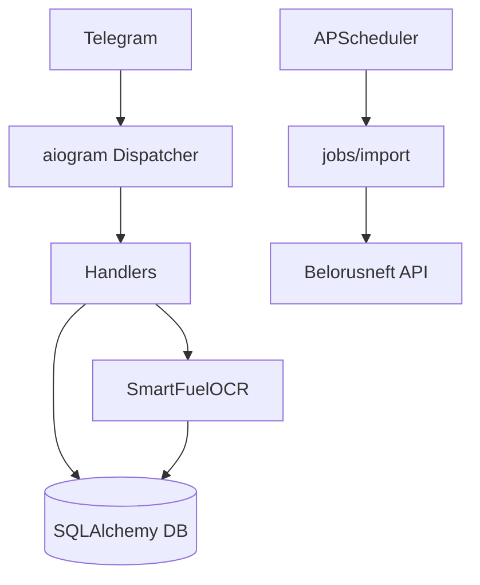

# BOT_SRC / ARCHITECTURE

Архитектура runtime для `src/`: Telegram + scheduler + DB + OCR.

Ключевые точки входа:

- `src/run_bot.py`
- `src/app/bot/register.py`
- `src/app/scheduler.py`

Связанные документы:

- [DATA_LAYER](DATA_LAYER.md)
- [TELEGRAM_LAYER](TELEGRAM_LAYER.md)
- [IMPORT_AND_JOBS](IMPORT_AND_JOBS.md)

## Подробная расшифровка узлов диаграммы

### Telegram / Dispatcher / Handlers

- `TG` — внешний transport событий (message/callback/update).
- `DP` — aiogram dispatcher, который маршрутизирует обновления.
- `H` — конкретные handler-функции user/admin уровня.

Ключевая особенность:

- middleware (`ActiveUserMiddleware`) работает до handler и может остановить update.

### Scheduler / Jobs / API

- `SCH` — APScheduler lifecycle и jobstore.
- `JOBS` — async/фоновые задачи импорта.
- `API` — Belorusneft auth + fetch + parse.

Ключевая особенность:

- cron-задачи используют те же модели и БД, что и интерактивный бот.

### OCR -> DB

- OCR pipeline записывает `FuelOperation(source=personal_receipt)`.
- После user confirm/edit операция переходит в `confirmed` и уходит в Excel path.

## Точки входа и точки координации

### Точка входа процесса

`src/run_bot.py`:

1. читает конфиг и токен;
2. создает `Bot` и `Dispatcher`;
3. регистрирует handlers;
4. инициализирует БД и scheduler;
5. запускает polling loop.

### Точка входа Telegram routing

`src/app/bot/register.py`:

- склеивает user/admin handlers;
- подключает middleware к message и callback.

### Точка входа планировщика

`src/app/scheduler.py`:

- `init_scheduler()`;
- `schedule_daily_import()` / `remove_schedule()`.

## Подсистемы и их границы ответственности

| Подсистема | Файлы | Что не должна делать |
|---|---|---|
| Telegram handlers | `bot/handlers/*` | Не должны содержать transport-level API logic Белоруснефти |
| Import domain | `import_logic.py` | Не должен отправлять Telegram сообщения |
| API transport | `belorusneft_api.py` | Не должен решать статус/ownership операций |
| OCR engine | `ocr/engine.py` | Не должен знать UI/FSM детали бота |
| Excel export | `excel_export.py` | Не должен запускать импорт/уведомления |

## Сквозные data contracts

### Contract 1: Operation lifecycle

- создание (`new` / `loaded_from_api`);
- ожидание (`pending`/related);
- финал (`confirmed` / disputed path).

Любые изменения списка статусов должны быть синхронны в:

- handlers;
- web endpoints;
- Excel export.

### Contract 2: user matching

Пути сопоставления:

- по карте;
- по госномеру;
- по ФИО (в спорных сценариях).

Контракт хранится в `User.cards`, `User.cars`, `FuelCard`, `Car.owners`.

### Contract 3: confirmation history

Таблица `ConfirmationHistory` — аудитный след для перенаправлений и финальных подтверждений.

## Важные зависимости между файлами

- `run_bot.py` -> `bot/register.py` -> `handlers/*`.
- `handlers/admin_import.py` -> `belorusneft_api.py`, `models.py`, `notifications.py`.
- `handlers/user.py` -> `ocr/engine.py`, `tokens.py`, `excel_export.py`.
- `jobs.py` -> `belorusneft_api.py`, `bot_handlers.py`.
- `web/backend/services/*` -> те же `src.app.models`.

## Пример рисков архитектуры

1. **Слишком толстый handler**  
   Риск: сложнее тестировать и поддерживать.

2. **Дубли статусов/веток между admin и user**  
   Риск: несогласованное поведение.

3. **Прямая работа с JSON-полями без нормализации**  
   Риск: хрупкость при изменении payload внешнего API.

## Рекомендации по эволюции

- Вынести доменные transition-функции в отдельный service layer.
- Централизовать enum статусов операций.
- Добавить слой DTO для входов/выходов handlers.
- Добавить тонкие unit-тесты на импортный дедуп и confirm/dispute маршруты.

## Быстрый архитектурный чеклист ревью

- Есть ли разделение transport/domain/persistence.
- Не добавлена ли внешняя API-логика в Telegram handlers.
- Не возникла ли циклическая зависимость между bot и permissions/import modules.
- Сохранился ли единый `get_db_session` паттерн во всех путях.
