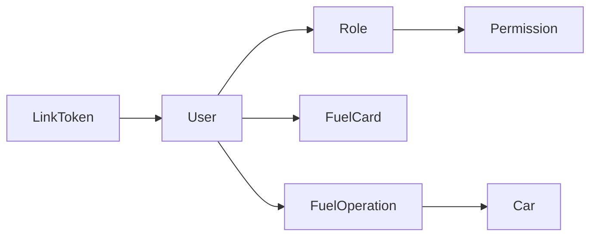
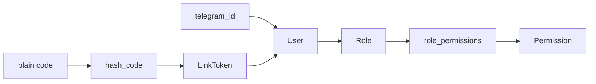

# BOT_SRC / DATA_AND_PERMISSIONS

## Ключевые файлы

- `src/app/models.py`
- `src/app/db.py`
- `src/app/permissions.py`
- `src/app/tokens.py`
- `src/app/plate_util.py`

## Граф данных и прав



## Примечания

- `user_has_permission` проверяет доступ через роль и таблицу связей.
- `ActiveUserMiddleware` фильтрует неактивных пользователей.
- `tokens.py` отвечает за генерацию/проверку кодов привязки.

## Доступ к БД в проверке прав

Как реально ходим в БД:
- сначала читается пользователь по `telegram_id` (получаем `id`, `role_id`);
- если роль не задана (`role_id is None`) -> доступ сразу `False`;
- затем проверяется связка `role_permissions` + `permissions.name`.

Практический смысл:
- проверка дешевая по объему данных (точечные `SELECT`), подходит для вызова на каждом update/message;
- отсутствие роли трактуется как "минимальные права", а не исключение.

## Хранение токенов и консистентность

- Токены привязки (`LinkToken`) хранятся с `code_hash`, статусом, сроком действия, временем использования.
- Частый паттерн: `new -> used/expired/revoked`; это важно для идемпотентности при повторных попытках авторизации.
- Уникальность `code_hash` и индекс `status + expires_at` позволяют быстро отбрасывать невалидные коды на стороне БД.

## Примеры реализации

```python
# src/app/permissions.py
def user_has_permission(db, telegram_id: int, permission_name: str) -> bool:
    row = db.query(User.id, User.role_id).filter(User.telegram_id == telegram_id).first()
    ...
```

```python
# src/app/tokens.py (использование в проекте)
create_bulk_codes(...)
verify_and_consume_code(...)
```

## Связанные документы

- [telegram integration](TELEGRAM.md)
- [data layer details](DATA_LAYER.md)
- [import and operation statuses](IMPORT_AND_REPORTS.md)

## Разбор функций по правам

### `user_has_permission(db, telegram_id, permission_name)`

Алгоритм:

1. читает пользователя и `role_id` по `telegram_id`;
2. если пользователя/роли нет -> `False`;
3. джойнит `Permission` через `role_permissions`;
4. возвращает bool.

Почему так:

- минимизируется объем ORM-объектов;
- логика пригодна для частых вызовов в middleware и декораторах.

### `require_permission(permission_name)`

Функция-декоратор для handlers.

Сценарий:

- открывает db session;
- проверяет permission;
- при отказе отправляет deny-message;
- при ошибке проверки возвращает generic error.

Это централизует access-control и упрощает поддержку.

### `ActiveUserMiddleware`

Проверяет:

- разрешенные действия onboarding/link;
- активность пользователя в БД;
- блокирует неактивных от бизнес-веток.

## Токены привязки: разбор lifecycle

Ключевые функции из `tokens.py`:

- `generate_code()` — выпуск plain кода.
- `hash_code(code, TOKEN_SALT)` — хранится только хэш.
- `create_bulk_codes(db, user_id, count, created_by)` — массовый выпуск.
- `verify_and_consume_code(db, plain_code, telegram_id)` — атомарная проверка/погашение/привязка.

### Почему используется `with_for_update`

В `verify_and_consume_code`:

- токен читается с блокировкой строки (`with_for_update`);
- устраняет race condition, когда один код пробуют применить одновременно.

## Схема прав и токенов



## Пример кода: consume токена

```python
token = db.query(LinkToken).filter_by(code_hash=code_hash).with_for_update().first()
if not token:
    return False, "invalid_or_used"
token.status = "used"
token.telegram_id = telegram_id
db.commit()
```

Практическая ценность:

- один токен невозможно "использовать дважды" конкурентно;
- связь Telegram <-> User фиксируется в одной транзакции.

## Edge-cases и expected behavior

### Пользователь без `role_id`

`user_has_permission` -> `False`.  
Это безопасное default-поведение.

### Просроченный токен

`verify_and_consume_code`:

- ставит `status = "expired"`;
- коммитит изменение статуса;
- возвращает причину `"expired"`.

### Токен уже использован

Возвращается `"invalid_or_used"`, изменения в БД не выполняются.

## Практические рекомендации

1. Не сохранять plain-код в таблицу токенов.
2. Всегда использовать `TOKEN_SALT`.
3. В admin-flow ограничивать срок жизни кодов (`CODE_TTL_HOURS`).
4. Проверять индексы по `code_hash` и `status/expires_at` при росте нагрузки.

## Чеклист ревью security-изменений

- Декораторы стоят на всех admin handlers.
- Middleware не блокирует `/link`, но блокирует чувствительные команды.
- Нет bypass-ветки, где handler пишет в БД без permission-check.
- В `verify_and_consume_code` сохранилась блокировка `with_for_update`.
