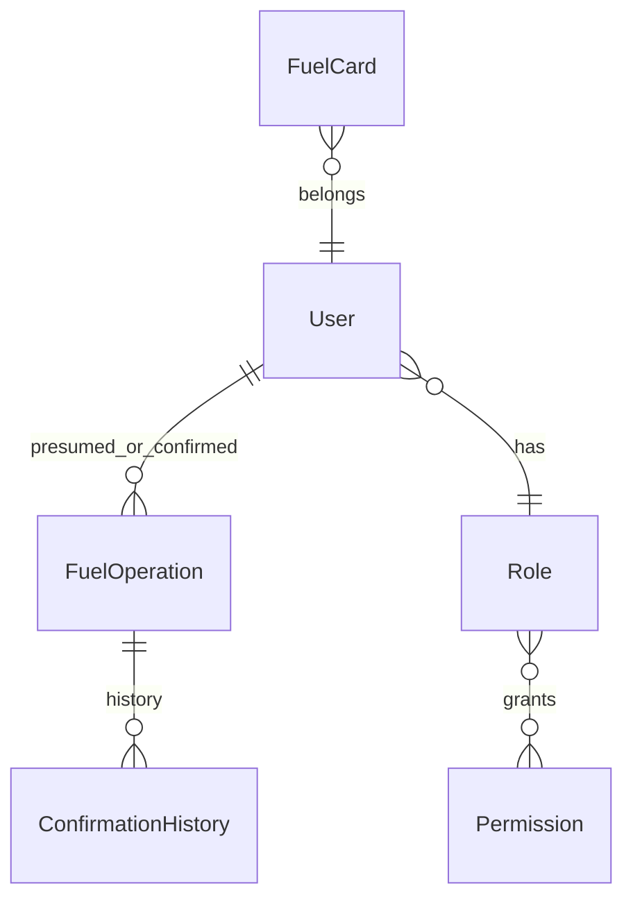

# BOT_SRC / DATA_LAYER

Слой данных: `src/app/db.py` + `src/app/models.py`.

## Основные сущности

- `User`, `Role`, `Permission`
- `FuelOperation`, `FuelCard`, `Car`
- `LinkToken`, `ConfirmationHistory`, `Schedule`



## Паттерн работы с сессией

Используется `with get_db_session() as db:` с commit/rollback в контекст-менеджере.

## Runtime БД: практические детали

### Engine и фабрика сессий

- `engine = create_engine(DATABASE_URL, pool_pre_ping=True)` в `src/app/db.py`.
- `SessionLocal = sessionmaker(bind=engine, autoflush=False, autocommit=False)`.

Что это значит:
- `pool_pre_ping=True` снижает риск "мертвых" коннектов при долгоживущем процессе бота/web.
- `autocommit=False` -> транзакция фиксируется только явно (в проекте это делает контекст `get_db_session`).
- `autoflush=False` -> SQL не отправляется до `flush()/commit()`; удобно контролировать порядок записи.

### Границы транзакции

Контекст `get_db_session()`:
- на успешном выходе делает `commit()`,
- при исключении делает `rollback()`,
- всегда закрывает сессию (`close()`).

Важно для разработчика:
- если нужно получить `id` новой ORM-сущности до конца транзакции, вызывается `db.flush()`;
- изменения JSON-полей (`cars`, `cards`, `owners`) должны быть присвоены обратно в поле, чтобы ORM зафиксировал модификацию.

### Примечания по дизайну сущностей

- В `User` и `Car` есть JSON-поля (`cars/cards/owners`) для быстрых списков связей, параллельно с классическими FK-отношениями (`FuelCard.user_id`, `FuelOperation.presumed_user_id` и т.д.).
- `FuelOperation` хранит и "сырой источник" (`api_data`/`ocr_data`), и нормализованные поля (`doc_number`, `date_time`, `status`) для эффективной фильтрации/отчетов.
- В `LinkToken` добавлены `UniqueConstraint` и индекс по (`status`, `expires_at`) для частых проверок валидности токена.

### Типовые DB-паттерны в проекте

```python
# insert + immediate id usage
obj = User(full_name="...")
db.add(obj)
db.flush()   # obj.id уже доступен до commit
```

```python
# safe read path
rows = db.query(FuelOperation).order_by(FuelOperation.date_time.desc()).all()
```

```python
# mutation path
op.status = "confirmed"
db.commit()
```

Связанные:

- [DATA_AND_PERMISSIONS](DATA_AND_PERMISSIONS.md)
- [IMPORT_AND_JOBS](IMPORT_AND_JOBS.md)

## Таблицы и реальные сценарии использования

### `users`

Используется в:

- auth/link (`tokens.py`, `permissions.py`);
- подбор владельца операции (`import_logic.py`, `admin_import.py`);
- user/admin profile handlers.

Ключевые поля:

- `telegram_id` — связь с Telegram.
- `active` — доступ к функционалу.
- `role_id` — права.
- `cars/cards` — быстрые JSON-списки.

### `fuel_operations`

Центральная таблица домена.

Используется в:

- импорте API;
- OCR сценарии;
- pending/disputed workflows;
- web endpoints;
- excel export.

Ключевые поля:

- `source`, `status`, `doc_number`, `date_time`,
- `api_data`, `ocr_data`,
- `presumed_user_id`, `confirmed_user_id`,
- `car_from_api`, `actual_car`.

### `link_tokens`

Важна для lifecycle привязки и безопасности:

- выдача кода;
- проверка кода;
- погашение кода;
- аудит admin actions.

## Реальные SQLAlchemy-паттерны в проекте

### Pattern A: query scalar columns

```python
row = db.query(User.id, User.role_id).filter(User.telegram_id == tg_id).first()
```

Плюс: дешевле, чем грузить весь ORM-объект.

### Pattern B: query full ORM + mutate + commit

```python
op = db.query(FuelOperation).filter_by(id=op_id).first()
op.status = "confirmed"
db.commit()
```

### Pattern C: create + flush + reuse id

```python
car = Car(plate=plate)
db.add(car)
db.flush()  # car.id уже доступен
```

### Pattern D: JSON-like contains via cast

```python
db.query(User).filter(cast(User.cards, String).like(f"%{card_num}%")).first()
```

Нужно помнить:

- это удобно, но не самый быстрый путь при большом объеме данных;
- подходит для текущей модели и миграционного этапа.

## Транзакции: практические сценарии

### Сценарий 1: успешный handler

- открыли session;
- изменили 1-2 сущности;
- commit в конце;
- close.

### Сценарий 2: исключение в середине

- исключение ловится context manager;
- rollback;
- сессия закрывается;
- вызывающий код получает exception.

### Сценарий 3: частичный workflow с внешним шагом

Пример:

- БД запись сделана;
- отправка Telegram не удалась.

Рекомендация:

- разделять commit-блок и side-effects (telegram/io),
- корректно логировать частичный успех.

## Индексы и ограничения: что защищают

- `UniqueConstraint(code_hash)` в `LinkToken` — уникальность кода.
- Индекс по `status, expires_at` — быстрый выбор "живых" токенов.
- `doc_number`/`date_time` indexed в `FuelOperation` — ускорение поиска и дедуп.
- `plate` indexed в `Car` — ускорение поиска по номеру.

## Где сейчас узкие места

1. Частые `query(User).filter_by(id=...)` внутри циклов экспорта.
2. Поиск по JSON через cast/like.
3. Дублирующая логика lookup/mapping в нескольких handlers/services.

## Рекомендации по оптимизации

- Использовать `joinedload/selectinload` в массовых read path.
- Вынести lookup users/cards/cars в reusable helper/service.
- Добавить кэширование справочников для batch import.

## Мини-гайд по безопасному изменению модели

1. Добавили поле в `models.py`.
2. Проверили все create paths (import, OCR, admin/user handlers).
3. Проверили read paths (web API, export, notifications).
4. Обновили документацию и сценарии прототипирования.
5. Прогнали smoke/регрессы.
