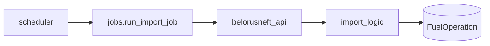
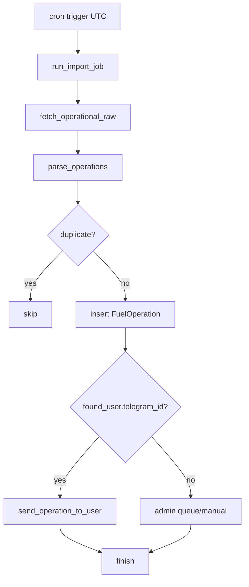

# BOT_SRC / IMPORT_AND_JOBS

Импорт API и запуск по расписанию.

## Основные файлы

- `src/app/belorusneft_api.py`
- `src/app/import_logic.py`
- `src/app/jobs.py`
- `src/app/scheduler.py`



## Примечания

- `import_logic.import_api_operations` — основной batch-path с dry-run.
- `jobs.run_import_job` — job-path, требует корректной передачи `Bot`.

## Поток работы с БД во время импорта

Типовой путь записи в БД (по коду `import_logic`/`api_import_web`):

1. Получаем и парсим raw операции.
2. Для каждой операции вычисляем ключи дедупликации (`doc_number`, `date_time`, `source`).
3. Ищем/создаем связанные сущности:
   - `User` (по водителю/карте),
   - `FuelCard` (по номеру карты),
   - `Car` (по номеру авто).
4. Обновляем JSON-массивы связей (`user.cards`, `user.cars`, `car.owners`) при необходимости.
5. Проверяем дубль `FuelOperation`; если найден — пропускаем запись.
6. Создаем новую `FuelOperation`, делаем `flush()` и считаем `new_count`.

Почему есть `flush()` до commit:
- нужен `id` только что созданных сущностей для последующих FK/связей в рамках той же транзакции;
- при ошибке весь набор изменений откатывается единым rollback.

## Транзакции: web vs bot

- В web (`run_api_import_sync`) commit обычно делается на уровне запроса через `get_db_session`.
- В bot job-path commit контролируется контекстом запуска джобы.
- В обоих случаях граница транзакции одна и та же: `get_db_session` из `src/app/db.py`.

Связанные:

- [IMPORT_AND_REPORTS](IMPORT_AND_REPORTS.md)
- [SERVICES_AND_CONFIG](SERVICES_AND_CONFIG.md)

## Подробно по `jobs.run_import_job`

`run_import_job(bot, schedule_name, dry_run=False)` делает:

1. вычисляет "вчера" в API timezone (UTC+3);
2. запрашивает raw операции;
3. парсит список операций;
4. выполняет дедуп и создание `FuelOperation`;
5. пытается уведомить пользователя;
6. обновляет `Schedule.last_run`.

Практический момент:

- функция объявлена async и принимает `Bot`, потому что уведомления отправляются сразу после записи.

## Подробно по scheduler API

### `init_scheduler()`

- singleton инициализация;
- SQLAlchemy jobstore на той же БД;
- timezone = UTC.

### `schedule_daily_import(name, hour_utc, minute)`

- удаляет существующую задачу с тем же id;
- регистрирует cron job;
- `replace_existing=True`.

### `remove_schedule(name)`

- удаляет cron job по имени;
- используется вместе с удалением `Schedule` из БД.

## Что происходит при старте приложения

В `run_bot.py`:

1. вызывается `init_scheduler()`;
2. из БД читаются `Schedule(enabled=True)`;
3. для каждого schedule вызывается `schedule_daily_import`.

Это гарантирует восстановление расписаний после рестарта процесса.

## Диаграмма job-исполнения



## Различия между manual import и scheduled import

| Путь | Где | Особенность |
|---|---|---|
| Manual | `admin_import.py` (`/run_import_now`) | Богатая диагностика, debug-files, интерактивный фидбек в чат |
| Scheduled | `jobs.py` | Фоновый режим, упор на стабильность и last_run |

## Типичные риски

1. **Дата в неверной зоне**  
   Импортируется не "вчера", а "сегодня/позавчера".

2. **Дедуп слишком слабый**  
   Дубли в `FuelOperation`.

3. **Дедуп слишком жесткий**  
   Часть легитимных операций теряется.

4. **Уведомления падают после commit**  
   Операция в БД есть, но пользователь не уведомлен.

## Рекомендованные проверки после изменений

1. Smoke тест `schedule_set`/`schedule_get`/`schedule_remove`.
2. Ручной запуск импорта и сравнение с scheduled path.
3. Проверка `last_run` обновляется корректно.
4. Проверка что статус новых операций ожидаемый (`loaded_from_api`/`awaiting_user_confirmation` в текущем коде-path).
5. Проверка что уведомления отправляются только при наличии `telegram_id`.

## Пример кода: добавление/обновление расписания

```python
with get_db_session() as db:
    sched = db.query(Schedule).filter_by(name=name).first()
    if not sched:
        sched = Schedule(name=name, cron_hour=hour, cron_minute=minute, enabled=True)
        db.add(sched)
    else:
        sched.cron_hour = hour
        sched.cron_minute = minute
        sched.enabled = True
    db.commit()
```

## Практические советы эксплуатации

- Держать часы/минуты в UTC в БД и в командах админа.
- Логировать `new_count` и ключевые ошибки импорта.
- Для диагностики API держать debug-dump включенным.
- После крупных обновлений парсера делать dry-run перед production import.
