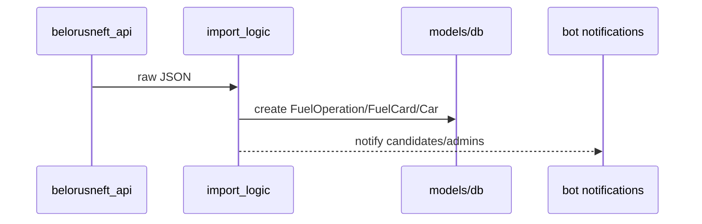
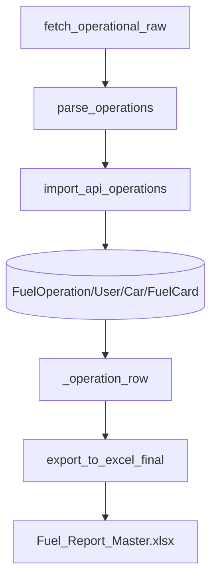

# BOT_SRC / IMPORT_AND_REPORTS

## Ключевые файлы

- `src/app/belorusneft_api.py`
- `src/app/import_logic.py`
- `src/app/jobs.py`
- `src/app/scheduler.py`
- `src/app/excel_export.py`

## Ключевые точки в коде

```python
# src/app/import_logic.py
def parse_api_datetime(dt_raw: Any) -> Optional[datetime]: ...
def is_duplicate_api_operation(db, flat: Dict[str, Any]) -> bool: ...
def import_api_operations(db, json_payload: Dict[str, Any], *, dry_run: bool) -> ImportBatch: ...
```

```python
# src/app/jobs.py
async def run_import_job(bot: Bot, schedule_name: str, dry_run: bool = False): ...
```

```python
# src/app/excel_export.py
HEADERS = [...]
def _operation_row(db, op): ...
```

## Поток импорта



## Отчеты

- Excel строки строятся через `_operation_row()` и `HEADERS`.
- В web используется отдельный builder (`web/backend/services/excel_report.py`), но на тех же моделях.

## Связанные документы

- [web side import/report endpoints](../../WEB/MODULES/BACKEND_API.md)
- [import and jobs details](IMPORT_AND_JOBS.md)
- [service + config internals](SERVICES_AND_CONFIG.md)

## Подробно по функциям импорта

### `parse_api_datetime(dt_raw)`

Назначение:

- безопасно преобразовать дату из сырого payload (string/datetime/None) в `datetime | None`.

Плюсы текущей реализации:

- не падает на мусорном формате;
- понимает trailing `Z`;
- возвращает `None` вместо exception.

### `extract_flat_fields(parsed_op)`

Извлекает "плоский" набор полей из nested JSON:

- карта,
- чек,
- дата/время,
- АЗС,
- продукт,
- количество,
- сырой номер авто.

Эти поля используются для дедупликации и нормализации.

### `is_duplicate_api_operation(db, flat)`

Составной дедуп:

- фильтрует по `source == "api"`,
- при наличии фильтрует по `date_time` и `doc_number`,
- дополнительно сравнивает поля из `api_data` (`card/azs/product/quantity`).

Это снижает риск дублей, когда документ или дата неполные.

### `import_api_operations(db, json_payload, dry_run)`

Основная функция массового импорта:

1. парсит операции;
2. пропускает строки без достаточных ключей;
3. выполняет дедуп;
4. создает/линкует `FuelCard`, `User`, `Car`;
5. создает `FuelOperation`;
6. формирует уведомления (`notify_users`, `notify_admins_ops`).

Возвращает `ImportBatch`, а commit остается снаружи.

## Подробно по отчетным функциям (Excel)

### `_operation_row(db, op)`

Единый формат строки отчета:

- для `api`-операций берет данные из `api_data`;
- для `personal_receipt` — из `ocr_data`;
- формирует 23 колонки в соответствии с `HEADERS`.

### `export_to_excel_final(op_id)`

Production path экспорта:

- находит операцию;
- определяет целевой лист по source/status;
- защищается от повторной выгрузки;
- пишет строку в workbook;
- выставляет флаги экспорта.

### `_ensure_workbook(path)`

Гарантирует:

- файл существует,
- нужные листы созданы,
- заголовки на месте.

## Поток от API до Excel в коде



## Пример кода: импорт с dry-run

```python
# смысловой пример
batch = import_api_operations(db, payload, dry_run=True)
# commit не выполняем, внешний слой делает rollback
```

Практическая польза:

- можно проверить парсер и дедуп без изменения БД;
- удобно для диагностики интеграции с API.

## Пример кода: дедуп на уровне домена

```python
if is_duplicate_api_operation(db, flat):
    logger.info("duplicate skipped")
    continue
```

## Типовые проблемы и интерпретация

### 1) "Импорт прошел, new_count = 0"

Возможные причины:

- в ответе API нет операций;
- все операции попали в дедуп;
- payload структура изменилась, и ключевые поля не извлекаются.

### 2) "Операции есть в БД, но в Excel пусто"

Проверить:

- статусы операций (`confirmed`/disputed/etc);
- ветку выбора листа;
- флаги `exported_to_excel` / `exported_disputed_excel`.

### 3) "Некорректные ФИО/авто после импорта"

Проверить:

- логику сопоставления `presumed_user` по карте/водителю;
- нормализацию номера через `normalize_plate`;
- обновление JSON-полей `user.cards/user.cars/car.owners`.

## Чеклист изменения импорта/отчетов

1. После изменения parser-функций прогнать dry-run и обычный run.
2. Сверить, что `extract_flat_fields` и `is_duplicate_api_operation` согласованы.
3. Сверить, что экспортные колонки `_operation_row` не ломают ширину `HEADERS`.
4. Проверить сценарии API + personal receipt в одном отчете.
5. Обновить документацию в `EXCEL_AND_DATA.md` при изменении колонок.
