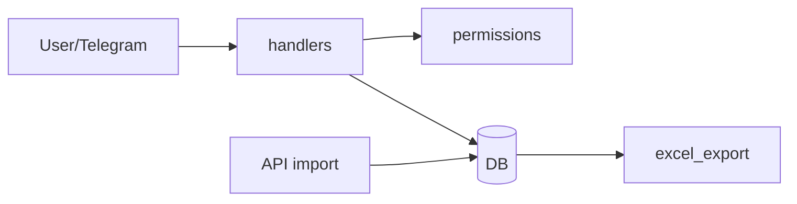

# BOT_SRC / OVERVIEW

## Основные пакеты

- `src/app/bot/*` — aiogram handlers, keyboards, middleware wiring
- `src/app/models.py` — ORM entities
- `src/app/import_logic.py` / `belorusneft_api.py` — загрузка и парсинг операций
- `src/app/scheduler.py` / `jobs.py` — планировщик задач
- `src/app/excel_export.py` — excel export logic

## Ключевые точки в коде

Ключевые точки, с которых удобно начинать чтение кода:

```python
# src/app/bot/register.py
def register_handlers(dp: Dispatcher) -> None: ...

# src/app/import_logic.py
class ImportBatch: ...
def import_api_operations(db, json_payload, *, dry_run): ...

# src/app/permissions.py
def user_has_permission(db, telegram_id: int, permission_name: str) -> bool: ...
```

## Runtime-топология



## Технически: что к чему в `src/app`

- **Точка входа бота** обычно `src/run_bot.py` → создаётся `Dispatcher`, вызывается `register_handlers` из `src/app/bot/register.py`. До хендлеров может подключаться middleware (например, активность пользователя в `permissions.py`), поэтому «первый» код на сообщении — не всегда сам handler.

- **Данные** живут в SQLAlchemy-моделях (`models.py`), сессия и engine — в `db.py`. Хендлеры и джобы получают сессию, читают/пишут сущности; экспорт в Excel читает те же таблицы, что и бот, без отдельного «теневого» хранилища.

- **Импорт из Belorusneft** разделён: сетевой/сырой слой (`belorusneft_api.py`) отдаёт JSON или текст, **нормализация и запись в БД** — `import_logic.py`; **периодический запуск** — `scheduler.py` + `jobs.py` (вызов импорта из контекста бота с уведомлениями).

- **Excel** (`excel_export.py`) — чистая проекция операций из БД в строки листа; заголовки и ширина колонок зашиты в `HEADERS` / `_operation_row`, их же используют проверки в `prototiping`.

Так связаны слои: **Telegram** → **permissions + DB**; **API/джобы** → **import_logic** → **DB** → **excel / отчёты**.

## Связанные документы

- [telegram layer](TELEGRAM.md)
- [data + permissions](DATA_AND_PERMISSIONS.md)
- [import + reports](IMPORT_AND_REPORTS.md)
- [full src modules index](README.md)

## Детализация по runtime-цепочкам

### Цепочка 1: вход пользователя в бот

`run_bot.py` -> `register_handlers` -> `ActiveUserMiddleware` -> `user handler` -> `db`.

Ключевая идея:

- middleware сначала решает, можно ли вообще пускать update;
- handler решает бизнес-действие;
- запись в БД выполняется в локальном `get_db_session`.

### Цепочка 2: API импорт

`scheduler/jobs` -> `belorusneft_api.fetch_operational_raw` -> `parse_operations` -> `import_logic.import_api_operations` -> `FuelOperation`.

Ключевая идея:

- транспортный парсер и доменный импорт разделены;
- дедупикация и линковка сущностей живут в одном месте (`import_logic`).

### Цепочка 3: OCR чек личных средств

`user.py:/check` -> `SmartFuelOCR.run_pipeline` -> `FuelOperation(source=personal_receipt)` -> confirm/edit flow -> export.

Ключевая идея:

- OCR не финализирует операцию автоматически до пользовательского подтверждения;
- всегда есть manual/fallback путь.

## Разбор ключевых файлов "с чего начать"

### `src/app/models.py`

Если не понимаешь систему — начинай отсюда:

- увидишь реальные сущности;
- поймешь поля статусов;
- поймешь связи user/card/car/operation/token/schedule.

### `src/app/import_logic.py`

Здесь:

- нормализация payload;
- дедуп;
- создание и линковка доменных записей.

### `src/app/bot/handlers/user.py`

Здесь:

- пользовательский UX;
- OCR и confirmation flow;
- ручной ввод и разрешение споров.

### `src/app/excel_export.py`

Здесь:

- финальная проекция данных в бизнес-отчет;
- правила маршрутизации по листам;
- защита от дублирующей выгрузки.

## Пример сквозного сценария (словами)

1. Админ запускает импорт (`/run_import_now`).
2. API присылает операции, parser превращает их в список dict.
3. `import_logic` записывает новые `FuelOperation`, привязывает карту/авто/предполагаемого пользователя.
4. Пользователь получает карточку подтверждения.
5. После подтверждения статус становится `confirmed`.
6. Операция выгружается в Excel.

Это и есть "главный happy-path" для карточных заправок.

## Пример кода: где вычисляется корректный доступ

```python
# src/app/permissions.py
with get_db_session() as db:
    if not user_has_permission(db, tg_id, "admin:manage"):
        await deny("У вас нет прав")
        return
```

## Пример кода: где происходит ключевая запись операции

```python
# src/app/import_logic.py
new_op = FuelOperation(
    source="api",
    api_data=op.get("raw") or op,
    status="loaded_from_api",
)
db.add(new_op)
db.flush()
```

## Пример кода: где operation попадает в Excel

```python
# src/app/excel_export.py
row = _operation_row(db, op)
ws.append(row)
wb.save(MASTER_FILE)
```

## Что чаще всего ломают при изменениях

1. Изменяют формат `api_data`, но не обновляют `_operation_row`.
2. Добавляют новый статус, но не обновляют фильтры admin/web/export.
3. Меняют callback_data в `keyboards.py`, но не меняют handler filter.
4. Меняют поля `ReceiptData`, но забывают manual parser.

## Рекомендованная стратегия регресса

После заметных изменений:

- прогнать базовые user/admin сценарии в боте;
- проверить импорт за "вчера";
- проверить OCR + manual path;
- проверить экспорт и файл `Fuel_Report_Master.xlsx`;
- прогнать прототипирование `PYTHONPATH=. python -m prototiping`.
