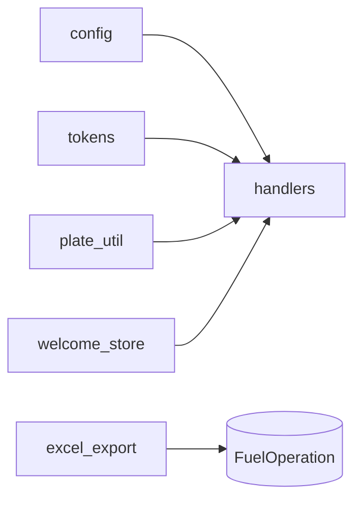

# BOT_SRC / SERVICES_AND_CONFIG

Сервисный слой и конфиг `src/app`.

## Содержит

- `config.py`
- `excel_export.py`
- `tokens.py`
- `plate_util.py`
- `welcome_store.py`

## Карта сервисов



Связанные:

- [EXCEL_AND_DATA](../EXCEL_AND_DATA.md)
- [DATA_LAYER](DATA_LAYER.md)

## Подробный разбор конфигурации

Файл: `src/app/config.py`.

Основные переменные:

- `DATABASE_URL`
- `BOT_TOKEN`
- `TOKEN_SALT`
- `CODE_LENGTH`
- `CODE_TTL_HOURS`
- `ADMIN_TELEGRAM_ID`
- `WELCOME_BANNER_PATH`
- `BEL_PASSWORD`, `BEL_EMITENT_ID`, `BEL_CONTRACT_ID`

Практика:

- конфиг читается один раз на старте модуля;
- отсутствие обязательных env может проявиться в runtime при первом вызове связанной функции.

## Подробно по сервисным файлам

### `tokens.py`

Сервис link-кодов:

- безопасный hash;
- массовый выпуск;
- consume с транзакционной защитой.

### `plate_util.py`

Сервис нормализации номеров:

- очищает пробелы/дефисы/точки;
- приводит к upper-case;
- дает единый ключ сопоставления для импорта и user-input.

### `welcome_store.py`

Локальный persistence для UX:

- хранит `telegram_id` пользователей, кому уже показали welcome-баннер;
- позволяет избежать повторного спама приветствием.

### `excel_export.py` (как сервис)

Хотя файл "отчетный", по факту это сервис:

- умеет трансформировать доменную операцию в бизнес-таблицу;
- делает idempotent экспорт по operation id;
- учитывает спорные/подтвержденные статусы.

## Пример: как config влияет на runtime

```python
# src/app/config.py
CODE_LENGTH = int(os.getenv("CODE_LENGTH", "6"))
```

Если env не задан:

- берется безопасное дефолтное значение;
- код не падает на старте.

## Пример: нормализация номера авто

```python
def normalize_plate(text: str) -> str:
    t = text.strip().upper()
    t = re.sub(r"[\s\-\.\t\n\r]+", "", t)
    return t
```

Практический эффект:

- `1234 AB-7`, `1234AB7`, `1234-ab-7` -> один normalized ключ.

## Конфигурационные риски

1. Неверный `DATABASE_URL` -> не стартует БД слой.
2. Пустой `BOT_TOKEN` -> бот не поднимется.
3. Пустой `TOKEN_SALT` -> компрометация link-кодов.
4. Неверные `BEL_*` -> сбой auth в API.
5. Неверный `TESSERACT_CMD` (в OCR контуре) -> OCR failure.

## Чеклист конфиг-ревью

- Есть `.env.example`/описание переменных.
- Секреты не попадают в git.
- Дефолты заданы только для не-критичных полей.
- Ошибки по критичным env понятны в логах.

## Рекомендации по развитию

1. Вынести валидацию env в единый `Settings` класс.
2. Добавить startup-check обязательных конфигов.
3. Разделить env по доменам: bot/import/ocr/security.

## Технические связи сервисов с кодом

### `config.py` -> runtime consumers

- `run_bot.py` читает `BOT_TOKEN`.
- `db.py` читает `DATABASE_URL`.
- `tokens.py` читает `TOKEN_SALT`, `CODE_LENGTH`, `CODE_TTL_HOURS`.
- `belorusneft_api.py` читает `BEL_*`.
- `user.py` использует `WELCOME_BANNER_PATH`.

### `plate_util.py` -> import + user flows

- `import_logic.py` нормализует номера из API.
- `user.py` нормализует ввод автомобиля пользователем.
- matching работает на едином формате plate.

### `tokens.py` -> admin/user link flows

- admin-users handlers генерируют/отзывают коды;
- user-handler (`/link`) проверяет и потребляет код.

## Пример безопасной конфиг-валидации (рекомендуемый)

```python
required = ["DATABASE_URL", "BOT_TOKEN", "TOKEN_SALT"]
missing = [k for k in required if not os.getenv(k)]
if missing:
    raise RuntimeError(f"Missing env: {', '.join(missing)}")
```

Это пока рекомендация для будущего улучшения startup-check.

## Эксплуатационные советы

1. Для production фиксировать `CODE_TTL_HOURS` в разумном окне (не слишком долго).
2. `TOKEN_SALT` хранить как secret и ротировать по процедуре.
3. Для OCR сервиса явно задавать `TESSERACT_CMD`, если окружение неоднородное.
4. В staging держать отдельный `DATABASE_URL`.

## Troubleshooting по конфигу

- **Симптом:** бот не стартует.  
  Проверить `BOT_TOKEN`.

- **Симптом:** ошибки при любом DB запросе.  
  Проверить `DATABASE_URL`.

- **Симптом:** `/link` всегда invalid.  
  Проверить `TOKEN_SALT` (совпадает ли с salt, с которым коды выпускались).

- **Симптом:** импорт API всегда 401/400.  
  Проверить `BEL_PASSWORD`, `BEL_EMITENT_ID`, `BEL_CONTRACT_ID`.
