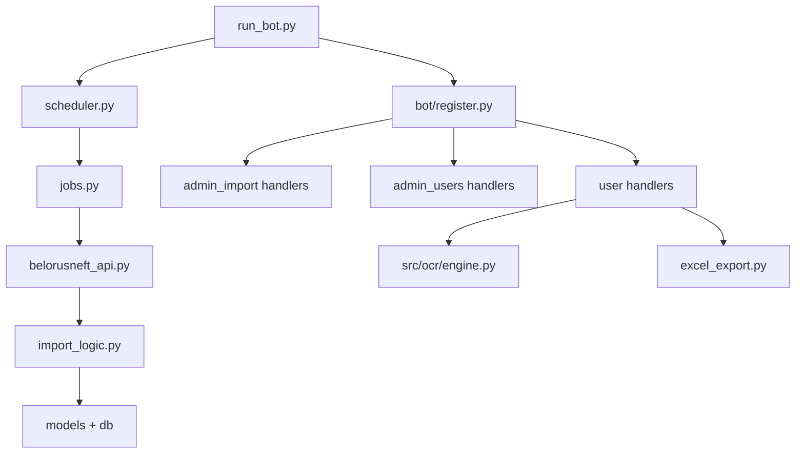

# BOT_SRC / ФАЙЛЫ SRC

Подробный справочник по файлам в `src/` с практическим назначением.

## Корневые файлы `src`

| Файл | Назначение |
|---|---|
| `src/run_bot.py` | Основная точка запуска Telegram-бота: инициализирует `Bot`/`Dispatcher`, регистрирует хендлеры, поднимает scheduler, грузит расписания из БД и стартует polling. |
| `src/migrate_old_ops.py` | Миграционный/ремонтный скрипт для старых `FuelOperation`: вытаскивает поля из `api_data`, дозаполняет `doc/date/car/user`, обновляет связи `FuelCard/Car/User`, работает батчами. |

## `src/app`: ядро приложения

| Файл | Назначение |
|---|---|
| `src/app/config.py` | Конфигурация из `.env`: БД, токены, параметры link-кодов, учетные данные Belorusneft API, путь приветственного баннера. |
| `src/app/db.py` | SQLAlchemy engine/session factory, `init_db()`, контекст `get_db_session()` с commit/rollback/close. |
| `src/app/models.py` | ORM-модели домена: пользователи/роли/права, операции/карты/авто, токены привязки, расписания, история подтверждений, user-state. |
| `src/app/seed.py` | Первичное заполнение ролей и permissions (`admin:manage`, `user:*`) и их связей. |
| `src/app/manage.py` | CLI-обертка инициализации: `init_db + seed_roles_and_permissions`. |
| `src/app/permissions.py` | Проверка прав (`user_has_permission`, `require_permission`) и middleware активности пользователя (`ActiveUserMiddleware`). |
| `src/app/tokens.py` | Генерация/хэширование/погашение кодов привязки (`LinkToken`), защита от race condition через `with_for_update`. |
| `src/app/plate_util.py` | Нормализация госномеров, сравнение и поиск автомобилей по нормализованному номеру. |
| `src/app/welcome_store.py` | Локальное хранилище (`exports/welcome_shown.json`) для показа приветственного баннера один раз на Telegram ID. |
| `src/app/legacy_ssl.py` | `requests`-адаптер для legacy TLS renegotiation (нужен для API Белоруснефти). |
| `src/app/bot_ref.py` | Глобальная ссылка на экземпляр `Bot` для фоновых контекстов без текущего update. |

## `src/app`: импорт и отчеты

| Файл | Назначение |
|---|---|
| `src/app/belorusneft_api.py` | HTTP-клиент Белоруснефти: auth/token cache, запрос operational endpoint, debug dump request/response, универсальный `parse_operations()`. |
| `src/app/import_logic.py` | Бизнес-логика импорта без Telegram: нормализация полей, дедуп по составному ключу, создание/линковка `FuelCard/Car/User`, формирование `ImportBatch`. |
| `src/app/jobs.py` | Фоновые job-функции импорта: получает операции, пишет в БД, пытается отправлять уведомления пользователям. |
| `src/app/scheduler.py` | APScheduler-обвязка: инициализация jobstore, добавление/удаление cron-задач импорта. |
| `src/app/excel_export.py` | Выгрузка операций в master Excel: подготовка листов, формирование строки `_operation_row`, экспорт подтвержденных/спорных операций. |

## `src/app/bot`: Telegram-слой

| Файл | Назначение |
|---|---|
| `src/app/bot/__init__.py` | Публичный экспорт `register_handlers`. |
| `src/app/bot/register.py` | Единая регистрация middleware и групп хендлеров (user/admin schedules/admin users/admin import). |
| `src/app/bot/keyboards.py` | Константы кнопок и фабрики reply/inline-клавиатур для всех пользовательских и админских сценариев. |
| `src/app/bot/notifications.py` | Шаблон и отправка карточки операции пользователю в Telegram (`send_operation_to_user`). |
| `src/app/bot/utils.py` | Утилиты телеграм-слоя: парсинг аргументов команды, временное хранилище plain link-кодов. |
| `src/app/bot/handlers/__init__.py` | Маркер пакета хендлеров. |
| `src/app/bot/handlers/user.py` | Крупнейший пользовательский сценарий: старт/привязка, профиль, OCR чека, ручная корректировка, выбор авто, подтверждение/отклонение операций, FSM-состояния. |
| `src/app/bot/handlers/admin_import.py` | Админ-импорт и обработка операций: ручной запуск импорта, pending/disputed/recent, Excel-выгрузка, assign/confirm/dispute callback-flow. |
| `src/app/bot/handlers/admin_users.py` | Админ-управление пользователями и link-кодами: пагинация users, генерация/экспорт/отзыв кодов, блокировка/разблокировка. |
| `src/app/bot/handlers/admin_schedules.py` | Админ-управление расписаниями импорта (`/schedule_get`, `/schedule_set`, `/schedule_remove`) + синхронизация с APScheduler. |

## Совместимость и legacy-модули

| Файл | Назначение |
|---|---|
| `src/app/bot_handlers.py` | Legacy-совместимость: реэкспорт `register_handlers` и `send_operation_to_user` для старых импортов. |

## OCR-пакет `src/ocr`

| Файл | Назначение |
|---|---|
| `src/ocr/engine.py` | `SmartFuelOCR`: preprocess изображения, Tesseract OCR, структурирование через LLM, dedup (хэш + бизнес-поля), сохранение `FuelOperation` для личных чеков. |
| `src/ocr/schemas.py` | Pydantic-схема `ReceiptData` для нормализованного результата OCR/LLM. |

## Как читать этот список разработчику

1. Для бизнес-данных начните с `models.py` -> `db.py` -> `import_logic.py`.
2. Для Telegram потока: `bot/register.py` -> `handlers/user.py` -> `handlers/admin_*`.
3. Для OCR: `ocr/engine.py` + `ocr/schemas.py`, затем интеграция в `handlers/user.py`.
4. Для cron-импорта: `scheduler.py` -> `jobs.py` -> `belorusneft_api.py`.

## Ключевые функции по файлам (быстрый индекс)

### `src/run_bot.py`

- `main()` — инициализация всего runtime.

### `src/app/db.py`

- `init_db()` — create_all.
- `get_db_session()` — transaction scope.

### `src/app/import_logic.py`

- `api_local_yesterday_datetime()`
- `parse_api_datetime()`
- `extract_flat_fields()`
- `is_duplicate_api_operation()`
- `import_api_operations()`

### `src/app/belorusneft_api.py`

- `auth()`
- `fetch_operational_raw()`
- `parse_operations()`
- `save_debug_dump()`

### `src/app/excel_export.py`

- `_operation_row()`
- `export_to_excel_final()`
- `_ensure_workbook()`

### `src/app/permissions.py`

- `user_has_permission()`
- `require_permission()`
- `ActiveUserMiddleware.__call__()`

### `src/app/tokens.py`

- `generate_code()`
- `hash_code()`
- `create_bulk_codes()`
- `verify_and_consume_code()`

### `src/app/scheduler.py`

- `init_scheduler()`
- `schedule_daily_import()`
- `remove_schedule()`

### `src/app/jobs.py`

- `run_import_job()`

### `src/ocr/engine.py`

- `run_pipeline()`
- `_check_duplicates()`
- `extract_raw_text()`
- `structure_with_llm()`

## Call-graph высокого уровня

## Практические зоны изменений

### Если меняется внешний API Белоруснефти

Править:

- `belorusneft_api.py` (payload/парсер);
- `import_logic.py` (mapping/dedup);
- docs `IMPORT_AND_REPORTS.md`.

### Если меняется UX Telegram

Править:

- `bot/keyboards.py`;
- `bot/handlers/user.py` и/или `admin_*`;
- docs `TELEGRAM_BOT.md`, `MODULES/TELEGRAM.md`.

### Если меняется модель операции

Править:

- `models.py`;
- импорт (`import_logic.py`);
- OCR save (`ocr/engine.py`);
- excel (`excel_export.py`);
- web endpoints (если завязаны).

## Частые антипаттерны

1. Менять callback_data в `keyboards.py`, забыв handlers.
2. Добавлять новый статус в одном месте и не обновлять фильтры в остальных.
3. Класть бизнес-логику во внешний API-транспорт вместо domain-layer.
4. Добавлять поля в `ReceiptData`, не обновляя manual parser.

## Рекомендации по качеству изменений

1. Малые PR: transport/domain/ui отдельно.
2. На каждое изменение callback протокола — smoke тест кнопок.
3. На каждое изменение импорта — dry-run + обычный run.
4. На каждое изменение OCR — проверить fallback manual path.

## Привязка к документации

- Общий обзор: `OVERVIEW.md`
- Telegram: `TELEGRAM.md`, `TELEGRAM_LAYER.md`, `TELEGRAM_BOT.md`
- Данные/права: `DATA_AND_PERMISSIONS.md`, `DATA_LAYER.md`
- Импорт/отчеты: `IMPORT_AND_JOBS.md`, `IMPORT_AND_REPORTS.md`, `EXCEL_AND_DATA.md`
- OCR: `OCR_INTERNALS.md`, `OCR_MODULE.md`, `PERSONAL_FUNDS_SCENARIO.md`
