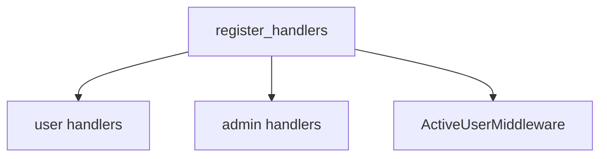

# BOT_SRC / TELEGRAM

## Ключевые файлы

- `src/app/bot/register.py`
- `src/app/bot/handlers/user.py`
- `src/app/bot/handlers/admin_import.py`
- `src/app/bot/handlers/admin_users.py`
- `src/app/bot/handlers/admin_schedules.py`
- `src/app/bot/keyboards.py`
- `src/app/bot/notifications.py`

## Схема регистрации хендлеров



## Примеры реализации

```python
# src/app/bot/register.py
def register_handlers(dp: Dispatcher) -> None:
    dp.update.middleware(ActiveUserMiddleware())
    register_schedule_handlers(dp)
    register_admin_user_handlers(dp)
    register_admin_import_handlers(dp)
    register_user_handlers(dp)
```

```python
# src/app/permissions.py
class ActiveUserMiddleware(BaseMiddleware):
    async def __call__(self, handler, event, data):
        ...
```

## Примечания

- permissions проверяются через `require_permission(...)`
- middleware активности пользователя находится в `src/app/permissions.py`
- часть импортов чувствительна к циклам (важно для прототипирования)

## Связанные документы

- [permissions + data](DATA_AND_PERMISSIONS.md)
- [telegram layer details](TELEGRAM_LAYER.md)
- [runtime architecture](ARCHITECTURE.md)

## Подробный разбор ключевых функций

### `register_handlers(dp)`

Что делает функция:

1. подключает middleware активности;
2. регистрирует admin schedules handlers;
3. регистрирует admin users handlers;
4. регистрирует admin import handlers;
5. регистрирует user handlers.

Порядок важен: при конфликте фильтров более ранняя регистрация часто выигрывает в маршрутизации.

### `register_user_handlers(dp)`

Внутри `user.py` регистрируются:

- команды (`/start`, `/link`, `/check`, `/myprofile`, `/pending`);
- текстовые кнопки (`BTN_USER_*`);
- callback query (`ocr_confirm_`, `fuel_card_yes_`, ...);
- FSM state handlers для OCR/manual/disputed flow.

### `register_admin_import_handlers(dp)`

Регистрация команд и кнопок для:

- ручного импорта;
- просмотра pending/disputed/recent операций;
- export в Excel;
- callback confirm/assign/dispute.

### `register_admin_user_handlers(dp)`

Регистрация:

- `/users`, `/generate_code`, `/export_codes`;
- callback pagination, view_user, gen_code, send_code, revoke_code, toggle_active.

## Пример: как callback переходит в БД-мутацию

```python
# src/app/bot/handlers/admin_import.py
@require_permission("admin:manage")
async def callback_confirm_op(call: types.CallbackQuery):
    op_id = int(call.data.split(":", 1)[1])
    with get_db_session() as db:
        op = db.query(FuelOperation).filter_by(id=op_id).first()
        op.status = "confirmed"
        op.confirmed_at = datetime.now(timezone.utc)
        db.commit()
```

Что здесь хорошо:

- четкий parse `op_id` из callback payload;
- write-path ограничен permission-декоратором;
- есть commit после статуса.

## Middleware `ActiveUserMiddleware`: деталь поведения

Алгоритм:

1. Сначала проверяет "разрешенные без активации" действия (`/start`, `/link`, кнопка привязки).
2. Если action auth-related — пропускает дальше.
3. Иначе читает пользователя по `telegram_id` и проверяет `active`.
4. Неактивному пользователю отправляет сообщение с CTA на привязку.

Практический эффект:

- блокирует выполнение бизнес-команд неактивным аккаунтам;
- не блокирует onboarding и link-flow.

## Почему Telegram слой сейчас "тяжелый"

В `user.py` сосредоточены:

- FSM переходы,
- OCR-пайплайн интеграция,
- валидации ручного ввода,
- изменения БД,
- интеграция с Excel.

Это удобно для скорости разработки, но повышает связность.

### Рекомендуемое направление рефакторинга

- вынести OCR orchestration в `services/receipt_flow.py`;
- вынести parse/validate ручного текста в отдельный parser module;
- вынести статусные переходы операций в сервис domain-layer.

## Словарь статусных переходов операций в Telegram-флоу

- `new` -> создано (личный чек/новая операция)
- `pending` / `loaded_from_api` -> ожидает подтверждения
- `confirmed` -> подтверждено пользователем/админом
- `disputed` / `requires_manual` -> конфликтный кейс, нужен ручной разбор
- `rejected` / `rejected_by_other` -> отклонено

## Диагностика по симптомам

### Симптом: "команды работают, кнопки нет"

- проверить `reply_keyboard_user()` / `reply_keyboard_admin()` что кнопка действительно добавлена;
- проверить регистрацию `dp.message.register(..., F.text == BTN_...)`.

### Симптом: "кнопка нажимается, но ничего не меняется"

- проверить callback prefix/format;
- проверить, что callback handler зарегистрирован в `register_*_handlers`.

### Симптом: "все callbacks получают no rights"

- проверить роль пользователя и `user_has_permission`;
- проверить отсутствие rollback из-за исключения в декораторе.

## Мини-чеклист при добавлении нового telegram-сценария

1. Добавить кнопку/команду в `keyboards.py` (если нужна UI entrypoint).
2. Написать handler функцию.
3. Зарегистрировать ее в `register_user_handlers` или `register_admin_*`.
4. Если есть доступ-контроль — обернуть `@require_permission`.
5. Если есть БД-изменения — убедиться в commit path.
6. Для сложного сценария — добавить FSM state и clear на финале.
7. Добавить/обновить документацию в этом файле и в `TELEGRAM_BOT.md`.
