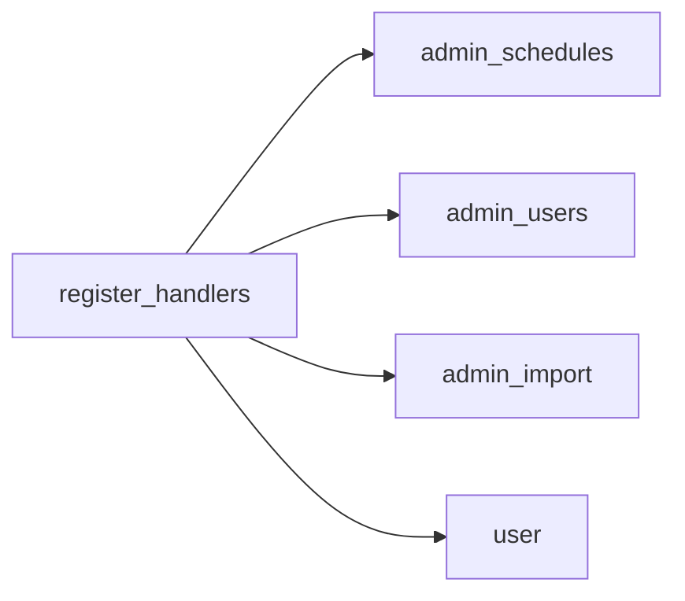

# BOT_SRC / TELEGRAM_LAYER

Подробности по aiogram-слою в `src/app/bot/*`.

## Регистрация хендлеров



## Важные примечания

- middleware активности: `ActiveUserMiddleware` (`src/app/permissions.py`)
- кнопки/колбэки централизованы в `keyboards.py`
- уведомления по операциям: `notifications.py`

Связанные:

- [TELEGRAM](TELEGRAM.md)
- [ARCHITECTURE](ARCHITECTURE.md)

## Детальный разбор регистрации

`register_handlers` собирает слой в следующем порядке:

1. middleware (`ActiveUserMiddleware`) для message/callback;
2. handlers расписаний;
3. handlers админ-пользователей;
4. handlers админ-импорта;
5. handlers пользователей.

Это дает:

- сначала admin/control сценарии;
- затем user сценарии;
- минимальный риск конфликтов фильтров.

## Категории хендлеров

### Командные

- `CommandStart()`, `Command("link")`, `Command("check")`, и т.д.

### Текстовые кнопки

- матч по `F.text == BTN_*`.

### Callback handlers

- матч по `F.data.startswith("...")`.

### FSM handlers

- матч по текущему `State`.

## Пример кода: registration snippet

```python
dp.message.register(cmd_start, CommandStart())
dp.message.register(cmd_link, Command(commands=["link"]))
dp.callback_query.register(callback_ocr_confirm, F.data.startswith("ocr_confirm_"))
dp.message.register(process_manual_receipt_text, ReceiptStates.waiting_for_manual_receipt_text, F.text)
```

## Где чаще всего ломается Telegram-layer

1. Кнопка добавлена в `keyboards.py`, но не зарегистрирована в handler.
2. Callback prefix отличается на 1 символ между keyboard и handler.
3. FSM состояние не очищается после финала.
4. Для admin handler забыли `@require_permission`.

## Технические практики для новых сценариев

- Использовать единый prefix callback (`feature_action_{id}` или `feature:action:id`).
- Для длинных сценариев всегда иметь cancel/reset путь.
- Не смешивать тяжелую бизнес-логику и transport code в одном большом handler — выносить в сервисы.

## Мини-чеклист регресса telegram flow

1. Команда срабатывает из меню и из текстового ввода.
2. Кнопка срабатывает по точному тексту.
3. Callback закрывает/обновляет старую клавиатуру (`edit_reply_markup`/`edit_text`).
4. После завершения state сброшен.
5. Ошибки показывают понятный текст пользователю.

## Детализация FSM-подхода

`user.py` использует `StatesGroup`:

- `RegistrationStates`
- `CardUpdateStates`
- `LinkStates`
- `ReceiptStates`

Плюсы:

- явная модель шагов;
- ограничение валидных переходов;
- проще дебажить "на каком шаге" пользователь.

Риски:

- state может "зависнуть", если не clear на исключении;
- callback из старого сообщения может прийти в неподходящем контексте.

Практика:

- каждый финальный хендлер должен делать `await state.clear()`;
- при устаревшем контексте давать пользователю clear next-step сообщение.

## Разделение user/admin handler-поведения

### User handlers

- работают с личным профилем;
- подтверждают/отклоняют операции;
- инициируют OCR сценарии;
- не должны управлять ролями, кодами и расписаниями.

### Admin handlers

- доступ только через `admin:manage`;
- управляют импортом и спорными кейсами;
- управляют пользователями и кодами;
- управляют расписаниями.

Это разделение защищает от случайного эскалационного behavior в user-flow.

## Слой клавиатур как "контракт UI"

`keyboards.py` фактически определяет:

- публичные точки входа сценариев;
- callback_data протокол;
- текстовые labels для F.text фильтров.

Поэтому при изменении label/callback:

1. обновить клавиатуры;
2. обновить регистрацию хендлеров;
3. обновить docs и smoke tests.

## Рекомендуемые тесты telegram-layer (ручные)

1. `/start` для активного user.
2. `/start` для неактивного user.
3. `/link` happy path + invalid + expired.
4. `/check` OCR success + manual fallback.
5. admin `/users` pagination + callbacks.
6. admin import callback confirm/reject/assign.

## Контроль качества логов

Желательно логировать:

- start/end длинных операций;
- parse/callback errors с контекстом op_id/user_id;
- причины deny по permission или inactive user.

Это резко ускоряет расследование инцидентов в Telegram runtime.
