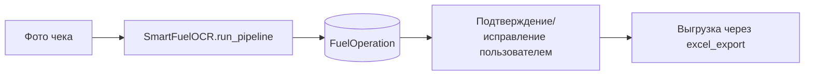

# BOT SRC OCR MODULE

Краткий обзор OCR в контексте `src`. Полный технический разбор вынесен в отдельный домен: [`docs/OCR`](../OCR/README.md).

## Что делает OCR в системе

- принимает фото чека;
- выполняет OCR + LLM-структурирование;
- создает `FuelOperation(source=personal_receipt)`;
- передает результат в пользовательский confirm/edit flow;
- в финале данные уходят в Excel.

## Где смотреть подробно

- Архитектура и карта модулей OCR: [OCR/README](../OCR/README.md)
- Пошаговый pipeline по коду: [OCR/PIPELINE](../OCR/PIPELINE.md)
- Контракты данных (`ReceiptData`, `ocr_data`): [OCR/DATA_CONTRACTS](../OCR/DATA_CONTRACTS.md)
- Дедуп и валидация: [OCR/DEDUP_AND_VALIDATION](../OCR/DEDUP_AND_VALIDATION.md)
- Интеграция с ботом/экспортом: [OCR/INTEGRATION](../OCR/INTEGRATION.md)
- Диагностика и runbook: [OCR/TROUBLESHOOTING](../OCR/TROUBLESHOOTING.md)

## Связанные документы в BOT_SRC

- [PERSONAL_FUNDS_SCENARIO](PERSONAL_FUNDS_SCENARIO.md)
- [EXCEL_AND_DATA](EXCEL_AND_DATA.md)
