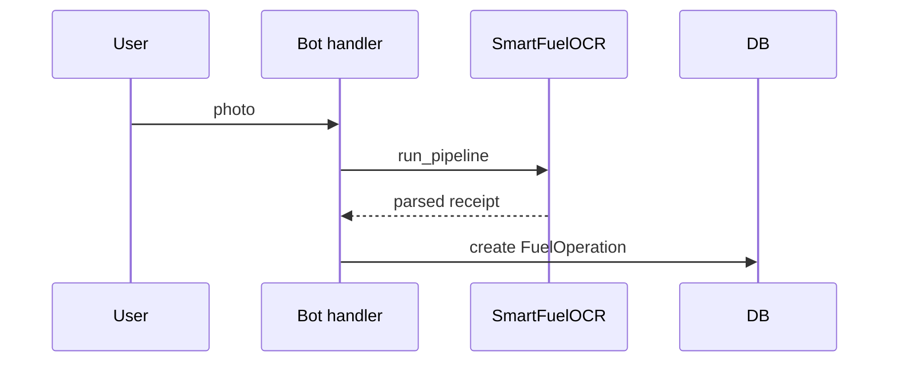
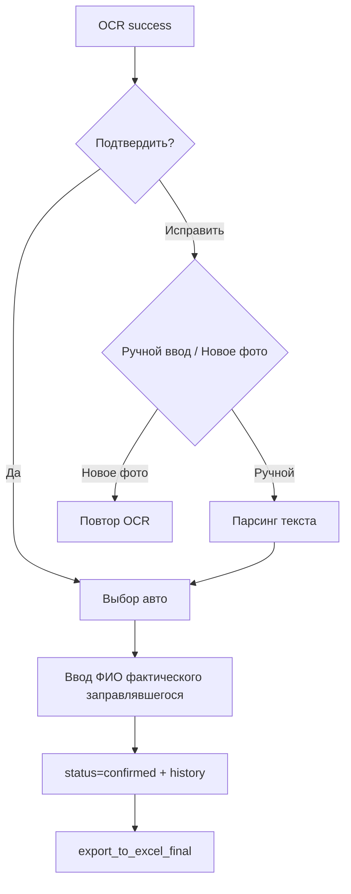

# BOT SRC PERSONAL FUNDS SCENARIO

Сценарий личных заправок:

1. пользователь отправляет фото
2. OCR распознает чек
3. бот показывает извлеченные данные
4. подтверждение/исправление
5. ввод авто и ФИО
6. запись в БД и экспорт в Excel



Связанные документы:
- [TELEGRAM_BOT](TELEGRAM_BOT.md)
- [OCR_MODULE](OCR_MODULE.md)

## Подробный runtime-поток по функциям

Основной файл: `src/app/bot/handlers/user.py`.

### Шаг 1: вход в сценарий

- `btn_send_receipt_start`:
  - проверяет, что пользователь привязан (`User.telegram_id`);
  - переводит FSM в `ReceiptStates.waiting_for_photo`;
  - просит отправить фото.

### Шаг 2: прием фото и OCR

- `handle_receipt_photo`:
  - скачивает файл в `temp_ocr/`;
  - запускает `SmartFuelOCR.run_pipeline` с timeout;
  - обрабатывает 3 ветки:
    - `None` -> fallback/manual draft;
    - `duplicate` -> предупреждение;
    - success -> `op_id` + экран подтверждения OCR.

### Шаг 3: подтверждение или исправление OCR

- `callback_ocr_confirm` -> выбор авто из профиля.
- `callback_ocr_edit` -> выбрать: ручной ввод / новое фото.
- `callback_receipt_manual` -> показывает шаблон для ручного ввода.
- `process_manual_receipt_text` -> парсит текст, валидирует `ReceiptData`, обновляет `ocr_data`.

### Шаг 4: выбор авто и фактического заправлявшегося

- `callback_select_personal_car` -> сохраняет выбранный автомобиль;
- `process_personal_fueler_name` -> ищет сотрудника по ФИО и финализирует операцию:
  - `op.status = "confirmed"`,
  - `op.confirmed_user_id`,
  - `op.actual_car`,
  - запись в `ConfirmationHistory`.

### Шаг 5: финализация и выгрузка

- вызывается `export_to_excel_final(op_id)`;
- при успехе — сообщение пользователю о добавлении в Excel;
- при ошибке Excel — сообщается частичный успех (БД сохранена, Excel нет).

## Пример кода: ручной ввод чека

```python
# src/app/bot/handlers/user.py (смысловой фрагмент)
parsed, err = _parse_manual_receipt_text(message.text)
if not parsed:
    await message.answer(f"❌ {err}")
    return

structured = ReceiptData.model_validate(parsed)
op.ocr_data = structured.model_dump()
op.status = "new"
db.commit()
```

Что дает этот путь:

- пользователь не блокируется, даже если OCR/LLM дал сбой;
- структура данных остается совместимой с `ReceiptData`;
- отчетность/экспорт используют те же поля, что и авто-OCR.

## FSM-состояния сценария

Ключевые состояния:

- `waiting_for_photo`
- `waiting_for_confirmation`
- `waiting_for_manual_receipt_text`
- `waiting_for_personal_car_plate`
- `waiting_for_personal_fueler`

Плюс дополнительные для споров/подтверждений карт (`waiting_for_real_fueler`, `waiting_for_disputed_car`, ...).

Практика:

- каждое состояние имеет строго ограниченные обработчики;
- при завершении сценария вызывается `state.clear()`;
- при устаревшем контексте показывается "начните заново".

## Обработка ошибок: детализация

### OCR timeout

Если `asyncio.wait_for(..., timeout=OCR_PIPELINE_TIMEOUT_SEC)` срабатывает:

- пользователю дается понятный текст;
- FSM очищается;
- временный файл удаляется в `finally`.

### Ошибка сохранения в Excel

Если экспорт не удался:

- операция уже подтверждена в БД;
- пользователю отправляется warning;
- админ может повторить экспорт вручную.

### Неоднозначное ФИО

`process_personal_fueler_name`:

- если 0 совпадений -> просит уточнить;
- если >1 совпадения -> выводит варианты;
- только одно совпадение дает переход в `confirmed`.

## Диаграмма подтверждения после OCR



## Где хранятся ключевые данные

- `FuelOperation.ocr_data` — структурированные поля чека + debug.
- `FuelOperation.doc_number/date_time` — индексируемые поля для поиска/дедупа.
- `FuelOperation.actual_car` — фактическое авто.
- `FuelOperation.confirmed_user_id` — кто действительно заправлялся.
- `ConfirmationHistory` — аудит этапов подтверждения/перенаправления.

## Технический чеклист для разработчика

При изменениях сценария проверить:

1. Любой переход FSM имеет обратный/ошибочный выход.
2. Нет веток без `state.clear()` на финале.
3. При manual path поля совместимы с `ReceiptData`.
4. После confirm заполняются `actual_car`, `confirmed_user_id`, `confirmed_at`.
5. Экспорт в Excel вызывается и обрабатывает исключения.
6. Сообщения пользователю не "зависают" на старых inline-кнопках.

## Тестовые кейсы, которые стоит прогнать вручную

- Хорошее фото -> OCR success -> confirm -> экспорт.
- Плохое фото -> `None` -> manual edit -> confirm.
- Duplicate чек -> предупреждение, без новой записи.
- Несколько совпадений ФИО -> запрос уточнения.
- Отсутствуют авто в профиле -> корректный блокирующий ответ.
