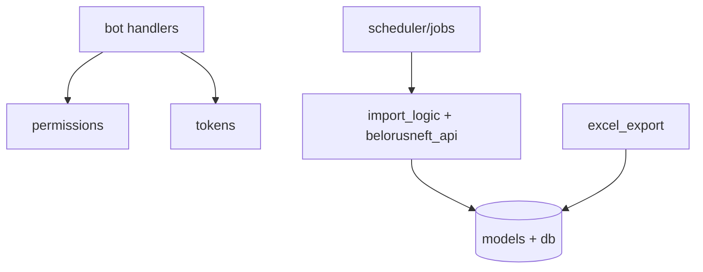

# BOT_SRC

Документация по `src/app` (бот, импорт, БД-модели, scheduler, экспорт, permissions).

## Область

- директория: `src/app`
- основной runtime: Telegram bot + jobs + DB

## Верхнеуровневая диаграмма



## Документация модулей

- [OVERVIEW](MODULES/OVERVIEW.md)
- [TELEGRAM](MODULES/TELEGRAM.md)
- [DATA_AND_PERMISSIONS](MODULES/DATA_AND_PERMISSIONS.md)
- [IMPORT_AND_REPORTS](MODULES/IMPORT_AND_REPORTS.md)
- [SRC_FILES](MODULES/SRC_FILES.md)

## Связанные документы

- [Project map](../README.md)
- [Detailed modules index](MODULES/README.md)

## Как читать BOT_SRC разработчику (практический маршрут)

### Маршрут A: нужно понять запуск бота

1. `src/run_bot.py` — вход, polling, scheduler bootstrap.
2. `src/app/bot/register.py` — что именно регистрируется в Dispatcher.
3. `src/app/bot/handlers/user.py` — user runtime.
4. `src/app/permissions.py` — почему часть апдейтов блокируется.

### Маршрут B: нужно понять импорт из API

1. `src/app/belorusneft_api.py` — auth + raw fetch + parse.
2. `src/app/import_logic.py` — дедуп и запись сущностей.
3. `src/app/jobs.py` / `src/app/scheduler.py` — фоновый запуск.
4. `src/app/models.py` — куда все пишется.

### Маршрут C: нужно понять OCR личных чеков

1. `src/ocr/engine.py` + `src/ocr/schemas.py`.
2. `src/app/bot/handlers/user.py` (ветка `/check`).
3. `src/app/excel_export.py` (как результат попадает в Excel).

## Карта ответственности по слоям

| Слой | Файлы | Что делают |
|---|---|---|
| Вход и orchestration | `run_bot.py`, `bot/register.py` | Инициализация и маршрутизация |
| Транспорт Telegram | `bot/handlers/*`, `bot/keyboards.py`, `bot/notifications.py` | Диалог и callback flow |
| Авторизация/права | `permissions.py`, `tokens.py` | Access control, link-коды |
| Импорт и интеграции | `belorusneft_api.py`, `import_logic.py`, `jobs.py`, `scheduler.py` | Внешний API и наполнение БД |
| Данные | `db.py`, `models.py` | Сессии, транзакции, ORM сущности |
| OCR | `ocr/engine.py`, `ocr/schemas.py` | Распознавание чеков и структурирование |
| Отчетность | `excel_export.py` | Экспорт в master Excel |

## Что обязательно учитывать при изменениях

1. `src/app/models.py` — любые изменения полей требуют проверки:
   - импорта (`import_logic.py`);
   - Telegram handlers;
   - OCR сохранения;
   - Excel export.

2. Изменения callback-протокола (`callback_data`) требуют синхронизации:
   - `keyboards.py`,
   - соответствующих handlers,
   - user/admin флоу документации.

3. Изменения статусов операций требуют синхронизации:
   - фильтров в admin view,
   - экспорта в Excel,
   - web endpoint фильтров.

4. Изменения в API-парсере требуют регресса:
   - дедупикация;
   - сопоставление пользователей и авто;
   - маршрутизация уведомлений.

## Мини troubleshooting по домену BOT_SRC

- **Бот стартует, но команды не видны**  
  Проверить `bot.set_my_commands` в `run_bot.py` и токен.

- **Импорт работает, но никому не шлются уведомления**  
  Проверить `presumed_user.telegram_id`, логи в `admin_import.py`/`jobs.py`.

- **OCR распознает, но данные не подтверждаются**  
  Проверить FSM-состояния в `user.py` и callback prefix в `keyboards.py`.

- **Excel не обновляется**  
  Проверить статус операции, `export_to_excel_final`, доступ к файлу `exports/Fuel_Report_Master.xlsx`.

## Что читать при типовых задачах

### Задача: добавить новую admin-команду

1. Добавить кнопку/текст в `bot/keyboards.py` (если нужна).
2. Добавить handler в `bot/handlers/admin_*.py`.
3. Зарегистрировать в `register_admin_*_handlers`.
4. Добавить permission-check (`admin:manage`).
5. Обновить docs: `TELEGRAM_BOT.md` + профильный модульный файл.

### Задача: изменить дедуп импорта

1. Изменить `import_logic.py` (`extract_flat_fields` / `is_duplicate_api_operation`).
2. Проверить связанный admin import path (`admin_import.py`).
3. Прогнать dry-run и обычный run.
4. Обновить docs: `IMPORT_AND_REPORTS.md`, `IMPORT_AND_JOBS.md`.

### Задача: изменить OCR поля

1. Обновить `ReceiptData` в `src/ocr/schemas.py`.
2. Обновить prompt/parse в `src/ocr/engine.py`.
3. Обновить ручной парсер в `user.py`.
4. Обновить excel mapping в `excel_export.py`.
5. Обновить docs: `OCR_MODULE.md`, `PERSONAL_FUNDS_SCENARIO.md`.
6. Полный технический разбор вести в отдельном OCR-домене: `docs/OCR/*`.

## Ключевые инварианты системы

1. Все пути работают через общую модель `src.app.models`.
2. Транзакционная граница — `get_db_session`.
3. Telegram access-control обязателен для admin веток.
4. OCR path всегда имеет fallback через ручной ввод.
5. Excel path не должен ломать основной бизнес-flow (при ошибке Excel БД-состояние сохраняется).

## Рекомендации по структуре PR

- Изменения в коде и docs держать в одном PR.
- Для каждого доменного изменения добавлять:
  - где changed behavior,
  - какие файлы обновлены,
  - как проверить вручную.
- Если затронуты статусы/контракты — явно перечислить регресс-тесты.

## Быстрые команды для локальной проверки

```bash
# запуск бота
PYTHONPATH=. python src/run_bot.py

# прогон прототипирования (регресс по ключевым сценариям)
PYTHONPATH=. python -m prototiping
```

Полезно держать оба прогона после крупных изменений в `src/app`.
