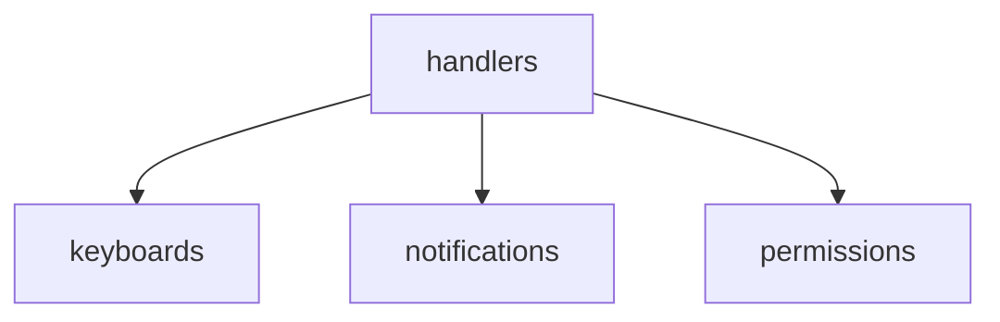
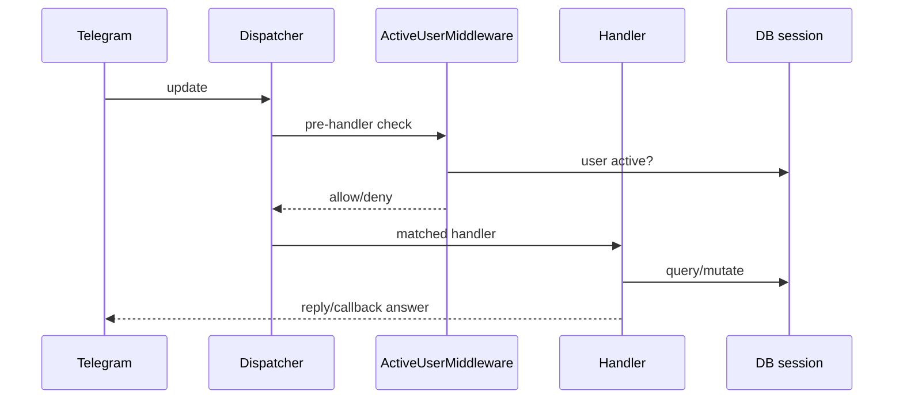

# BOT SRC TELEGRAM BOT

Документация по Telegram-части `src/app/bot/*`.

## Основные команды

- `/start`
- `/link`
- `/check`
- `/myprofile`
- `/pending`
- `/help`

## Слои



Сценарий личных средств:
- [PERSONAL_FUNDS_SCENARIO](PERSONAL_FUNDS_SCENARIO.md)

## Архитектура Telegram-слоя по файлам

Основные файлы:

- `src/app/bot/register.py` — сборка middleware + регистрация групп хендлеров.
- `src/app/bot/handlers/user.py` — пользовательские команды/FSM/чековые сценарии.
- `src/app/bot/handlers/admin_import.py` — импорт, очереди операций, экспорт, спорные кейсы.
- `src/app/bot/handlers/admin_users.py` — пользователи, link-коды, soft-block/restore.
- `src/app/bot/handlers/admin_schedules.py` — CRUD расписаний импорта.
- `src/app/bot/keyboards.py` — все reply/inline-кнопки и callback payload pattern.
- `src/app/permissions.py` — middleware активности + декоратор permission-check.

## Как проходит одно обновление (message/callback)



## Подробно по командам пользователя

- `/start`
  - сбрасывает state;
  - показывает приветствие (однократно через `welcome_store`);
  - определяет роль/активность;
  - выдает admin или user клавиатуру.

- `/link`
  - принимает код напрямую (`/link 123456`) или через FSM-режим;
  - вызывает `verify_and_consume_code`;
  - привязывает Telegram ID и активирует учетку.

- `/check`
  - стартует OCR сценарий личного чека;
  - далее фото -> распознавание -> подтверждение/исправление.

- `/myprofile`
  - показывает ФИО, карты, авто из `User`.

- `/pending`
  - вытягивает операции с ожиданием подтверждения для пользователя.

## Подробно по admin-командам

- `/run_import_now`, `/run_import_now_dry`
  - ручной запуск API-импорта;
  - dry-run путь для диагностики.

- `/users`
  - пагинация пользователей;
  - inline-управление по карточке пользователя.

- `/generate_code`, `/export_codes`
  - lifecycle link-кодов: выпуск, показ, отправка, отзыв.

- `/schedule_get`, `/schedule_set`, `/schedule_remove`
  - управление cron-задачами и таблицей `Schedule`.

- `/assign_op`, `/pending_ops`
  - обработка спорных/неподтвержденных операций.

## Пример кода: регистрация хендлеров

```python
# src/app/bot/register.py
def register_handlers(dp: Dispatcher) -> None:
    dp.message.middleware(ActiveUserMiddleware())
    dp.callback_query.middleware(ActiveUserMiddleware())
    register_schedule_handlers(dp)
    register_admin_user_handlers(dp)
    register_admin_import_handlers(dp)
    register_user_handlers(dp)
```

Что важно:

- middleware подключен и к message, и к callback;
- порядок регистрации важен для предсказуемого роутинга;
- разделение по handler-группам снижает связанность.

## Пример кода: permission-декоратор

```python
# src/app/permissions.py
def require_permission(permission_name: str):
    def decorator(handler):
        async def wrapper(event, *args, **kwargs):
            with get_db_session() as db:
                if not user_has_permission(db, event.from_user.id, permission_name):
                    ...
            return await handler(event, *args, **kwargs)
        return wrapper
    return decorator
```

## Callback naming conventions

Из `keyboards.py` и handlers:

- `fuel_card_yes_{op_id}`
- `fuel_card_no_{op_id}`
- `ocr_confirm_{op_id}`
- `ocr_edit_{op_id}`
- `confirm_op:{op_id}`
- `assign_op:{op_id}`
- `users_page:{n}`

Практика:

- prefix кодирует use-case;
- suffix (id/page) кодирует объект действия;
- обработчики матчятся по `startswith`.

## Точки интеграции с БД

Телеграм-слой использует `get_db_session()` почти в каждом handler:

- читаем профиль/права/операции;
- обновляем статусы и связи;
- пишем `ConfirmationHistory`;
- создаем `LinkToken`.

Типовой паттерн:

1. открыть сессию;
2. прочитать/изменить сущности;
3. `commit`;
4. ответ пользователю.

## Точки интеграции с внешними подсистемами

- OCR: `src/ocr/engine.py` (`SmartFuelOCR`).
- API Белоруснефти: `src/app/belorusneft_api.py`.
- Excel: `src/app/excel_export.py`.
- Scheduler: `src/app/scheduler.py` (через admin schedules и startup).

## Частые проблемы и диагностика

- **Команда не срабатывает**
  - проверить регистрацию в `register_user_handlers` / `register_admin_*`;
  - проверить, не перекрывает ли текстовая кнопка фильтр `F.text == ...`.

- **Кнопка есть, callback не ловится**
  - проверить точный prefix в `callback_data`;
  - проверить `startswith` в соответствующем callback-handler.

- **Пользователь видит "нет прав"**
  - проверить `User.role_id`;
  - проверить связи `role_permissions`.

- **Неактивный пользователь "не пускается"**
  - поведение корректное, это фильтр `ActiveUserMiddleware`;
  - разрешены только `/start`, `/link` и action-кнопка привязки.

## Рекомендации по развитию

1. Вынести тяжелые бизнес-блоки из `handlers/user.py` в сервисы.
2. Унифицировать статусы операций между админ и user флоу.
3. Добавить метрики по времени OCR/подтверждения.
4. Централизовать тексты сообщений в отдельный i18n/strings модуль.
