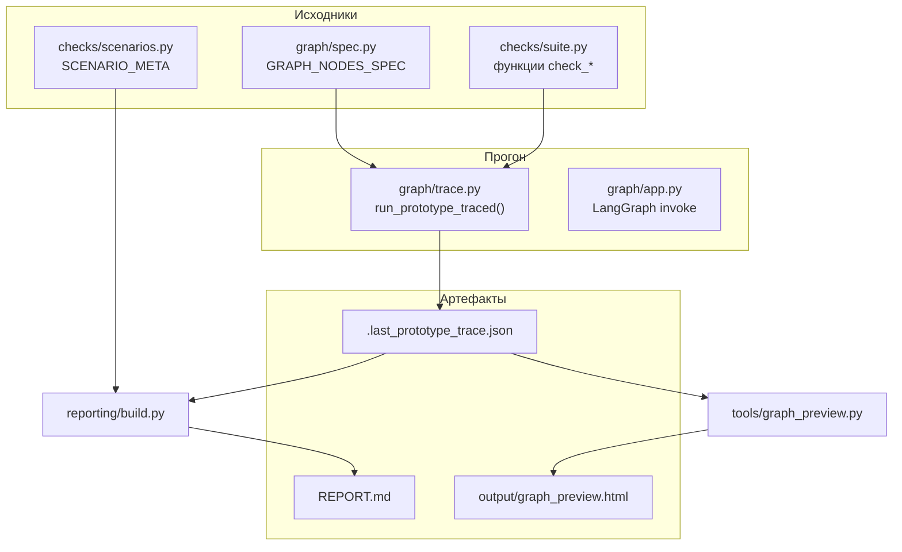
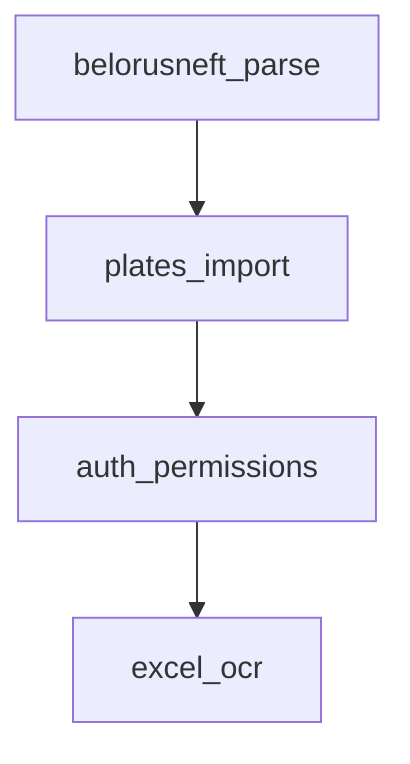

# Как работает прототипирование

## Зачем это нужно

- Проверять критичные куски логики (парсинг API, импорт, права, OCR-схемы) **одним прогоном**.
- Иметь **единый список сценариев** с кодами S01… и порядком, совпадающим с графом.
- Получать **REPORT.md** и **HTML** для обзора и демонстрации.

Проверки лежат в `prototiping/checks/suite.py` и вызывают **реальный код** из `src/` (через импорты), чаще всего на **in-memory SQLite** (`prototiping/db/memory.py`).

**Важно:** прототип **не** подменяет бизнес-логику приложения. Узлы LangGraph в `graph/app.py` только по очереди вызывают функции `check_*` из `suite.py`; каждая из них импортирует уже существующие функции и модели из `src/`. Отдельного «второго» OCR-пайплайна нет: в отчёте секция **OCR** вызывает тот же **`SmartFuelOCR.run_pipeline()`**, что и бот (`src/ocr/engine.py`).

## Поток данных (общая картина)

1. **`verify_spec_matches_all_checks()`** убеждается, что множество функций в `GRAPH_NODES_SPEC` совпадает с `ALL_CHECKS` в `suite.py`.
2. **`run_prototype_traced()`** идёт по узлам и для каждой функции вызывает `check_*()`; результат — дерево проверок + опционально запись JSON.
3. **`render_report()`** подставляет в `reporting/template.md` таблицу сценариев, граф, блоки БД, OCR и т.д. Подробно о плейсхолдерах: [REPORT_TEMPLATE.md](REPORT_TEMPLATE.md).
4. **`graph_preview`** читает JSON (или делает короткий прогон) и строит HTML с Mermaid.

## Граф сценариев

Узлы и рёбра задаются в `graph/spec.py`. Порядок **сверху вниз** на диаграмме совпадает с порядком выполнения проверок.

Каждый узел — это **список вызовов** без аргументов: `chk.check_parse_operations_items`, … LangGraph собирает из них приложение и может прогонять его с трейсингом (LangSmith), если настроены переменные окружения.

## Нумерация S01, S02, …

- В отчёте колонка **№** — порядок прогона (1, 2, 3…).
- Колонка **Код** — значение `id` из `checks/scenarios.py` (**S01…S15** в текущей версии).
- **Важно:** при добавлении сценария следующий код должен быть **S16** (и далее по порядку в конец графа в том узле, куда вы вставили проверку), чтобы номера шли подряд без дыр в логике отчёта. Подробнее: [QUICKSTART.md](QUICKSTART.md), [ADDING_SCENARIOS.md](ADDING_SCENARIOS.md).

## Связь с pytest

`prototiping/tests/test_prototype_graph.py` дублирует ожидания: граф проходит, каждая проверка из `ALL_CHECKS` возвращает `ok=True`. После сессии `conftest.py` вызывает `write_report()` (если не передан `--no-prototype-report`).

---

← [Оглавление](README.md) · [Структура по папкам →](STRUCTURE.md)
