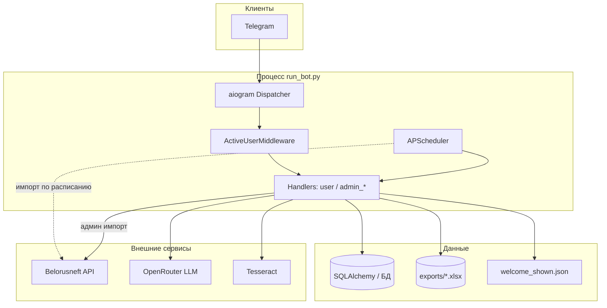
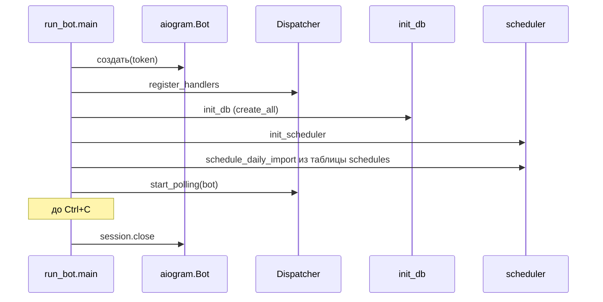
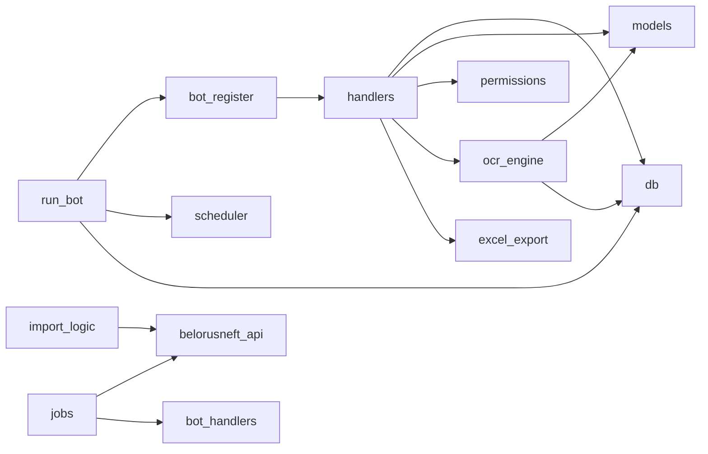

# Архитектура приложения (`src/`)

## Роль системы

Telegram-бот учитывает заправки по **двум каналам**:

1. **API (карта)** — операции подтягиваются из отчётов, сохраняются в БД, пользователям уходят запросы на подтверждение.
2. **Личные средства** — пользователь присылает фото чека; OCR и LLM формируют черновик операции; после проверок данные попадают в Excel.

Каналы **не смешиваются на уровне бизнес-правил**: чеки за личные средства не привязываются к API Белоруснефти.

## Компоненты (логический вид)

## Жизненный цикл процесса бота

## Потоки данных (упрощённо)

| Поток | Откуда | Куда | Ключевые модули |
|-------|--------|------|-----------------|
| Подтверждение карты | API → БД → Telegram | БД, Excel | `import_logic` / `jobs`, `handlers/user`, `excel_export` |
| Чек за личные средства | Фото → OCR | БД, Excel | `ocr/engine`, `handlers/user`, `excel_export` |
| Привязка аккаунта | Код в чат | `users`, `link_tokens` | `tokens`, `handlers/user` |

## Зависимости между пакетами

`belorusneft_api` — **лист изменений**: при доработках сценария личных средств этот модуль не трогаем.

## Соглашения для разработки

- Сессия БД: предпочтительно **`with get_db_session() as db:`** — commit/rollback/close централизованы в `db.py`.
- Статусы `FuelOperation.status` используются и в UI, и в Excel; новые значения согласовывать с `excel_export.STATUS_RU` и фильтрами в админке.
- Права админа проверяются через `user_has_permission(..., "admin:manage")` и декоратор `@require_permission`.

← [Оглавление](README.md) · [Слой данных →](DATA_LAYER.md)
