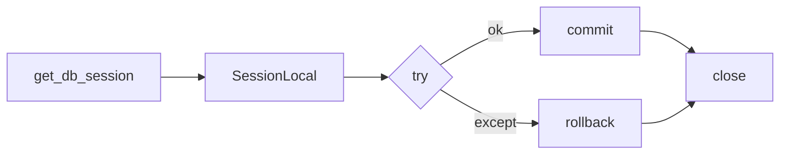
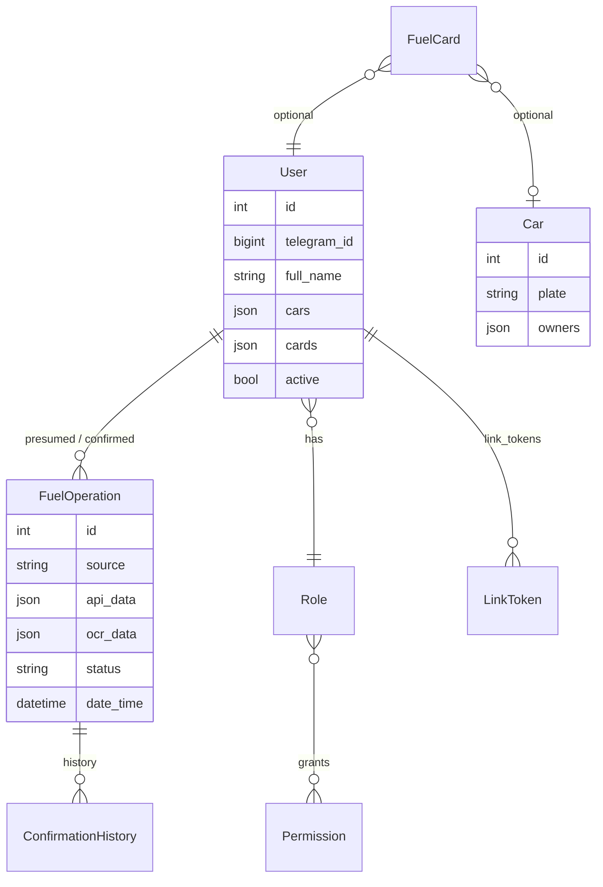

# Слой данных: `db.py` и `models.py`

## `src/app/db.py`

| Элемент | Назначение |
|---------|------------|
| `engine` | `create_engine(DATABASE_URL, pool_pre_ping=True)` |
| `SessionLocal` | фабрика сессий `sessionmaker` |
| `init_db()` | `Base.metadata.create_all` — создаёт таблицы, **миграций Alembic в репозитории нет** |
| `get_db_session()` | контекстный менеджер: `yield session` → при успехе `commit()`, при исключении `rollback()`, в `finally` `close()` |

**Важно:** вложенные `with get_db_session()` в одном запросе создают **отдельные** транзакции. Для согласованных многошаговых сценариев держите одну сессию или явно проектируйте границы commit.

## `src/app/models.py` — сущности

Ниже логическая ER-схема (не все поля, акцент на связях).

### Таблицы и назначение

| Таблица | Назначение |
|---------|------------|
| `users` | Сотрудники: Telegram, ФИО, JSON-списки `cars` / `cards`, флаг `active`, роль |
| `roles`, `permissions`, `role_permissions` | RBAC для админ-функций |
| `cars` | Справочник ТС: `plate`, опционально `owners` (список `user_id`) |
| `fuel_cards` | Привязка номера карты к пользователю и авто |
| `fuel_operations` | Единая сущность операции: `source` (`api` / `personal_receipt`), сырьё API/OCR, статусы, даты, флаги Excel |
| `confirmation_history` | Аудит перенаправлений и ответов по операциям с карты |
| `link_tokens` | Одноразовые коды привязки Telegram |
| `schedules` | Расписание cron для импорта (час/минута UTC, `enabled`) |
| `user_states` | Зарезервировано под серверное состояние шагов (FSM в боте сейчас в основном в памяти aiogram) |

### Поле `FuelOperation.source`

В коде встречаются:

- `"api"` — импорт из отчёта (см. `jobs.py`, `excel_export`, фильтры).
- `"personal_receipt"` — чек за личные средства (`ocr/engine.py`).

Иные строки в старых данных возможны; новые фичи лучше явно нормализовать.

### JSON-поля

- `User.cars` — список **строк** госномеров (как в профиле), не FK на `cars.id`.
- `Car.owners` — список **целочисленных** `user_id`.
- `api_data` / `ocr_data` — произвольная структура; Excel и UI читают ключи осторожно (см. `excel_export._stored_api_vals`, `_operation_row`).

← [Архитектура](ARCHITECTURE.md) · [Telegram-слой →](TELEGRAM_LAYER.md)
