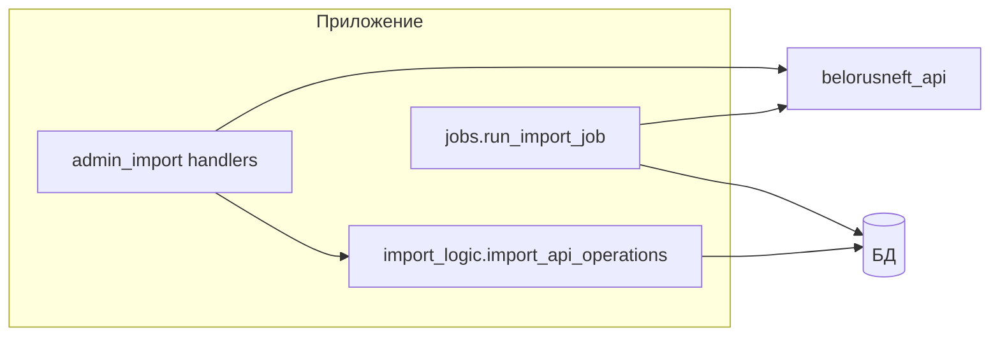

# Импорт операций API: `import_logic`, `jobs`, планировщик

## Граница с `belorusneft_api`

Модуль **`src/app/belorusneft_api.py`** инкапсулирует HTTP и разбор ответа. Остальной код опирается на **готовые** функции вроде `fetch_operational_raw`, `parse_operations` и не дублирует протокол.

## `import_logic.py` — пакетный импорт в сессию

**Функция:** `import_api_operations(db, json_payload, *, dry_run) -> ImportBatch`

| Этап | Описание |
|------|----------|
| Парсинг | `parse_operations(json_payload)` → список нормализованных операций |
| Плоские поля | `extract_flat_fields` — карта, чек, дата/время, АЗС, продукт, количество, авто |
| Дедуп | `is_duplicate_api_operation` — составной ключ по полям в уже сохранённых `api` операциях |
| Справочники | при необходимости создаётся `FuelCard`, `Car`, обновляются `owners`, `user.cars` |
| Операция | `FuelOperation(source="api", status="loaded_from_api", …)` |
| Уведомления | `batch.notify_users` / `notify_admins_ops` — **без** отправки в Telegram (это делает вызывающий код после `commit`) |

**Контракт:** функция **не делает** `commit` — откат/фиксация снаружи (удобно для dry-run).

## `jobs.py` — альтернативный «тонкий» импорт

**Функция:** `async run_import_job(bot, schedule_name, dry_run=False)`

Отличия от `import_logic`:

- Сам вызывает `fetch_operational_raw` за **вчера** в логике «календарный день UTC+3» (см. код).
- Дедуп упрощённый: `date_time` + `doc_number`.
- Статус новой операции: `awaiting_user_confirmation`.
- Сразу после создания операции шлёт `send_operation_to_user` в Telegram, если найден `presumed_user` с `telegram_id`.
- Обновляет `Schedule.last_run`.

Используется как целевой job для **APScheduler** и должен получать живой экземпляр **`Bot`**.

## `scheduler.py`

| Функция | Назначение |
|---------|------------|
| `init_scheduler()` | `BackgroundScheduler` + `SQLAlchemyJobStore(url=DATABASE_URL)` |
| `schedule_daily_import(name, hour_utc, minute)` | регистрирует cron-job с id `job_{name}` |
| `remove_schedule(name)` | снимает job с планировщика |

При старте **`run_bot.py`** читает включённые строки из таблицы `schedules` и вызывает `schedule_daily_import` для каждой.

### Важно для разработки

Сигнатура `run_import_job(bot, schedule_name, dry_run=False)` **требует** `Bot` первым аргументом. Регистрация job в APScheduler должна передавать этот объект (например через `functools.partial` или замыкание с глобальным/инжектированным ботом). Если в `args` передаётся только имя расписания, при срабатывании cron возможна ошибка времени выполнения — при правке планировщика сверяйте сигнатуру с `jobs.run_import_job`.

## Ручной импорт из админки

`admin_import.py` вызывает `fetch_operational_raw`, затем **`import_api_operations`** (или соседнюю логику в том же файле — см. актуальный код кнопки «Обновить импорт»), делает `commit`, рассылает уведомления через `send_operation_to_user`.

## Статусы операций (импорт карты)

В разных путях встречаются, например: `loaded_from_api`, `awaiting_user_confirmation`, `pending`, `confirmed`, `disputed`, `requires_manual`. Фильтры в админке и условия экспорта в Excel должны оставаться согласованными при добавлении новых значений.

← [Telegram-слой](TELEGRAM_LAYER.md) · [OCR →](OCR_INTERNALS.md)
