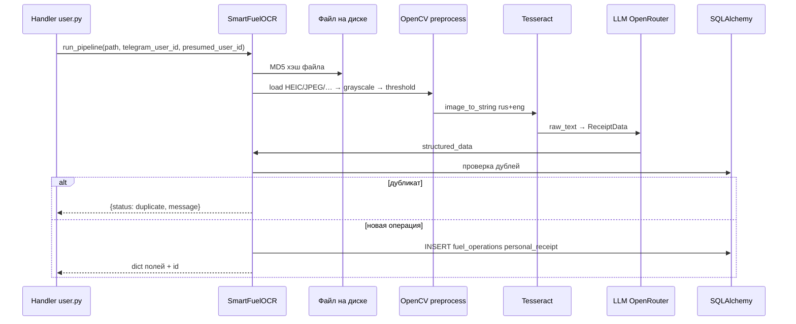

# OCR: `src/ocr/`

## Файлы

| Файл | Роль |
|------|------|
| `schemas.py` | Pydantic-модель `ReceiptData` — контракт для LLM и полей в `ocr_data` |
| `engine.py` | Класс `SmartFuelOCR`: изображение → текст → структура → БД |

## Пайплайн `SmartFuelOCR.run_pipeline`

## Этапы детально

### 1. Загрузка и хэш

- `_get_image_hash` — MD5 сырого файла (дедуп по повторной загрузке того же файла).
- `load_and_convert_image` — PIL → RGB → массив OpenCV (BGR).

### 2. Препроцессинг

`preprocess`: масштабирование по ширине ~1500px, CLAHE, лёгкое усиление контраста, bilateral filter, Otsu threshold. Цель — стабильный ввод для Tesseract.

### 3. Tesseract

- Конфиг: `--psm 6 -l rus+eng`
- Путь к бинарнику: **`TESSERACT_CMD`** в окружении или `shutil.which("tesseract")`

### 4. LLM

- `ChatOpenAI` с `base_url=https://openrouter.ai/api/v1`, ключ **`OPENROUTER_API_KEY`**
- Модель задаётся в конструкторе `SmartFuelOCR` (параметр `model_name`, значение по умолчанию см. в коде)
- `PydanticOutputParser(ReceiptData)` — ответ приводится к схеме

### 5. Дедупликация

- По `ocr_data.image_hash` (JSON path + cast в SQLAlchemy).
- По связке `doc_number` + `date_time` + `source == personal_receipt` (дата/время парсятся `_parse_receipt_datetime` с допуском форматов времени).

### 6. Сохранение операции

Поля `FuelOperation`:

- `source="personal_receipt"`
- `ocr_data` — `model_dump()` + `image_hash` + `raw_text_debug`
- `doc_number`, `date_time`, `presumed_user_id` (кто прислал фото, если пользователь найден в БД)
- `status="new"` до подтверждения в боте

## Расширение схемы чека

1. Добавить поле в **`ReceiptData`** с описанием для промпта.
2. Обновить промпт в `structure_with_llm`, если нужны новые правила.
3. При необходимости — колонки/текст в **`excel_export._operation_row`** для листа личных средств.
4. Показ пользователю — строка в **`handlers/user.py`** после OCR.

## Журналирование

Логгер `SmartFuelOCR` пишет в **`ocr_processing.log`** и в stderr (см. `setup_logging`).

← [Импорт](IMPORT_AND_JOBS.md) · [Сервисы и конфиг →](SERVICES_AND_CONFIG.md)
