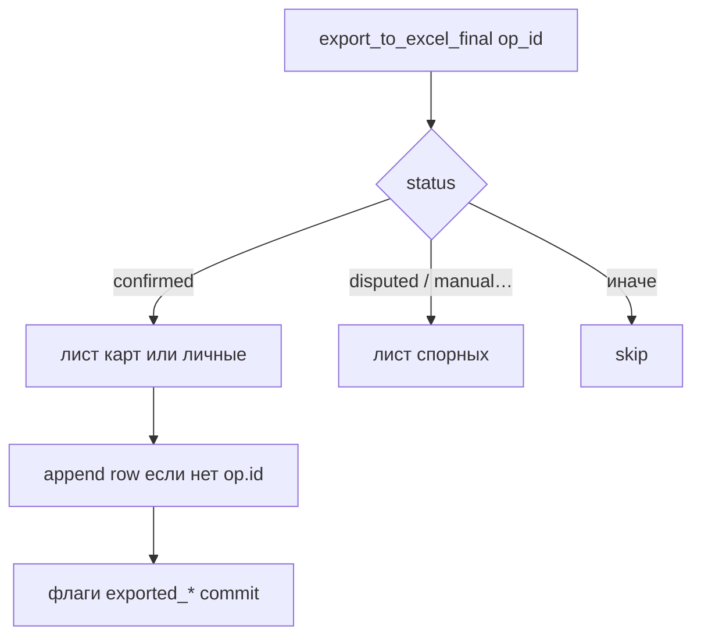

# Сервисы, экспорт, конфиг, утилиты

## `src/app/config.py`

Загрузка `.env` через `load_dotenv()`. Основные переменные:

| Переменная | Назначение |
|------------|------------|
| `DATABASE_URL` | SQLAlchemy URL |
| `BOT_TOKEN` | Telegram |
| `TOKEN_SALT`, `CODE_LENGTH`, `CODE_TTL_HOURS` | хэширование кодов привязки |
| `ADMIN_TELEGRAM_ID` | опционально, для админ-сценариев |
| `WELCOME_BANNER_PATH` | путь к картинке приветствия |
| `BEL_*` | учётные данные API (см. код, не логировать) |
| `OPENROUTER_API_KEY`, `TESSERACT_CMD` | OCR (в `config` не дублируются — читает `ocr/engine`) |

## `src/app/excel_export.py`

| Функция | Назначение |
|---------|------------|
| `_ensure_workbook` | создаёт файл и листы по ТЗ |
| `_operation_row` | одна строка из `FuelOperation` + join пользователей |
| `export_to_excel_final(op_id)` | идемпотентная запись: проверка `exported_to_excel` / спорных флагов |
| `export_operation_to_excel` | альтернативный путь выгрузки (см. отличия в коде) |

Файл по умолчанию: **`exports/Fuel_Report_Master.xlsx`**.

## `src/app/tokens.py`

- **`generate_code` / `hash_code`** — одноразовые цифровые коды, SHA256 с солью.
- **`create_bulk_codes`** — пакет для админа, возвращает plain-коды для отправки пользователю.
- **`verify_and_consume_code`** — `with_for_update`, проверка срока, статус `used`, привязка `User.telegram_id`.

## `src/app/plate_util.py`

| Функция | Назначение |
|---------|------------|
| `normalize_plate` | верхний регистр, удаление пробелов/дефисов/точек |
| `plates_equal` | сравнение после нормализации |
| `find_cars_by_normalized_plate(db, norm)` | полный перебор `Car` с нормализацией `plate` (для небольших справочников достаточно; при росте данных имеет смысл индекс/кэш) |

Используется в сценарии личных средств и при вводе госномера по карте.

## `src/app/welcome_store.py`

Файл **`exports/welcome_shown.json`**: список Telegram ID, которым уже показано приветствие с первого `/start`. Не хранит PII, только числовые id.

## `src/app/seed.py` + `manage.py`

- **`seed_roles_and_permissions`** — базовые роли и право `admin:manage`.
- **`python -m src.app.manage`** (или запуск `manage.py` как скрипта): `init_db()` + seed — подготовка пустой БД.

## Прочие файлы в `app/`

| Файл | Заметка |
|------|---------|
| `legacy_ssl.py` | обход SSL для особых окружений при запросах API |
| `bot_ref.py` | вспомогательные ссылки на бота, если используются |
| `migrate_old_ops.py` (в `src/`) | разовые миграции данных, не часть runtime бота |

## Точка входа

**`src/run_bot.py`**: `asyncio.run(main())` — инициализация БД, регистрация хендлеров, команды меню бота, планировщик, `dp.start_polling(bot)`.

← [OCR](OCR_INTERNALS.md) · [Оглавление модулей](README.md)
