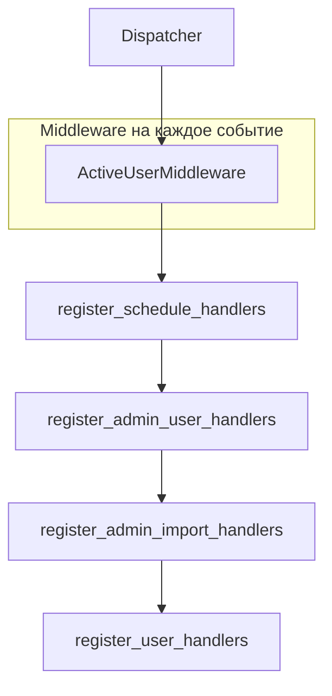
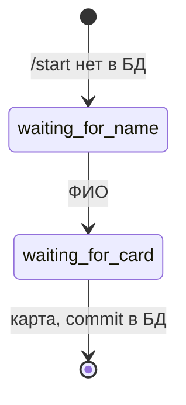
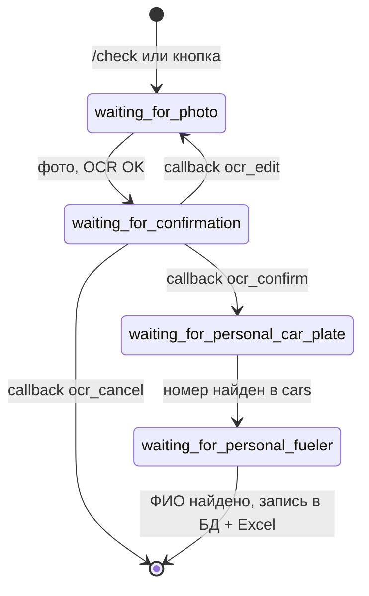
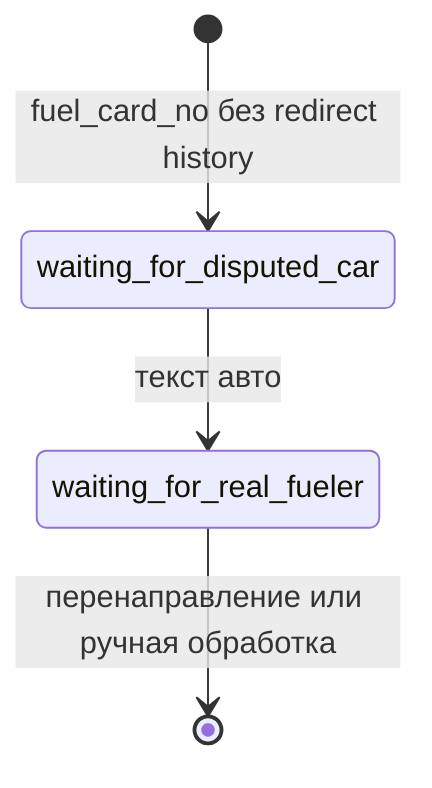

# Telegram-слой: `src/app/bot/`

## Сборка диспетчера

Точка сборки — **`src/app/bot/register.py`** → `register_handlers(dp)`.

**Порядок регистрации важен:** сначала админские и служебные команды, затем широкие пользовательские фильтры (`F.text == …`), иначе общие хендлеры могут перехватить `/command`.

`src/run_bot.py` вызывает `register_handlers` из **`src.app.bot`** (пакет `app/bot/__init__.py` должен реэкспортировать ту же функцию). Файл **`src/app/bot_handlers.py`** — устаревший минимальный вариант; **актуальная** регистрация в `app/bot/register.py`.

## ActiveUserMiddleware (`permissions.py`)

| Условие | Поведение |
|---------|-----------|
| Сообщение начинается с `/start` или `/link` | всегда пропускается |
| FSM-состояние `RegistrationStates:*` | пропуск (регистрация до активации) |
| Пользователь в БД с `active=False` | ответ с просьбой `/link`, **handler не вызывается** |
| Иначе | вызов следующего handler |

Колбэки (`CallbackQuery`) не разбирают `/start` по тексту; для них действует только проверка `active` и состояние FSM.

## Модули хендлеров

### `handlers/user.py`

- Пользовательские команды и reply-кнопки.
- FSM: **регистрация** (`RegistrationStates`) и **чек за личные средства** + сценарии спора по карте (`ReceiptStates`).
- Импортирует `send_operation_to_user` из **`notifications.py`** (не дублировать функцию в `user.py`).

### `handlers/admin_schedules.py`

| Команда | Действие |
|---------|----------|
| `/schedule_get` | список расписаний из `schedules` |
| `/schedule_set name HH:MM` | UTC, запись в БД + `schedule_daily_import` |
| `/schedule_remove name` | удаление из БД + `remove_schedule` |

### `handlers/admin_users.py`

- `/users`, пагинация, просмотр карточки, `/generate_code`, `/export_codes`, колбэки `toggle_active`, `gen_code`, и т.д.

### `handlers/admin_import.py`

- Ручной импорт (`run_import_now`, кнопки), списки операций, назначения, Excel, дублирующие кнопки на часть команд из `admin_users` / расписаний.

## FSM: регистрация нового пользователя

## FSM: личные средства (чек)

При нескольких авто с одним нормализованным номером показывается inline-клавиатура; после выбора состояние переходит в `waiting_for_personal_fueler` (см. `callback_select_personal_car`).

## FSM: спор по карте (фрагмент)

## Inline callback-префиксы (шпаргалка)

| Префикс | Назначение |
|---------|------------|
| `fuel_card_yes_` / `fuel_card_no_` | подтверждение операции с карты |
| `ocr_confirm_` / `ocr_edit_` / `ocr_cancel_` | OCR черновик личных средств |
| `personal_car_` | выбор авто при нескольких совпадениях |
| `confirm_op:` / `assign_op:` / `mark_dispute:` | админка операций |
| `op_confirm:` / `op_reject:` | устаревший/доп. вариант клавиатур операций |

## `keyboards.py`

Централизованные тексты кнопок (константы `BTN_*`) и сборщики `InlineKeyboardMarkup` / `ReplyKeyboardMarkup`. При добавлении новой reply-кнопки — завести константу и зарегистрировать handler с `F.text == BTN_…`.

## `notifications.py`

`send_operation_to_user(bot, telegram_id, operation_id)` — единая точка текста «По вашей топливной карте…» и клавиатуры подтверждения. Используется из `user.py`, `admin_import.py`, `jobs.py` (через `bot_handlers` re-export).

← [Данные](DATA_LAYER.md) · [Импорт и jobs →](IMPORT_AND_JOBS.md)
