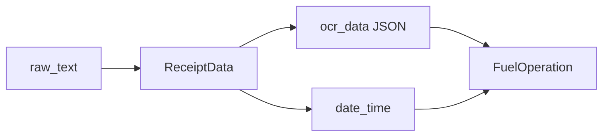

# OCR / DATA_CONTRACTS

Контракты данных OCR-подсистемы: что приходит, что сохраняется и что используют downstream-модули.

## `ReceiptData` (Pydantic схема)

Источник: `src/ocr/schemas.py`.

```python
class ReceiptData(BaseModel):
    fuel_type: Optional[str]
    quantity: Optional[float]
    price_per_liter: Optional[float]
    doc_number: Optional[str]
    azs_number: Optional[str]
    date: Optional[str]       # ДД.ММ.ГГГГ
    time: Optional[str]       # ЧЧ:ММ:СС
    total_sum: Optional[str]
    pump_no: Optional[str]
    azs_address: Optional[str]
    additional_info: Optional[str]
```

## `FuelOperation` поля, которые трогает OCR

Источник: `src/app/models.py`.

- `source = "personal_receipt"`
- `ocr_data` (JSON с полями из `ReceiptData` + debug)
- `doc_number`
- `date_time`
- `status = "new"` (до user confirm)

## Формат `ocr_data` в БД

Минимальный пример после `run_pipeline`:

```json
{
  "fuel_type": "АИ-95",
  "quantity": 45.2,
  "doc_number": "123456",
  "azs_number": "12",
  "date": "05.04.2026",
  "time": "14:30:00",
  "total_sum": "125.50",
  "image_hash": "ab12cd34...",
  "raw_text_debug": "..."
}
```

## Контракт времени/даты

`engine.py` ожидает:

```python
datetime.strptime(f"{structured_data.date} {structured_data.time}", "%d.%m.%Y %H:%M:%S")
```

Следствие:

- `date` строго `ДД.ММ.ГГГГ`;
- `time` строго `ЧЧ:ММ:СС`.

Иначе запись операции упадет на conversion этапе.

## Контракт ручного ввода (manual fallback)

В `user.py` ручной парсер приводит текст к тем же полям `ReceiptData`.

```python
structured = ReceiptData.model_validate(parsed)
op.ocr_data = structured.model_dump()
```

Это позволяет:

- иметь единый формат данных для auto-OCR и manual;
- не дублировать downstream-логику (экспорт/отчеты).

## Контракт для Excel

`src/app/excel_export.py` читает:

- `ocr_data.fuel_type`
- `ocr_data.quantity`
- `ocr_data.total_sum`
- `ocr_data.azs_number`
- `ocr_data.raw_text_debug`

Если поле отсутствует:

- в export ставятся fallback значения (`—`/пусто).

## Контракт для прототипирования OCR-отчета

`prototiping/reporting/ocr.py` ориентируется на:

- `run_pipeline` return format,
- `None`/`duplicate`/`success`,
- лог `ocr_processing.log`.

## Изменение контрактов: обязательная последовательность

1. Обновить `ReceiptData`.
2. Обновить `engine.py` prompt и сохранение.
3. Обновить manual parser в `user.py`.
4. Обновить экспорт (`excel_export.py`).
5. Обновить docs `OCR/*` + связанные `BOT_SRC` файлы.

## Мини validation checklist

- JSON в `ocr_data` сериализуется без ошибок.
- `doc_number` не теряется между OCR и confirm.
- `date_time` корректно парсится из `date+time`.
- `raw_text_debug` сохраняется для диагностики.

## Подробная карта полей `ReceiptData`

### `fuel_type`

- тип топлива (например, АИ-95, ДТ);
- downstream: отображается в preview и в Excel.

### `quantity`

- объем в литрах (float);
- downstream: бизнес-ключ дедупа + Excel.

### `doc_number`

- номер чека/документа;
- downstream: дедуп + поиск + Excel.

### `date` и `time`

- string-поля в фиксированном формате;
- при save конвертируются в `FuelOperation.date_time`.

### `total_sum`, `azs_number`, `pump_no`

- используются для отображения пользователю и отчетности.

### `additional_info`

- резервное поле для редких текстовых артефактов.

## Схема преобразований данных



## Contract: `ocr_data` расширяется служебными полями

Помимо `ReceiptData`, pipeline добавляет:

- `image_hash`
- `raw_text_debug`
- иногда `id` в возвращаемом dict (не обязательно в БД JSON)

Пример:

```python
full_ocr_json = structured_data.model_dump()
full_ocr_json["image_hash"] = img_hash
full_ocr_json["raw_text_debug"] = raw_text
```

## Где поля контракта читаются в коде

### В `user.py`

- формирование карточки подтверждения:
  - `fuel_type`, `quantity`, `total_sum`, `azs_number`, `doc_number`, `date`, `time`.

### В `excel_export.py`

- для `source=personal_receipt`:
  - `fuel_type`, `quantity`, `total_sum`, `azs_number`;
- для колонки OCR:
  - `raw_text_debug`.

### В `engine.py` dedup

- `doc_number`, `date`, `time`, `quantity`.

## Контракт ручного ввода (manual parser)

Ключевая идея: manual path должен выдать структуру, совместимую с `ReceiptData`.

Валидация:

- обязательные поля: топливо, литры, чек, дата, время;
- формат даты/времени нормализуется;
- quantity приводится к float.

## Типы и serialization caveats

1. `quantity` float может быть `45` или `45.0` при сериализации.
2. `total_sum` хранится как string в текущей схеме.
3. `date_time` хранится отдельно в ORM как `DateTime`.
4. JSON поля должны быть сериализуемы стандартным encoder.

## Совместимость между версиями

При эволюции схемы важно:

- не удалять старые поля без миграционного fallback;
- добавлять новые поля optional;
- сохранять возможность читать исторические `ocr_data`.

## Пример миграционного fallback в чтении

```python
ocr = op.ocr_data if isinstance(op.ocr_data, dict) else {}
fuel = ocr.get("fuel_type") or ocr.get("product") or "—"
```

## Контракт для API/WEB представления

Если web endpoint отдает OCR-операции:

- не светить `raw_text_debug` в публичный JSON без нужды;
- отдавать "чистые" поля (`doc_number`, `date_time`, amount, fuel_type).

## Security/PII considerations

- `raw_text_debug` может содержать лишние персональные данные из чека;
- при экспорте/логировании учитывать политику хранения;
- избегать отправки полного `raw_text_debug` в внешние API ответа.

## Checklist при изменении схемы

1. Обновить `ReceiptData`.
2. Обновить pipeline save.
3. Обновить manual parser.
4. Обновить Excel mapping.
5. Обновить web serializers (если затронуто).
6. Прогнать старые записи (backward read compatibility).

## Пример теста контракта

```python
def test_receipt_data_contract_roundtrip():
    payload = {
        "fuel_type": "АИ-95",
        "quantity": 45.2,
        "doc_number": "123",
        "date": "05.04.2026",
        "time": "14:30:00",
    }
    model = ReceiptData.model_validate(payload)
    out = model.model_dump()
    assert out["fuel_type"] == "АИ-95"
    assert float(out["quantity"]) == 45.2
```

## Anti-patterns по контрактам

1. Хранить дату/время только строками без `date_time` в ORM.
2. Привязывать UI напрямую к сырому `raw_text_debug`.
3. Смешивать типы (`quantity` как string в одном месте, float в другом).
4. Удалять обязательное поле без fallback.

## Дополнительные примеры валидации контракта

### Проверка обязательных полей для ручного сценария

```python
required = ("fuel_type", "quantity", "doc_number", "date", "time")
missing = [k for k in required if not payload.get(k)]
assert not missing, f"missing fields: {missing}"
```

### Нормализация времени `HH:MM -> HH:MM:SS`

```python
time_s = payload["time"]
if len(time_s) == 5:
    time_s = time_s + ":00"
payload["time"] = time_s
```

### Проверка сериализации JSON перед save

```python
import json
json.dumps(ocr_data, ensure_ascii=False)
```

## Контракт совместимости с историческими записями

При чтении старых операций:

- поле может отсутствовать;
- тип может отличаться (str vs float);
- ключ может называться иначе в legacy payload.

Рекомендация:

```python
qty = ocr.get("quantity")
if qty is None:
    qty = ocr.get("liters") or ocr.get("qty")
```

## Модель эволюции контракта (рекомендуемая)

1. Добавление нового поля как optional.
2. Двойное чтение old/new ключей.
3. Миграция исторических данных (по необходимости).
4. Перевод downstream на новый ключ.
5. Удаление legacy-ключа только после стабилизации.
