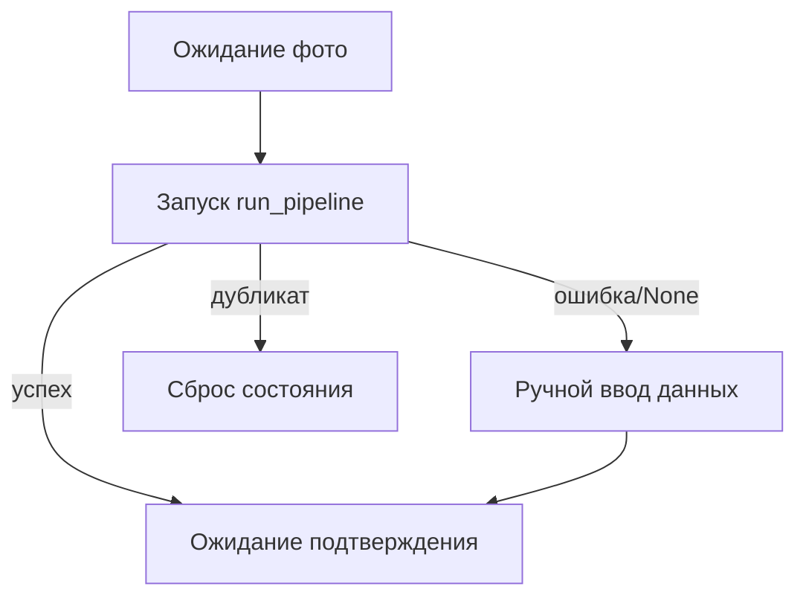

# OCR / INTEGRATION

Как OCR интегрирован в бот, БД, Excel и прототипирование.

## Интеграция с Telegram flow (`user.py`)

Ключевая функция: `handle_receipt_photo`.

```python
with get_db_session() as db:
    processor = SmartFuelOCR(db)
    ocr_result = await asyncio.wait_for(
        asyncio.to_thread(processor.run_pipeline, file_path, telegram_user_id=message.from_user.id),
        timeout=OCR_PIPELINE_TIMEOUT_SEC,
    )
```

После этого:

- `None` -> manual fallback;
- `duplicate` -> предупреждение;
- success -> сохранение `op_id` в FSM и экран подтверждения.

## Интеграция с FSM

Основные состояния:

- `waiting_for_photo`
- `waiting_for_confirmation`
- `waiting_for_manual_receipt_text`
- `waiting_for_personal_fueler`

Переходы:



## Интеграция с БД

OCR создает `FuelOperation(source=personal_receipt)` со статусом `new`.

Дальше user-confirm flow в `user.py`:

- проставляет `confirmed_user_id`, `actual_car`, `confirmed_at`;
- переводит в `status="confirmed"`;
- пишет `ConfirmationHistory`.

## Интеграция с Excel

После финального подтверждения:

```python
export_to_excel_final(op_id)
```

`excel_export.py` берет данные из `ocr_data` и пишет в лист "Заправки_личные_средства".

## Интеграция с Web

Web backend работает на той же БД (`src.app.models`), поэтому OCR-операции доступны и там:

- через операции endpoints;
- через excel report service.

## Интеграция с прототипированием

`prototiping/reporting/ocr.py` делает диагностический прогон `run_pipeline` на образцах и пишет секцию отчета:

- success/duplicate/none,
- куски `ocr_processing.log`,
- json output.

## Точки отказа на границах интеграции

1. Telegram -> OCR: timeout или download error.
2. OCR -> DB: `datetime` parse error или commit fail.
3. DB -> Excel: file lock/permission.
4. OCR -> prototyping report: missing env (`OPENROUTER_API_KEY`).

## Рекомендуемые smoke-проверки интеграции

1. Отправить фото чека в боте.
2. Подтвердить распознанные данные.
3. Проверить запись в `FuelOperation`.
4. Проверить строку в `Fuel_Report_Master.xlsx`.
5. Проверить web endpoint, что операция видна.

## Подробная интеграция с `user.py`

### `btn_send_receipt_start`

- вход в сценарий;
- проверка привязки пользователя;
- установка `ReceiptStates.waiting_for_photo`.

### `handle_receipt_photo`

- скачивание файла;
- вызов OCR в `to_thread`;
- развилка на success/duplicate/none;
- формирование preview-сообщения.

### `callback_ocr_confirm` / `callback_ocr_edit`

- confirm path ведет к выбору авто и фактического пользователя;
- edit path ведет к manual input или повторному фото.

### `process_manual_receipt_text`

- парсит текстовые поля;
- валидирует `ReceiptData`;
- обновляет `ocr_data` той же операции.

### `process_personal_fueler_name`

- финализирует запись:
  - `status="confirmed"`,
  - `confirmed_user_id`,
  - `actual_car`,
  - `confirmed_at`,
  - `ConfirmationHistory`.

## Взаимодействие OCR и Excel на уровне статусов

OCR создает `status="new"`.

Export path запускается после подтверждения:

- когда `status` становится `confirmed`;
- `excel_export.export_to_excel_final(op_id)` выбирает лист "личные средства".

## Интеграция с правами/доступом

Хотя OCR user-flow обычно доступен пользователю:

- middleware `ActiveUserMiddleware` блокирует неактивных;
- onboarding/link path остается доступным.

Следствие:

- OCR путь не должен обходить middleware проверки.

## Интеграция с web backend

Web использует ту же БД и те же модели:

- OCR-операции доступны через `operations` роуты;
- Excel download включает и OCR-операции.

## Интеграция с prototyping OCR-report

`prototiping/reporting/ocr.py`:

- запускает pipeline на образцах;
- собирает markdown-секцию;
- при `None` подтягивает релевантный кусок `ocr_processing.log`.

Практический смысл:

- отделяет "боевой OCR путь" и "диагностический отчет".

## Границы ответственности интеграционных слоев

| Слой | Ответственность | Не должен делать |
|---|---|---|
| OCR engine | распознавание и save | управлять FSM/UI |
| Bot handler | UX/FSM/подтверждение | менять internals OCR |
| Excel export | финальная отчетная запись | запускать OCR |
| Prototyping report | диагностика OCR | менять production данные |

## Пример интеграционного тест-кейса (псевдоплан)

1. Отправить валидное фото.
2. Получить preview с `doc_number`.
3. Подтвердить и выбрать авто.
4. Проверить `FuelOperation.status == "confirmed"`.
5. Проверить строку в excel.

## Типовые интеграционные race/consistency кейсы

1. Пользователь нажал callback после `state.clear`.
2. Вторая попытка отправки того же фото до завершения первой.
3. OCR success, но экспорт падает (partial success).
4. Duplicate от OCR и параллельно manual flow.

Рекомендации:

- idempotent callbacks;
- clear пользовательские сообщения при устаревшем op_id;
- явные ответы пользователю о статусе операции.

## Диагностика интеграции по логам

Сопоставлять:

- bot log (`user.py`) по времени и file_id;
- `ocr_processing.log` по имени файла;
- БД запись (`FuelOperation.id`, `status`) после шага.

## Чеклист изменений в интеграции

1. При изменении OCR результата обновить preview сообщение.
2. При изменении callback payload обновить клавиатуры и handlers.
3. При изменении статусов обновить export условия.
4. Обновить docs в `OCR/*` и `BOT_SRC/*`.

## Расширенный сценарий интеграции (псевдотрейс)

```text
user sends photo
 -> bot downloads file
 -> OCR run_pipeline
 -> db insert FuelOperation(new)
 -> bot asks confirm/edit
 -> user picks car and fueler
 -> db update FuelOperation(confirmed)
 -> excel_export writes row
```

## Полезные интеграционные проверки в коде

### Проверка наличия `op_id` после OCR

```python
op_id = ocr_result.get("id")
if not op_id:
    # fallback lookup by image_hash
    ...
```

### Проверка доступности операции для редактирования

```python
if not _can_edit_personal_receipt_op(db, op, telegram_id):
    await message.answer("Операция недоступна.")
    return
```

### Проверка успешности экспорта после confirm

```python
try:
    export_to_excel_final(op_id)
except Exception:
    await message.answer("Подтверждено в БД, но ошибка Excel.")
```

## Слои согласованности данных

1. OCR слой формирует `ocr_data`.
2. Bot слой подтверждает человека и авто.
3. DB слой хранит итоговый статус.
4. Export слой делает финальную запись.

Если один слой падает:

- важно не потерять предыдущий подтвержденный шаг.

## Сценарии конкурентного поведения

### Два callback на одну операцию

Риск:

- пользователь нажимает кнопку повторно.

Защита:

- проверка статуса и доступности операции перед мутацией.

### Параллельная отправка одинаковых фото

Риск:

- двойная вставка.

Защита:

- duplicate_hash + duplicate_biz.

## Интеграция с логами и observability

Рекомендуется коррелировать события по:

- `operation_id`,
- `telegram_user_id`,
- `image_hash`,
- timestamp.

Это упрощает разбор цепочки "фото -> OCR -> confirm -> export".

## Минимальный набор интеграционных smoke automation шагов

1. Загрузить фикстуру изображения.
2. Дождаться OCR ответа.
3. Проверить, что `op_id` выдан.
4. Подтвердить через callback.
5. Проверить статус в БД и строку в Excel.

## Что логировать в integration tests

- входной `file_id` / `image_hash`;
- результат OCR (`success/duplicate/none`);
- `operation_id`;
- финальный `status`;
- результат export.
