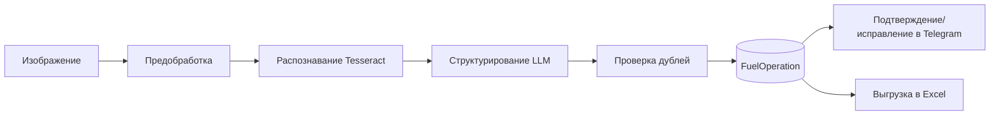
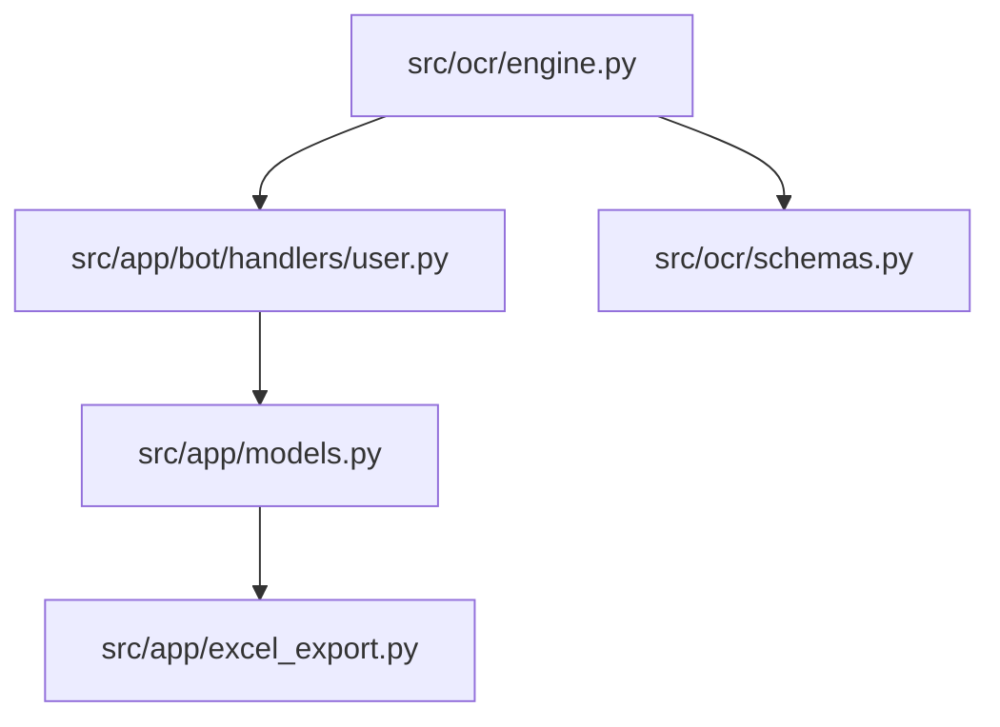

# OCR

Подробная документация OCR-подсистемы проекта: как она устроена в коде, как проходит обработка чека, где происходит дедупликация, как сохраняются данные и как дебажить ошибки.

## Область

- код OCR-движка: `src/ocr/engine.py`, `src/ocr/schemas.py`
- интеграция с ботом: `src/app/bot/handlers/user.py`
- запись результата: `src/app/models.py` (`FuelOperation`)
- экспорт результата: `src/app/excel_export.py`

## Архитектура OCR



## Навигация по разделам

- [PIPELINE](PIPELINE.md) — пошаговый разбор `SmartFuelOCR.run_pipeline`.
- [DATA_CONTRACTS](DATA_CONTRACTS.md) — `ReceiptData`, `ocr_data`, связи с `FuelOperation`.
- [INTEGRATION](INTEGRATION.md) — как OCR встроен в Telegram/FSM и export-поток.
- [DEDUP_AND_VALIDATION](DEDUP_AND_VALIDATION.md) — алгоритм дедупликации и риски.
- [TROUBLESHOOTING](TROUBLESHOOTING.md) — типовые сбои, диагностика, команды проверки.

## Быстрые code anchors

```python
# src/ocr/engine.py
class SmartFuelOCR:
    def run_pipeline(self, image_path: str, telegram_user_id: int = None):
        ...
```

```python
# src/ocr/schemas.py
class ReceiptData(BaseModel):
    fuel_type: Optional[str]
    quantity: Optional[float]
    doc_number: Optional[str]
    date: Optional[str]
    time: Optional[str]
```

```python
# src/app/bot/handlers/user.py
ocr_result = await asyncio.wait_for(
    asyncio.to_thread(processor.run_pipeline, file_path, telegram_user_id=message.from_user.id),
    timeout=OCR_PIPELINE_TIMEOUT_SEC,
)
```

## Связанные документы

- [BOT_SRC OCR_MODULE](../BOT_SRC/OCR_MODULE.md) — краткий обзор OCR в контексте `src`.
- [BOT_SRC PERSONAL_FUNDS_SCENARIO](../BOT_SRC/PERSONAL_FUNDS_SCENARIO.md) — полный пользовательский сценарий.
- [BOT_SRC EXCEL_AND_DATA](../BOT_SRC/EXCEL_AND_DATA.md) — куда OCR-данные попадают в Excel.

## Для чего выделен отдельный OCR-домен

Причины:

1. OCR-код и его интеграция сложнее обычного "модульного overview".
2. Ранее OCR-материал дублировался в `BOT_SRC/OCR_MODULE` и `BOT_SRC/MODULES/OCR_INTERNALS`.
3. Для разработчика важнее "source of truth" в одном месте с ссылками в другие домены.

## Границы OCR-домена

Внутри `docs/OCR/*`:

- алгоритмы OCR и дедупа;
- контракты данных;
- интеграция с ботом/экспортом/прототипированием;
- диагностика инцидентов.

Вне `docs/OCR/*`:

- бизнес-сценарии пользователя (`BOT_SRC/PERSONAL_FUNDS_SCENARIO`);
- общая архитектура системы (`BOT_SRC/MODULES/ARCHITECTURE`);
- web API детали (`WEB/MODULES/*`).

## Быстрый маршрут чтения (для нового разработчика)

1. `README.md` (этот файл) — карта и границы.
2. `PIPELINE.md` — что делает `run_pipeline` по шагам.
3. `DATA_CONTRACTS.md` — какие поля и где живут.
4. `INTEGRATION.md` — как это связано с ботом и Excel.
5. `DEDUP_AND_VALIDATION.md` — как не плодить дубли.
6. `TROUBLESHOOTING.md` — как разбирать падения.

## Роли файлов OCR-домена (таблица)

| Файл | Главный вопрос |
|---|---|
| `README.md` | Что входит в OCR-домен и где искать детали? |
| `PIPELINE.md` | Как именно работает `run_pipeline` в коде? |
| `DATA_CONTRACTS.md` | Какие поля и форматы считаются контрактом? |
| `INTEGRATION.md` | Как OCR встраивается в Telegram/DB/Excel/web/prototyping? |
| `DEDUP_AND_VALIDATION.md` | Как работает дедуп и где риски ложных срабатываний? |
| `TROUBLESHOOTING.md` | Как диагностировать сбои и какие команды запускать? |

## Мини glossary OCR-домена

- **raw_text** — результат tesseract до LLM.
- **ReceiptData** — типизированная модель чека после LLM.
- **ocr_data** — JSON в `FuelOperation` (ReceiptData + debug поля).
- **duplicate_hash** — дубль по хэшу файла.
- **duplicate_biz** — дубль по бизнес-полям.
- **manual fallback** — ручной ввод, когда auto OCR не дал результата.

## Связь OCR с ключевыми production-файлами



## Принципы ведения OCR-документации

1. Любое изменение `ReceiptData` отражается в `DATA_CONTRACTS`.
2. Любое изменение `run_pipeline` отражается в `PIPELINE`.
3. Любое изменение fallback/confirm flow отражается в `INTEGRATION`.
4. Любые новые инциденты и методы диагностики попадают в `TROUBLESHOOTING`.

## Чеклист "документация актуальна"

- Сигнатуры функций соответствуют текущему коду.
- Все env-переменные указаны.
- Примеры кода не псевдо, а по реальному пути в репозитории.
- Нет дублей с `BOT_SRC` (там только краткий обзор и ссылки).

## Основные runtime-сценарии OCR

### Сценарий A: успешное распознавание

1. Пользователь отправляет фото.
2. Бот сохраняет временный файл.
3. `run_pipeline` возвращает `dict` с `id`.
4. Пользователь подтверждает/исправляет данные.
5. Операция подтверждается и экспортируется в Excel.

### Сценарий B: `None` от pipeline

1. Ошибка на decode/tesseract/llm/save.
2. Бот предлагает manual fallback.
3. Пользователь вводит поля вручную.
4. Дальше стандартный confirm path.

### Сценарий C: duplicate

1. OCR видит duplicate_hash или duplicate_biz.
2. Возвращает `{"status":"duplicate"}`.
3. Бот не создает новую запись.

## Сопоставление разделов OCR и реальных файлов проекта

| Раздел OCR docs | Файлы проекта |
|---|---|
| Pipeline | `src/ocr/engine.py` |
| Data contracts | `src/ocr/schemas.py`, `src/app/models.py` |
| Integration | `src/app/bot/handlers/user.py`, `src/app/excel_export.py` |
| Dedup | `src/ocr/engine.py` (`_check_duplicates`) |
| Troubleshooting | `ocr_processing.log`, bot logs, DB state |

## Dev-note: почему OCR стоит отдельно от BOT_SRC

OCR имеет:

- собственный pipeline с ML/LLM эвристиками;
- особую диагностику и эксплуатационные риски;
- контракт на стыке Python/OpenCV/Tesseract/LLM/SQLAlchemy.

В `BOT_SRC` достаточно краткого контекста и ссылок.

## Пример "читать код по документации"

Маршрут:

1. В `PIPELINE.md` смотри шаг "Этап 4: LLM-структурирование".
2. Открывай `src/ocr/engine.py:structure_with_llm`.
3. В `DATA_CONTRACTS.md` смотри какие поля обязательны downstream.
4. В `INTEGRATION.md` смотри где результат используется в `user.py`.

## Пример изменений и куда писать документацию

### Изменили формат времени (`HH:MM`)

Обновить:

- `PIPELINE.md` (parse/save шаг);
- `DATA_CONTRACTS.md` (date/time контракт);
- `TROUBLESHOOTING.md` (ошибка `strptime`).

### Добавили новое поле в чек

Обновить:

- `DATA_CONTRACTS.md` (новое поле + тип);
- `INTEGRATION.md` (где поле отображается/используется);
- при необходимости `EXCEL_AND_DATA` в BOT_SRC.

### Изменили дедуп-правило

Обновить:

- `DEDUP_AND_VALIDATION.md` (алгоритм и риски);
- `TROUBLESHOOTING.md` (диагностика duplicate кейсов).

## OCR quality signals (практика)

Что стоит мониторить:

- доля `run_pipeline -> None`;
- доля duplicate;
- средняя latency по этапам;
- процент manual fallback после OCR.

Эти метрики полезны для продуктовой и тех. оценки.

## Рекомендуемый формат commit-сообщений для OCR изменений

Пример:

```text
refine ocr duplicate checks for quantity normalization

Reduce false duplicate matches by normalizing quantity format before business-key comparison.
Update OCR docs and troubleshooting accordingly.
```

## Правило поддержки этого домена

- Любое изменение OCR-кода без изменения `docs/OCR/*` считается неполным.
- Если поведение не изменилось, но рефакторинг затронул сигнатуры/flow — docs тоже обновляются.

## Связь с тестированием

Желательно иметь:

- unit-тесты на parser/normalization;
- интеграционные smoke на `run_pipeline` (mock LLM);
- сценарные проверки через `prototiping` OCR-report.

## Частые вопросы (FAQ)

### Почему в `run_pipeline` есть `telegram_user_id`, но не всегда используется?

Параметр оставлен для контекстной привязки/расширений; основной save-path опирается на вызывающий handler.

### Почему `total_sum` строка, а не float?

Текущий контракт ориентирован на устойчивость LLM-выхода; при необходимости можно ввести нормализацию и decimal-поле.

### Почему duplicate делается в OCR, а не только в импорте?

OCR и API импорт — разные источники данных, у OCR свой жизненный цикл и типичные дубли.

## Завершающий checklist перед merge OCR PR

1. Код: pipeline + contracts + integration.
2. Docs: обновлены нужные файлы в `docs/OCR`.
3. Smoke: success/none/duplicate.
4. Логи: понятные сообщения об ошибках.
5. Нет дублирования OCR-подробностей в `BOT_SRC` (только ссылки).

## Дополнительные ссылки по коду

- `src/ocr/engine.py` — основной pipeline.
- `src/ocr/schemas.py` — контракты модели чека.
- `src/app/bot/handlers/user.py` — вызов OCR и FSM-flow.
- `src/app/excel_export.py` — финальная выгрузка личных чеков.
- `prototiping/reporting/ocr.py` — диагностический OCR-отчет.

## Принцип "один источник истины"

Для OCR-подробностей:

- `docs/OCR/*` — source of truth.
- `docs/BOT_SRC/*` — контекст и ссылки.

Это правило предотвращает рассинхрон между доменами.

## Commit policy для OCR docs

Если затронуты функции:

- `run_pipeline`,
- `_check_duplicates`,
- `ReceiptData`,

то изменения в `docs/OCR/*` обязательны в том же PR.
