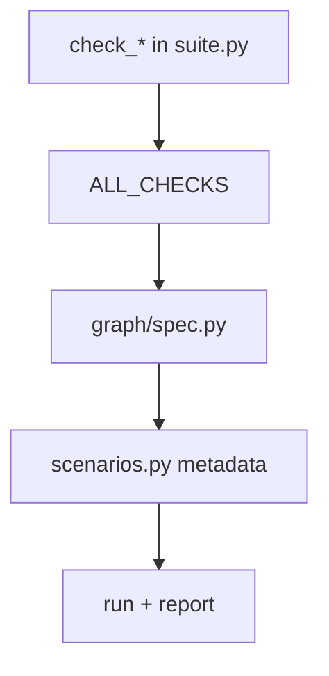

# PROTOTIPING ADDING SCENARIOS

Краткая памятка по добавлению нового сценария.



Обязательные поля в `SCENARIO_META`:

- `id`
- `graph_node`
- `title`
- `code_under_test`
- `description`
- `kind` (`standard`/`breaker`)
- `scenario_version`

## Технический чеклист перед коммитом

1. **`graph_node`** должен совпадать с `id` узла в `GRAPH_NODES_SPEC`, иначе в отчёте сценарий окажется «не у того» узла визуально.
2. **`kind=breaker`** выбирайте только если сценарий **намеренно** ожидает `ok=False`; иначе каждый зелёный прогон будет считаться FP.
3. После изменения списка сценариев прогоните пакет: `verify_spec_matches_all_checks()` поймает рассинхрон `ALL_CHECKS` и графа.
4. Если сценарий трогает `src`, не меняйте прод-код ради теста — расширяйте только `prototiping` (импорты, обход циклов, моки внутри `suite.py`).

Основной гайд:
- [QUICKSTART](QUICKSTART.md)
- [HOW_IT_WORKS](HOW_IT_WORKS.md)

## Шаблон standard-сценария

```python
def check_template_standard() -> dict:
    # arrange
    value = 2 + 2
    # assert
    if value == 4:
        return _result("template standard", True, "value matched")
    return _result("template standard", False, "unexpected value")
```

## Шаблон breaker-сценария

```python
def check_template_breaker() -> dict:
    # breaker: корректно, если ok=False
    bypass_happened = True
    if bypass_happened:
        return _result("template breaker", False, "bypass reproduced")
    return _result("template breaker", True, "bypass not reproduced")
```

## Пример добавления в `SCENARIO_META`

```python
"check_template_standard": {
    "id": "S201",
    "graph_node": "auth_permissions",
    "title": "Template standard",
    "code_under_test": "`src/app/...`",
    "description": "Пример стандартного сценария.",
    "kind": "standard",
    "scenario_version": SCENARIO_SCHEMA_VERSION,
},
```

## Чек-команды после добавления

```bash
PYTHONPATH=. python -m prototiping
PYTHONPATH=. python -m prototiping.tools.graph_preview
```
