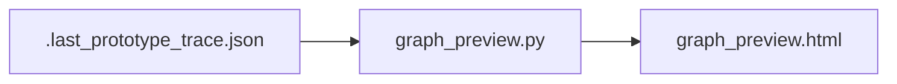

# PROTOTIPING GRAPH PREVIEW HTML

HTML-превью графа генерируется в:

- `prototiping/output/graph_preview.html`

Команда:

```bash
PYTHONPATH=. python -m prototiping.tools.graph_preview
```

## Технически: откуда берутся данные

1. **По умолчанию** используется файл **`prototiping/.last_prototype_trace.json`**, если он уже есть после прогона (`run_prototype_traced()` в `graph/trace.py` записывает его в конец выполнения графа).

2. **`graph_preview.py`** вызывает `_load_trace()`: если JSON-трассы нет или битый, выполняется **короткий прогон** `run_prototype_traced(console=False, write_trace_json=True)` и затем строится HTML. То есть отдельно «только ради HTML» граф можно не запускать — инструмент сам догонит трассу.

3. Далее сценарии обогащаются метаданными из `checks/scenarios.py` и собираются секции: Mermaid + таблицы по узлам.

Источник истины по фактам прогона — по-прежнему **структура трассы** (узлы, `checks`, P/N); HTML лишь отображает её в браузере.

## Что показывает

- Mermaid-диаграмму
- таблицы по узлам и сценариям
- класс `P/N` и факт `+/-`

Колонки **«Класс»** и **«Факт»** соответствуют полям трассы `expected_class` и `actual_sign` (см. [HOW_IT_WORKS](HOW_IT_WORKS.md)): разработчик видит то же самое, что попадает в `REPORT.md`, но в браузере.



## Связь с отчётом

- **Markdown-отчёт** (`REPORT.md`) — полная текстовая сводка, OCR, матрица ошибок.
- **HTML** — быстрый обзор графа и узлов без прокрутки длинного markdown.

Обе сущности опираются на **одну и ту же** трассу, поэтому расхождений «класс/факт» между ними быть не должно, если они собраны после одного прогона.
