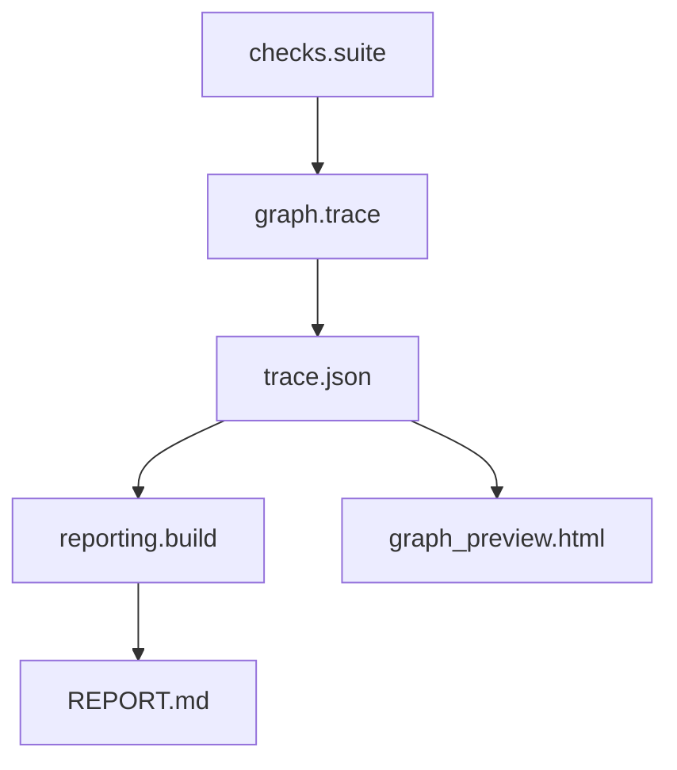
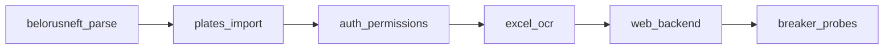

# PROTOTIPING HOW IT WORKS

## Назначение

Прототипирование запускает реальные проверки по `src` и `web`, считает корректность по P/N и собирает отчеты.

## Техническая цепочка (что за чем)

1. **`prototiping/graph/spec.py`** задаёт упорядоченный список узлов `GRAPH_NODES_SPEC`: у каждого узла есть `id`, человекочитаемый `title` и список ссылок на функции `check_*` из `prototiping/checks/suite.py`. Это единственный «источник правды» по порядку сценариев в графе.

2. **`prototiping/graph/trace.py` → `run_prototype_traced()`** обходит узлы **в том же порядке**, для каждой функции вызывает `fn()` и получает сырой словарь `{name, ok, detail}`. Затем по метаданным из `prototiping/checks/scenarios.py` (`kind`: `standard` или `breaker`) вычисляет **класс ожидания** `P` или `N` и флаг **`is_correct`**: для стандартного сценария нужен `ok=True`, для breaker — `ok=False`. Итог узла: `node_ok = all(is_correct по всем check в узле)`.

3. **Трассировка** пишется в `prototiping/.last_prototype_trace.json` (см. `prototiping/lib/paths.py`). Тот же объект возвращается из `run_prototype_traced()` с дополнительным ключом `flat_results` — плоский список сырых ответов `check_*` в порядке вызова (удобно для отладки).

4. **`prototiping/reporting/build.py`** читает трассу (или получает её из памяти), строит строки таблицы, считает матрицу `TP/FN/TN/FP` и подставляет в шаблон `prototiping/reporting/template.md` → **`prototiping/REPORT.md`**.

5. **OCR-секция** отчёта собирается отдельно в `prototiping/reporting/ocr.py` (таймауты, fail-fast, вытягивание логов из `ocr_processing.log` при `None` от пайплайна).

6. **`prototiping/tools/graph_preview.py`** читает последнюю трассу и генерирует **`prototiping/output/graph_preview.html`** — визуализация того же графа и таблиц.

Смысл разделения: **граф** только исполняет и фиксирует факты; **отчёт** — презентация и агрегация; **HTML** — обзор без пересборки markdown.

## Ключевые фрагменты кода (как это выглядит в реализации)

### Исполнение сценария и интерпретация P/N

```python
# prototiping/graph/trace.py
raw = fn()
ok_raw = bool(raw.get("ok"))
is_correct = (ok_raw is False) if expected_class == "N" else (ok_raw is True)
entry = {
    "fn": fn.__name__,
    "ok": ok_raw,
    "expected_class": expected_class,
    "actual_sign": "-" if not ok_raw else "+",
    "is_correct": is_correct,
}
```

### Агрегация матрицы в отчете

```python
# prototiping/reporting/build.py
rows = collect_results_from_trace(trace_full)
cm = compute_confusion(rows)  # TP/FN/TN/FP
out = out.replace("{{CONFUSION_MATRIX}}", build_confusion_matrix_md(cm))
```

### OCR-секция отчета

```python
# prototiping/reporting/ocr.py
timeout_sec = _ocr_timeout_sec()
fail_fast = _ocr_fail_fast()
result = ocr.run_pipeline(str(src))
if result is None and fail_fast:
    break
```

## Поток



## Граф

Узлы ниже — это **логические группы** в `GRAPH_NODES_SPEC`, а не отдельные процессы ОС. Внутри узла сценарии выполняются последовательно.



## Критерий корректности

- `P/+` и `N/-` корректно
- `P/-` и `N/+` некорректно

Логика в коде: для `expected_class == "N"` корректное поведение — **`ok_raw is False`** (тест «сломался» так, как задумано). Поэтому в консоли и в отчёте важно смотреть на **`(P/N)` и `(+/-)`**, а не на один только «зелёный ok» из сырого `check_*`.

## Пример «по словам»: один сценарий от кода до отчёта

Допустим, в узле `belorusneft_parse` вызывается `check_parse_api_datetime()`.

1. В **`suite.py`** функция возвращает, например, `{"name": "...", "ok": True, "detail": "..."}` — это **фактический** результат проверки (прошла ли проверка кода).

2. В **`trace.py`** для этой функции читается `SCENARIO_META["check_parse_api_datetime"]`: если `kind=standard`, то `expected_class="P"`. Тогда `is_correct = (ok_raw is True)`. В трассу попадает запись с полями `expected_class`, `actual_sign` (`+` если `ok`), `is_correct`.

3. В **`reporting/build.py`** эта строка попадает в таблицу: колонка «класс» — `P`, «факт» — `+`, статус строки — корректно (TP).

4. Если бы это был breaker с `kind=breaker` и тот же `ok=True`, получилось бы `N/+` — **ложное срабатывание** (FP), потому что негативный тест не «сломал» ожидаемую уязвимость.

## Трасса JSON (минимально полезно знать)

Корень `run_prototype_traced` / файла `.last_prototype_trace.json`:

- `graph` — строка-идентификатор графа (`GRAPH_TITLE`).
- `overall_ok` — `True` только если **все узлы** имеют `ok=True` (а `ok` узла уже интерпретировано через `is_correct`).
- `nodes[]` — по одному элементу на узел: `id`, `title`, `ok`, `elapsed_ms`, `checks[]`.
- В каждом `checks[]`: `fn`, `name`, `ok` (сырой), `detail`, `expected_class` (`P`/`N`), `actual_sign` (`+`/`-`), `is_correct`.

Отдельно возвращаемый **`flat_results`** — только список сырых dict от `check_*`, без обогащения P/N (удобно сравнить с логами).

### Пример реальной записи check в trace

```json
{
  "fn": "check_parse_api_datetime",
  "name": "parse api datetime",
  "ok": true,
  "detail": "parsed 2020-01-15T10:20:30Z",
  "expected_class": "P",
  "actual_sign": "+",
  "is_correct": true
}
```

## См. также

- [QUICKSTART](QUICKSTART.md)
- [REPORT_TEMPLATE](REPORT_TEMPLATE.md)
- [GRAPH_PREVIEW_HTML](GRAPH_PREVIEW_HTML.md)
- [MODULES/OVERVIEW](MODULES/OVERVIEW.md)
