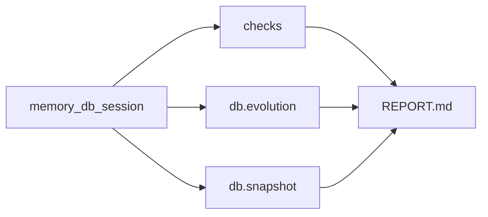

# PROTOTIPING / DB

## Файлы

- `prototiping/db/memory.py`
- `prototiping/db/evolution.py`
- `prototiping/db/snapshot.py`

## Назначение

In-memory SQLite используется для:

- изолированных check-сценариев
- секций отчета про эволюцию данных
- демо-снимка таблиц

## Поток работы с БД

## Связанные документы

- [reporting](REPORTING.md)
- [overview](OVERVIEW.md)
