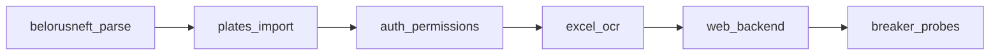

# PROTOTIPING / GRAPH

## Файлы

- `prototiping/graph/spec.py`
- `prototiping/graph/trace.py`
- `prototiping/graph/app.py`

## Цепочка узлов



## Примечания по выполнению

- `run_prototype_traced()` считает `is_correct` по P/N.
- `node.ok` и `overall_ok` = корректность, а не сырой `ok`.
- в консоли отображается `(P/+)`, `(N/-)` и т.п.

## Примеры реализации

```python
# prototiping/graph/spec.py
GRAPH_NODES_SPEC = [
    {"id": "belorusneft_parse", "checks": [...]},
    ...
]
```

```python
# prototiping/graph/trace.py
entry = {
    "expected_class": expected_class,     # P or N
    "actual_sign": "-" if not ok_raw else "+",
    "is_correct": is_correct,             # interpreted by class
}
```

## Связанные документы

- [checks contract](CHECKS.md)
- [report consumers](REPORTING.md)
- [tests](TESTS.md)
- [db usage during checks](DB.md)
