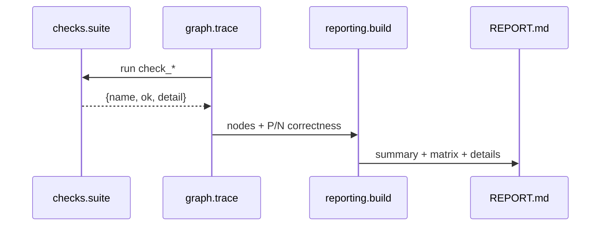

# PROTOTIPING / OVERVIEW

## Назначение

`prototiping` запускает реальные проверки бизнес-логики из `src` и `web`, строит P/N-оценку и формирует отчеты.

## Семантика P/N

- `P` (`kind=standard`): тест должен пройти (`ok=True`).
- `N` (`kind=breaker`): тест должен упасть (`ok=False`), это корректный результат.

## Матрица ошибок

```text
P/+ -> TP
P/- -> FN
N/- -> TN
N/+ -> FP
```

### Как читать матрицу словами

- **TP** — позитивный сценарий прошёл: код ведёт себя как ожидается при нормальных входах.
- **FN** — позитивный сценарий упал: регрессия или сломанный контракт `check_*`.
- **TN** — негативный сценарий «упал» (`ok=False`): уязвимость не проявилась или защита сработала — именно это мы хотим от breaker’а.
- **FP** — негативный сценарий «прошёл» (`ok=True`): код не дал ожидаемого «красного» сигнала; стоит пересмотреть тест или исправить прод.

## Поток выполнения



## Ключевые точки реализации

```python
# prototiping/graph/trace.py
def run_prototype_traced(*, console: bool = True, write_trace_json: bool = True) -> dict: ...

# prototiping/reporting/build.py
def collect_results_from_trace(trace_full: dict) -> list[dict]: ...
def compute_confusion(rows: list[dict]) -> dict[str, int]: ...

# prototiping/reporting/ocr.py
def build_ocr_section_markdown(*, console=None, use_spinner=None) -> str: ...
```

## Семантические связи

- сценарии и классы P/N -> [CHECKS](CHECKS.md)
- порядок выполнения и узлы -> [GRAPH](GRAPH.md)
- итоговый markdown/html output -> [REPORTING](REPORTING.md)

## Связанные документы

- [checks](CHECKS.md)
- [graph](GRAPH.md)
- [reporting](REPORTING.md)
