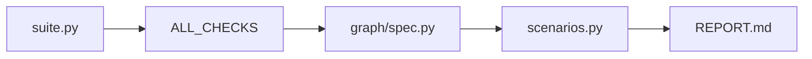

# PROTOTIPING QUICKSTART

Полный гайд по добавлению сценариев `check_*` в прототипирование.

## Шаги

1. добавить функцию в `prototiping/checks/suite.py`
2. добавить в `ALL_CHECKS`
3. подключить в `prototiping/graph/spec.py`
4. добавить метаданные в `prototiping/checks/scenarios.py` (`id`, `kind`, `scenario_version`)
5. прогнать `PYTHONPATH=. python -m prototiping`



## Минимальный рабочий пример (копируй и адаптируй)

### 1) `prototiping/checks/suite.py`: добавляем `check_*`

```python
def check_example_user_permission() -> dict:
    """
    Пример standard-сценария: ожидаем ok=True.
    """
    with _db_session() as db:
        allowed = _user_has_permission_compat(db, telegram_id=1001, permission_name="admin:manage")
    if allowed:
        return _result("example permission", True, "permission resolved")
    return _result("example permission", False, "expected admin permission")
```

### 2) `ALL_CHECKS`: обязательно зарегистрировать

```python
ALL_CHECKS = [
    ...,
    check_example_user_permission,
]
```

### 3) `prototiping/graph/spec.py`: добавить в узел графа

```python
{
    "id": "auth_permissions",
    "title": "Права и токены привязки",
    "checks": [
        ...,
        chk.check_example_user_permission,
    ],
}
```

### 4) `prototiping/checks/scenarios.py`: добавить метаданные

```python
"check_example_user_permission": {
    "id": "S99",
    "graph_node": "auth_permissions",
    "title": "Проверка прав пользователя (пример)",
    "code_under_test": "`src/app/permissions.py` -> `user_has_permission`",
    "description": "Проверка, что для заданной роли доступ разрешается.",
    "kind": "standard",
    "scenario_version": SCENARIO_SCHEMA_VERSION,
},
```

## Пример breaker-сценария (N-класс)

```python
def check_breaker_example_should_fail() -> dict:
    """
    breaker: корректный результат - ok=False.
    """
    violation_detected = True
    if violation_detected:
        return _result("breaker example", False, "violation reproduced")
    return _result("breaker example", True, "unexpectedly passed")
```

И метаданные:

```python
"check_breaker_example_should_fail": {
    "id": "S100",
    "graph_node": "breaker_probes",
    "title": "Breaker пример",
    "code_under_test": "`src/app/...`",
    "description": "Негативный сценарий должен падать.",
    "kind": "breaker",
    "scenario_version": SCENARIO_SCHEMA_VERSION,
},
```

## Команды запуска и проверки артефактов

```bash
# основной прогон
PYTHONPATH=. python -m prototiping

# html-превью графа
PYTHONPATH=. python -m prototiping.tools.graph_preview

# pytest набор
PYTHONPATH=. pytest prototiping -q
```

После запуска проверь:

```bash
ls -la prototiping/REPORT.md prototiping/.last_prototype_trace.json prototiping/output/graph_preview.html
```

### Что технически делает каждый шаг

1. **`suite.py`** — здесь живёт исполняемая логика: импорт функций из `src`/`web`, подготовка in-memory БД, вызов API и т.д. Контракт простой: вернуть `{"name": str, "ok": bool, "detail": str}`. Имя `check_*` должно совпадать с ключом в `SCENARIO_META`, иначе отчёт не сможет сопоставить метаданные (будут fallback-заглушки).

2. **`ALL_CHECKS`** — список всех ссылок на функции; используется `verify_spec_matches_all_checks()` в `trace.py`, чтобы граф не ссылался на забытые сценарии и наоборот. Если функция есть в графе, но не в `ALL_CHECKS` (или наоборот), прогон упадёт при старте — это намеренно.

3. **`graph/spec.py`** — вы решите, **в каком узле** и **в каком порядке** вызывается сценарий. Один и тот же `check_*` не должен дублироваться в разных узлах без необходимости: каждый вызов попадёт в трассу и отчёт отдельной строкой.

4. **`scenarios.py`** — человекочитаемые заголовки, `id` сценария (S01…), `graph_node` (должен совпадать с `id` узла в `spec.py`), `kind` и `scenario_version`. **`kind`** критичен: от него в `trace.py` выводится `expected_class` P/N. **`scenario_version`** позволяет помечать устаревшие описания в отчёте, не ломая прогон.

5. **Запуск `python -m prototiping`** — точка входа (см. `prototiping/__init__.py` / пакет) вызывает `run_prototype_traced`, затем сборку отчёта и при необходимости OCR. После прогона смотрите `REPORT.md`, при отладке — сырой `ok` в `flat_results` и обогащённые поля в `.last_prototype_trace.json`.

## P/N-семантика

- `kind=standard` -> класс `P` (ожидаем `ok=True`)
- `kind=breaker` -> класс `N` (ожидаем `ok=False`)

**Словами:** «корректный» `N`-сценарий — это когда проверка **намеренно** возвращает `ok=False` (баг/уязвимость обнаружена или условие не выполнено). В отчёте это **`N/-`**, а не ошибка прогона. Если breaker вернул `ok=True`, это **`N/+`** (FP) — код ведёт себя «слишком хорошо» для негативного теста.

## Быстрый self-check перед PR

```python
# что обязательно проверить глазами в trace:
entry = {
    "fn": "check_example_user_permission",
    "expected_class": "P",   # или N
    "actual_sign": "+",      # или -
    "is_correct": True,      # интерпретация с учетом класса
}
```

- `expected_class` соответствует `kind` из `SCENARIO_META`
- `graph_node` совпадает с узлом в `GRAPH_NODES_SPEC`
- новый `check_*` есть и в `ALL_CHECKS`, и в graph spec

Подробнее:
- [PROTOTIPING HOW_IT_WORKS](HOW_IT_WORKS.md)
- [PROTOTIPING ADDING_SCENARIOS](ADDING_SCENARIOS.md)
- [PROTOTIPING REPORT_TEMPLATE](REPORT_TEMPLATE.md)
