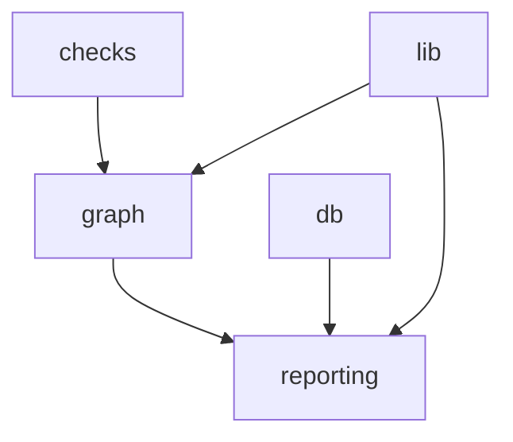

# PROTOTIPING

Документация по подсистеме `prototiping/`: сценарии P/N, граф, отчеты, OCR-секция, in-memory БД.

## Область

- код: `prototiping/*`
- артефакты: `prototiping/REPORT.md`, `prototiping/.last_prototype_trace.json`, `prototiping/output/graph_preview.html`

## Архитектура

## Технические артефакты (что лежит где)

| Артефакт | Путь | Назначение |
|----------|------|------------|
| Трассировка последнего прогона | `prototiping/.last_prototype_trace.json` | Снимок дерева узлов и каждого `check_*` с полями P/N; вход для отчёта и HTML-превью |
| Итоговый отчёт | `prototiping/REPORT.md` | Markdown по шаблону: сводка, матрица, таблица сценариев, OCR-секция |
| HTML графа | `prototiping/output/graph_preview.html` | Интерактивная/страничная схема + таблицы; строится из трассы |
| Шаблон отчёта | `prototiping/reporting/template.md` | Плейсхолдеры `{{...}}`, подставляются в `reporting/build.py` |

## Глоссарий (для разработчика)

- **`check_*`** — функция в `checks/suite.py`, возвращает `{name, ok, detail}`; это **сырой** результат проверки.
- **`kind`** (`scenarios.py`) — `standard` → ожидаем класс **P**, `breaker` → **N**; влияет только на интерпретацию `ok`.
- **`expected_class` / `actual_sign`** — в трассе: ожидание `P` или `N` и факт `+` (проверка вернула `ok=True`) или `-` (`ok=False`).
- **`is_correct`** — согласованы ли ожидание и факт; для узла `node_ok` = все `is_correct` внутри узла.
- **`overall_ok`** — все узлы графа корректны; это не «все тесты зелёные в сыром смысле», а именно **семантическая** корректность P/N.

Подробный разбор потока: [HOW_IT_WORKS](HOW_IT_WORKS.md).

## Документация модулей

- [OVERVIEW](MODULES/OVERVIEW.md)
- [CHECKS](MODULES/CHECKS.md)
- [GRAPH](MODULES/GRAPH.md)
- [REPORTING](MODULES/REPORTING.md)
- [DB](MODULES/DB.md)
- [LIB](MODULES/LIB.md)
- [TOOLS](MODULES/TOOLS.md)
- [TESTS](MODULES/TESTS.md)

## Связанные общие документы

- [Project map](../README.md)
- [How it works](HOW_IT_WORKS.md)
- [Template placeholders](REPORT_TEMPLATE.md)
