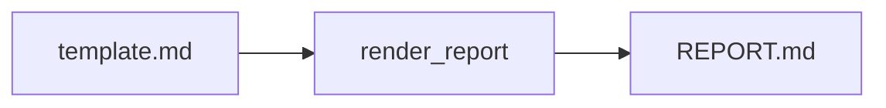

# PROTOTIPING REPORT TEMPLATE

Шаблон отчета: `prototiping/reporting/template.md`.

Сборка: `prototiping/reporting/build.py`.

## Основные плейсхолдеры

- `{{TOTAL}}`, `{{OK_COUNT}}`, `{{FAIL_COUNT}}`
- `{{TP_COUNT}}`, `{{FN_COUNT}}`, `{{TN_COUNT}}`, `{{FP_COUNT}}`
- `{{CONFUSION_MATRIX}}`
- `{{SCENARIOS_TABLE}}`, `{{SCENARIOS_DETAIL}}`
- `{{OCR_SAMPLES}}`

## Поток

Дополнительно:
- [HOW_IT_WORKS](HOW_IT_WORKS.md)
