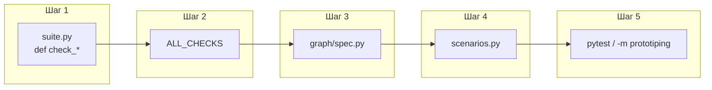
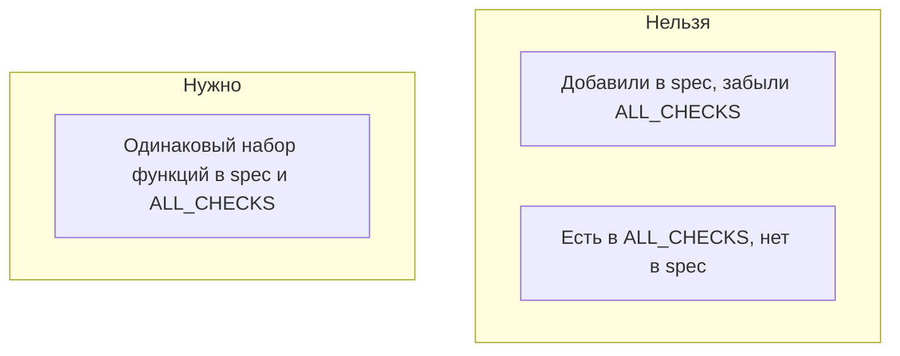
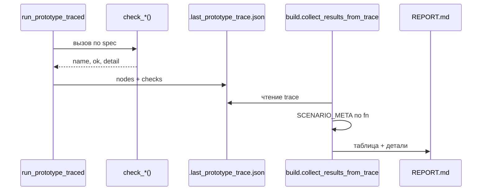

# QUICKSTART: написание сценариев (тестов прототипирования)

Пошаговое руководство: как добавить проверку, которая попадёт в граф, pytest и **REPORT.md**. Предполагается, что вы уже клонировали репозиторий и установили зависимости (`requirements.txt` / venv).

---

## Общая схема

Один сценарий — это **одна функция** `check_*` плюс **регистрация** в трёх местах и **метаданные** для отчёта.



---

## Шаг 0. Подготовка окружения

Рабочая директория — **корень репозитория** (где лежат `src/` и `prototiping/`).

```bash
cd /path/to/fuel-tracker-bot
source .venv/bin/activate   # если используете venv
export PYTHONPATH=.
```

Проверка:

```bash
PYTHONPATH=. python -c "from prototiping.graph.spec import verify_spec_matches_all_checks; verify_spec_matches_all_checks()"
```

Должно завершиться без ошибки (до ваших правок — да; после правок — тоже, если синхронизировали списки).

---

## Шаг 1. Реализовать функцию проверки

**Файл:** `prototiping/checks/suite.py`

**Контракт:**

- имя функции: `check_что_нибудь` (префикс `check_`);
- аргументов **нет**;
- возврат: `dict` с ключами `name`, `ok`, `detail`.

Используйте хелпер `_result`:

```python
def check_demo_greeting() -> dict:
    text = "hello".upper()
    if text != "HELLO":
        return _result("demo_greeting", False, f"got {text!r}")
    return _result("demo_greeting", True, "upper() OK")
```

**Смысл полей:**

| Ключ | Назначение |
|------|------------|
| `name` | Короткая метка шага (видна в трассировке Rich) |
| `ok` | `True` — сценарий успешен |
| `detail` | Текст для отчёта; при `ok=False` обязательно поясните причину |

---

## Шаг 2. Включить функцию в `ALL_CHECKS`

**Тот же файл:** `suite.py`, список **`ALL_CHECKS`** внизу.

Порядок элементов списка должен совпадать с порядком **обхода графа**: узлы сверху вниз как в `graph/spec.py`, внутри узла — порядок в массиве `checks`.

```python
ALL_CHECKS = [
    check_parse_operations_items,
    # ... другие проверки в нужном порядке ...
    check_demo_greeting,  # вставьте сюда, где логически должен идти сценарий
]
```



---

## Шаг 3. Повесить проверку на узел графа

**Файл:** `prototiping/graph/spec.py`

Добавьте ссылку на функцию в **`checks`** нужного узла (или создайте новый узел в `GRAPH_NODES_SPEC`).

```python
from prototiping.checks import suite as chk

# пример: новый узел в конце списка GRAPH_NODES_SPEC
{
    "id": "demo_node",
    "title": "Демонстрационный узел",
    "checks": [
        chk.check_demo_greeting,
    ],
},
```

Если узел новый, он автоматически попадёт в цепочку (см. `GRAPH_EDGE_ORDER` в том же файле).

---

## Шаг 4. Метаданные для отчёта

**Файл:** `prototiping/checks/scenarios.py`

Ключ словаря **`SCENARIO_META`** — строка **`check_demo_greeting`** (ровно `__name__` функции).

**Поле `id`:** следующий по порядку код **S16**, **S17**, … (сейчас последний в проекте — **S15**; смотрите фактический последний `id` в файле и увеличьте на 1, без пропусков в последовательности прогона).

```python
"check_demo_greeting": {
    "id": "S16",
    "graph_node": "demo_node",
    "title": "Демо: upper() для строки",
    "code_under_test": "`str.upper()` (пример)",
    "description": "Проверяет, что lower-case строка приводится к ожидаемому виду.",
},
```

Без этой записи `collect_results_from_trace` выбросит **`KeyError`** при сборке отчёта.

---

## Шаг 5. Прогон и отчёт

```bash
# Вариант A: только pytest (в конце перезапишет REPORT.md, если не указан флаг)
PYTHONPATH=. pytest prototiping -q

# Вариант B: сборка отчёта с Rich в консоли
PYTHONPATH=. python -m prototiping

# Одна ваша проверка
PYTHONPATH=. pytest prototiping/tests/test_prototype_graph.py::test_individual_check -k demo_greeting -v
```

Откройте **`prototiping/REPORT.md`**: в таблице сценариев должны появиться **№** и **Код S16** (или ваш id).

---

## Как сценарий попадает в отчёт (поток данных)



---

## Работа с БД (типичный паттерн)

Если проверяете код, которому нужна сессия SQLAlchemy:

```python
from prototiping.db.memory import memory_db_session

def check_my_db() -> dict:
    with memory_db_session() as db:
        # вызовы из src.app... с db
        # при ошибке: return _result("my_db", False, str(e))
        pass
    return _result("my_db", True, "ok")
```

Эталоны в репозитории: `check_import_api_operations_dry_run`, `check_tokens_flow`.

---

## Чек-лист перед коммитом

- [ ] Функция `check_*` возвращает словарь с `ok` / `detail`
- [ ] Запись в `ALL_CHECKS` на **правильной позиции**
- [ ] Функция указана в **`graph/spec.py`** у нужного узла
- [ ] Есть ключ в **`SCENARIO_META`**, `id` = следующий **SNN** по порядку прогона
- [ ] `pytest prototiping` проходит
- [ ] `REPORT.md` собирается без ошибки

---

## Куда смотреть дальше

| Документ | Зачем |
|----------|--------|
| [MODULES/CHECKS.md](MODULES/CHECKS.md) | Справочник по `suite` / `scenarios` |
| [MODULES/GRAPH.md](MODULES/GRAPH.md) | `run_prototype_traced`, LangGraph |
| [REPORT_TEMPLATE.md](REPORT_TEMPLATE.md) | Шаблон `reporting/template.md` и плейсхолдеры |
| [ADDING_SCENARIOS.md](ADDING_SCENARIOS.md) | Краткая отсылка (этот файл — основной гайд) |

---

← [Оглавление](README.md)
