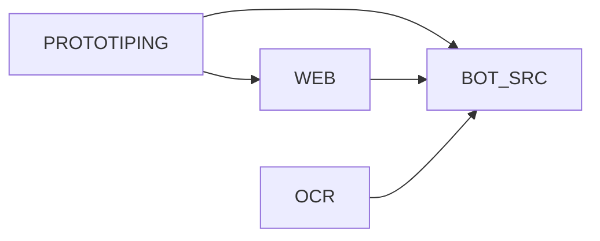

# Карта документации проекта

Эта папка содержит актуальную документацию, разбитую на четыре домена:

- `PROTOTIPING` — инфраструктура прототипирования, граф сценариев, отчеты.
- `BOT_SRC` — Telegram-бот и backend-логика в `src/app`.
- `WEB` — web backend/frontend и интеграция с `src/app`.
- `OCR` — отдельный технический домен OCR-движка, контрактов данных и интеграции.

## Верхнеуровневая диаграмма



## Разделы

- [PROTOTIPING](PROTOTIPING/README.md)
- [BOT_SRC](BOT_SRC/README.md)
- [WEB](WEB/README.md)
- [OCR](OCR/README.md)

## Рекомендуемые маршруты чтения

### 1) Прототипирование (тестовая оркестрация)
`PROTOTIPING/README` -> `PROTOTIPING/MODULES/OVERVIEW` -> `CHECKS` -> `GRAPH` -> `REPORTING`

### 2) Боевой backend/бот (`src`)
`BOT_SRC/README` -> `BOT_SRC/MODULES/README` -> `ARCHITECTURE` -> `DATA_LAYER` + `TELEGRAM_LAYER` -> `IMPORT_AND_JOBS`

### 3) Web слой
`WEB/README` -> `WEB/MODULES/OVERVIEW` -> `BACKEND_API` -> `SERVICES` -> `FRONTEND_INTEGRATION`

### 4) OCR домен
`OCR/README` -> `PIPELINE` -> `DATA_CONTRACTS` -> `INTEGRATION` -> `TROUBLESHOOTING`

## Краткий глоссарий (связь доменов)

| Термин | Где искать | Смысл |
|--------|------------|--------|
| Сырой результат сценария | `prototiping/checks/suite.py` | `ok` из `check_*` до интерпретации P/N |
| Семантическая корректность | `prototiping/graph/trace.py` | `is_correct`, `expected_class`, узел/граф «успешен» только если P/N согласованы |
| Доменные сущности (операции, пользователи) | `src/app/models.py` | Общая модель для бота и web |
| Импорт операций из API | `src/app/import_logic.py` + `web/backend/services/api_import_web.py` | Один источник правил, разные точки входа (бот/HTTP) |

Развёрнуто по прототипированию: [PROTOTIPING/HOW_IT_WORKS](PROTOTIPING/HOW_IT_WORKS.md).

## Кодовые якоря (быстро открыть и читать)

```python
# src/run_bot.py
async def main():
    bot = Bot(token=BOT_TOKEN)
    dp = Dispatcher()
    register_handlers(dp)
```

```python
# web/backend/main.py
app = FastAPI(title="Fuel Tracker API")
app.include_router(operations.router)
app.include_router(users.router)
app.include_router(reports.router)
```

```python
# prototiping/graph/trace.py
def run_prototype_traced(*, console: bool = True, write_trace_json: bool = True) -> dict:
    ...
```

## Точки входа по доменам

- прототипирование: [PROTOTIPING/README.md](PROTOTIPING/README.md)
- src/bot: [BOT_SRC/README.md](BOT_SRC/README.md)
- web: [WEB/README.md](WEB/README.md)
- ocr: [OCR/README.md](OCR/README.md)

Служебные документы разнесены по доменам; в корне `docs/` остались только общий индекс и структурные файлы.
