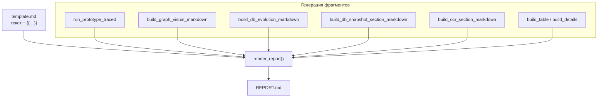
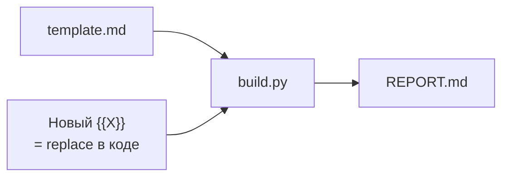

# REPORT_TEMPLATE: шаблон отчёта `reporting/template.md`

Здесь описано, **как устроена сборка REPORT.md**, какие есть **плейсхолдеры** `{{…}}`, как **безопасно править** шаблон и как добавить **свой блок**, если понадобится расширить `build.py`.

**Файл шаблона в репозитории:** `prototiping/reporting/template.md`  
**Код подстановки:** `prototiping/reporting/build.py` → `render_report()`

---

## Поток сборки отчёта



1. Читается **`REPORT_TEMPLATE`** (`paths.REPORT_TEMPLATE`).
2. Выполняется прогон графа (или используются уже посчитанные строки).
3. Каждый `{{ИМЯ}}` заменяется на заранее подготовленную **строку Markdown** (или пустую).

Замена — **простая** `str.replace("{{ИМЯ}}", value)`; форматирования внутри шаблона кроме Markdown нет.

---

## Полный список плейсхолдеров

Имя в шаблоне **должно совпадать посимвольно** с нижней таблицей (регистр, подчёркивания).

| Плейсхолдер | Кто формирует | Содержимое |
|-------------|---------------|------------|
| `{{GENERATED_AT}}` | `render_report` | Дата/время UTC строкой |
| `{{FAIL_ALERT}}` | `render_report` | Блок предупреждения, если есть проваленные сценарии; иначе пусто |
| `{{GRAPH_SUMMARY}}` | `render_report` | Краткая строка про граф и счётчик OK/FAIL |
| `{{TOTAL}}` | `render_report` | Число: всего сценариев |
| `{{OK_COUNT}}` | `render_report` | Число успешных |
| `{{FAIL_COUNT}}` | `render_report` | Число провалов |
| `{{GRAPH_VISUAL}}` | `diagram.build_graph_visual_markdown` | Таблица узлов, ASCII, Mermaid, ссылка на HTML |
| `{{SCENARIOS_TABLE}}` | `build.build_table` | Markdown-таблица сценариев (№, Код, узел, …) |
| `{{SCENARIOS_DETAIL}}` | `build.build_details` | Развёрнутые секции по каждому сценарию |
| `{{DB_EVOLUTION}}` | `db.evolution.build_db_evolution_markdown` | Динамика счётчиков по таблицам |
| `{{DB_SNAPSHOT}}` | `db.snapshot.build_db_snapshot_section_markdown` | JSON-превью строк демо-БД |
| `{{OCR_SAMPLES}}` | `reporting.ocr.build_ocr_section_markdown` | OCR: картинки, Tesseract, LLM или блоки ошибок |

Если опечататься в имени (`{{SCENARIO_TABLE}}` вместо `{{SCENARIOS_TABLE}}`), плейсхолдер **останется в тексте** как есть — это частая ошибка.

---

## Как править шаблон «правильно»

### Можно

- Менять **заголовки**, **пояснительный текст**, порядок **секций** (блоки между `---`).
- Добавлять **статический** Markdown: списки, ссылки, примечания для читателей.
- Оборачивать плейсхолдеры в цитаты или списки — главное, чтобы строка `{{…}}` осталась **целой** и **одной строкой** (не разбивайте `{{` и `}}` переносами посередине имени).

### Нельзя (без правки кода)

- Вводить **новые** `{{ИМЯ}}`, если в `build.py` нет соответствующего `.replace("{{ИМЯ}}", …)`.
- Удалять плейсхолдер, если вы всё ещё хотите видеть этот блок в отчёте (его просто не будет).

### Рекомендуется

- После правок запустить:

```bash
PYTHONPATH=. python -m prototiping
```

и просмотреть `prototiping/REPORT.md` в превью Markdown.

---

## Добавить свой плейсхолдер (расширение)

Пример: секция «Примечания релиза».

**1.** В `reporting/template.md` вставьте в нужное место:

```markdown
## Примечания

{{RELEASE_NOTES}}
```

**2.** В `reporting/build.py` внутри `render_report()`:

- Вычислите строку `release_notes` (или прочитайте файл).
- После остальных `replace` добавьте:

```python
out = out.replace("{{RELEASE_NOTES}}", release_notes)
```

**3.** Убедитесь, что при ошибке генерации вы подставляете хотя бы `_` или сообщение об ошибке, чтобы не оставить сырой `{{RELEASE_NOTES}}` в финальном отчёте.



---

## Связь шаблона с «опасными» секциями

Блоки **БД** и **OCR** могут внутри себя содержать Markdown с трассировками ошибок — это формируется не шаблоном, а функциями `build_db_*` и `build_ocr_section_markdown`. Шаблон только **вставляет** готовый кусок в `{{DB_EVOLUTION}}`, `{{DB_SNAPSHOT}}`, `{{OCR_SAMPLES}}`.

---

## Справочник по коду

- API сборки: [MODULES/REPORTING.md](MODULES/REPORTING.md)
- Диаграммы для `{{GRAPH_VISUAL}}`: тот же файл, раздел `diagram.py`
- Интерактивный HTML с той же Mermaid-логикой: [GRAPH_PREVIEW_HTML.md](GRAPH_PREVIEW_HTML.md)

---

← [Оглавление](README.md) · [QUICKSTART](QUICKSTART.md)
