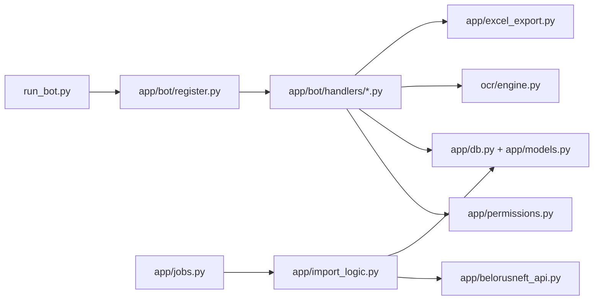
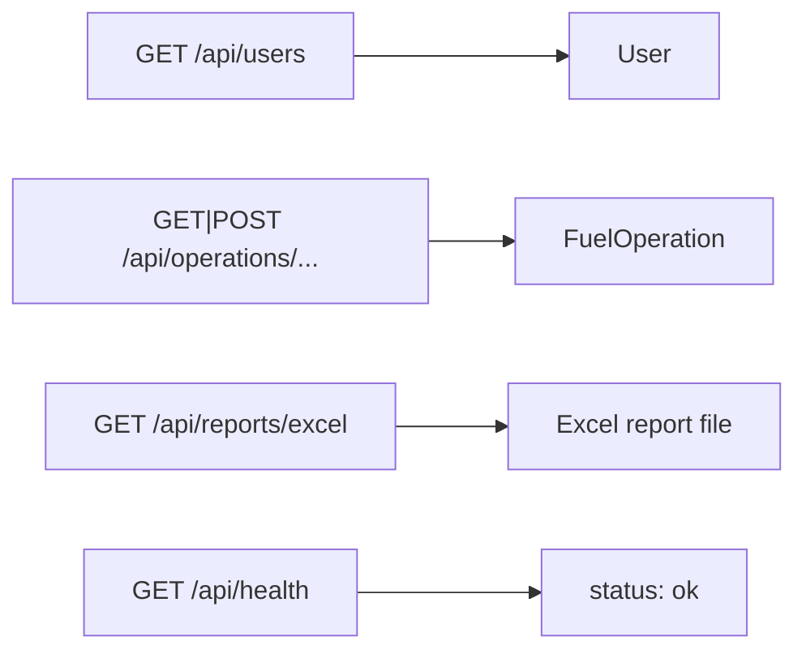
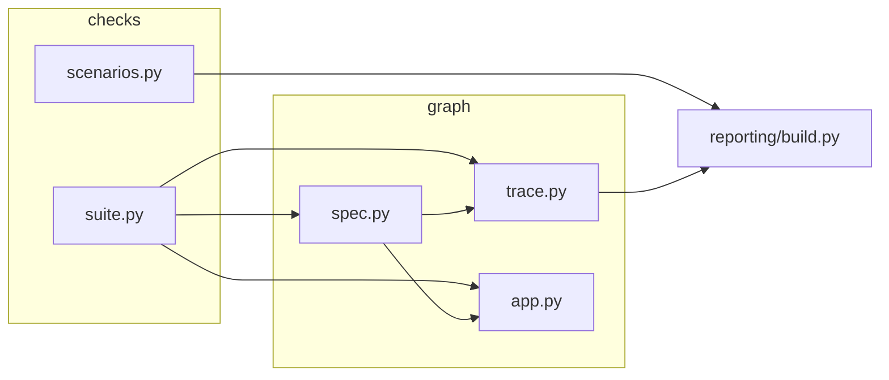

# Структура документации, `src/`, `web/` и `prototiping/`

## Структура документации (`docs/`)

```text
docs/
├── README.md                 общий навигатор
├── PROTOTIPING/
│   ├── README.md
│   └── MODULES/
├── BOT_SRC/
│   ├── README.md
│   └── MODULES/
├── WEB/
│   ├── README.md
│   └── MODULES/
├── OCR/
│   ├── README.md
│   ├── PIPELINE.md
│   ├── DATA_CONTRACTS.md
│   ├── INTEGRATION.md
│   ├── DEDUP_AND_VALIDATION.md
│   └── TROUBLESHOOTING.md
└── ... (legacy подробные документы)
```

---

# Структура `src/` по папкам

Корневой runtime backend/бота: **`src/`**.

## Дерево каталогов (упрощённо)

```text
src/
├── run_bot.py                      точка входа Telegram-бота
├── migrate_old_ops.py              служебная миграция операций
├── ocr/
│   ├── engine.py                   OCR-пайплайн (Tesseract + LLM + save)
│   └── schemas.py                  Pydantic-контракты OCR
└── app/
    ├── config.py                   env-конфигурация
    ├── db.py                       engine/session/init_db
    ├── models.py                   ORM-модели домена
    ├── permissions.py              middleware + permission checks
    ├── tokens.py                   lifecycle кодов привязки
    ├── import_logic.py             импорт/дедуп операций API
    ├── belorusneft_api.py          HTTP-клиент внешнего API
    ├── jobs.py                     плановые задачи импорта
    ├── scheduler.py                APScheduler и управление расписанием
    ├── excel_export.py             экспорт отчетов в Excel
    ├── plate_util.py               нормализация гос.номеров
    ├── welcome_store.py            хранение приветственных артефактов
    ├── legacy_ssl.py               адаптер совместимости TLS
    ├── bot_ref.py                  референс на bot-инстанс для уведомлений
    ├── manage.py                   служебные команды/операции
    ├── seed.py                     заполнение тестовых данных
    ├── bot_handlers.py             совместимый слой регистрации handler'ов
    └── bot/
        ├── __init__.py
        ├── register.py             центральная регистрация роутов/handler'ов
        ├── keyboards.py            inline/reply клавиатуры
        ├── notifications.py        уведомления пользователям
        ├── utils.py                утилиты telegram-слоя
        └── handlers/
            ├── __init__.py
            ├── user.py             user-flow + FSM + OCR/manual path
            ├── admin_users.py      админские user-команды
            ├── admin_import.py     админский запуск импорта
            └── admin_schedules.py  админское управление расписанием
```

## Карта модулей `src`



---

# Структура `web/` по папкам

Веб-домен: FastAPI backend и React frontend в одной папке **`web/`**.

## Дерево каталогов (упрощённо)

```text
web/
├── backend/
│   ├── main.py                     FastAPI app + CORS + router include
│   ├── dependencies.py             DI для DB session
│   ├── schemas.py                  Pydantic-схемы API
│   ├── requirements.txt            доп. зависимости backend
│   ├── routers/
│   │   ├── operations.py           /api/operations/*
│   │   ├── users.py                /api/users/*
│   │   └── reports.py              /api/reports/*
│   └── services/
│       ├── api_import_web.py       импорт API через web-слой
│       ├── excel_report.py         генерация excel-файлов
│       └── __init__.py
└── frontend/
    ├── package.json                скрипты dev/build/lint
    ├── vite.config.ts              Vite-конфигурация
    ├── index.html
    ├── README.md
    ├── src/
    │   ├── main.tsx
    │   ├── App.tsx
    │   ├── api.ts                  HTTP-клиент frontend -> backend
    │   ├── pages/                  основные экраны админки
    │   ├── components/admin/       UI-компоненты и модалки
    │   └── styles/                 css-стили
    └── public/
        └── icons.svg
```

## Карта endpoint'ов (backend)



> Примечание: если Mermaid не рендерится, проверь, что в узлах нет необрамленных символов `/` и `|`; безопаснее использовать подписи в кавычках как в примере выше.

---

# Структура `prototiping/` по папкам

Корень пакета: **`prototiping/`** (рядом с `src/` в репозитории).

## Дерево каталогов (упрощённо)

```text
prototiping/
├── docs/                    ← legacy-справка внутри модуля (может отличаться от `docs/`)
│   ├── README.md
│   ├── QUICKSTART.md
│   ├── REPORT_TEMPLATE.md
│   ├── GRAPH_PREVIEW_HTML.md
│   ├── HOW_IT_WORKS.md
│   ├── ADDING_SCENARIOS.md
│   └── MODULES/
│       ├── DB.md
│       ├── CHECKS.md
│       ├── GRAPH.md
│       ├── REPORTING.md
│       ├── LIB.md
│       ├── TOOLS.md
│       └── TESTS.md
├── checks/                  ← проверки и метаданные для отчёта
│   ├── suite.py             функции check_* и список ALL_CHECKS
│   └── scenarios.py         SCENARIO_META (id S01…, kind P/N, версии)
├── graph/                   ← граф сценариев
│   ├── spec.py              GRAPH_NODES_SPEC, GRAPH_EDGE_ORDER
│   ├── trace.py             run_prototype_traced(), JSON-трассировка
│   └── app.py               LangGraph: build_scenario_graph(), invoke
├── db/                      ← in-memory БД для проверок и разделов отчёта
│   ├── memory.py
│   ├── evolution.py
│   └── snapshot.py
├── reporting/               ← сборка REPORT.md
│   ├── template.md          шаблон с плейсхолдерами {{…}}
│   ├── build.py             render_report(), write_report()
│   ├── diagram.py           Mermaid / ASCII для отчёта
│   └── ocr.py               секция OCR (картинки, Tesseract, LLM)
├── lib/                     ← пути и .env
│   ├── paths.py
│   └── env.py
├── tools/
│   └── graph_preview.py     CLI → output/graph_preview.html
├── tests/                   pytest
│   └── test_prototype_graph.py
├── conftest.py              env для pytest + запись отчёта после сессии
├── __main__.py              python -m prototiping
├── REPORT.md                сгенерированный отчёт (не править руками)
├── .last_prototype_trace.json
└── output/graph_preview.html
```

## Роли папок (таблица)

| Папка / файл | Назначение |
|--------------|------------|
| **`checks/`** | Вся «логика теста»: что вызываем из `src/`, что считаем успехом. |
| **`graph/`** | Как сгруппировать проверки в узлы и в каком порядке их гонять. |
| **`db/`** | Общая схема SQLite in-memory и демо-данные для разделов отчёта про БД. |
| **`reporting/`** | Склейка текста отчёта, графики, OCR-секция. |
| **`lib/`** | `PROTO_DIR`, `ROOT_DIR`, загрузка `prototiping/.env`. |
| **`tools/`** | Утилиты командной строки (HTML-превью). |
| **`tests/`** | Pytest: целостность графа и каждая `check_*` по отдельности. |

## Зависимости между частями



- **`spec.py`** импортирует функции из **`suite.py`** (не наоборот).
- **`scenarios.py`** не импортирует граф; отчёт читает метаданные по **имени функции** `check_*`.

---

## Справочник API по подпакетам

Справочник по `prototiping/*` теперь находится в **`docs/PROTOTIPING/MODULES/`** (см. [docs/README.md](README.md)).

---

← [Как это работает](PROTOTIPING/HOW_IT_WORKS.md) · [Оглавление](README.md) · [Добавление сценариев →](PROTOTIPING/ADDING_SCENARIOS.md)
