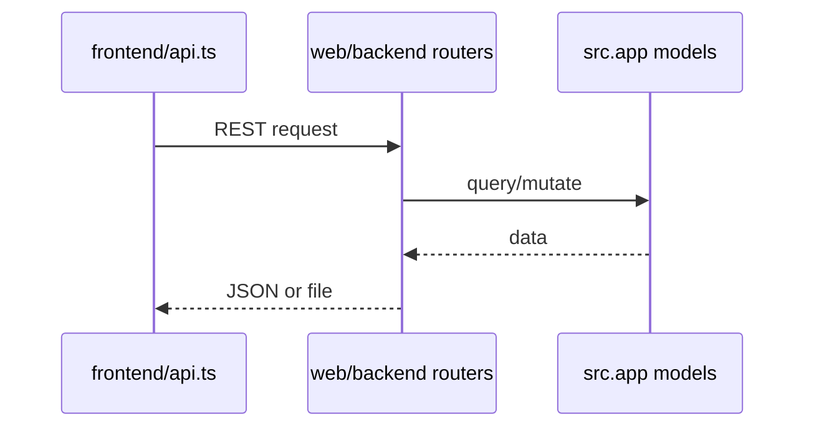

# WEB / FRONTEND_INTEGRATION

## Точки интеграции frontend

- `web/frontend/src/api.ts` — клиент запросов к backend API.
- backend CORS разрешает `http://localhost:5173` и `http://localhost:3000`.

## Контракты FE <-> BE

- users list/edit/delete
- operations tabs + actions
- import-from-api
- excel download
- health check

## Диаграмма контрактов

## Связанные документы

- [backend api](BACKEND_API.md)
- [web overview](OVERVIEW.md)
