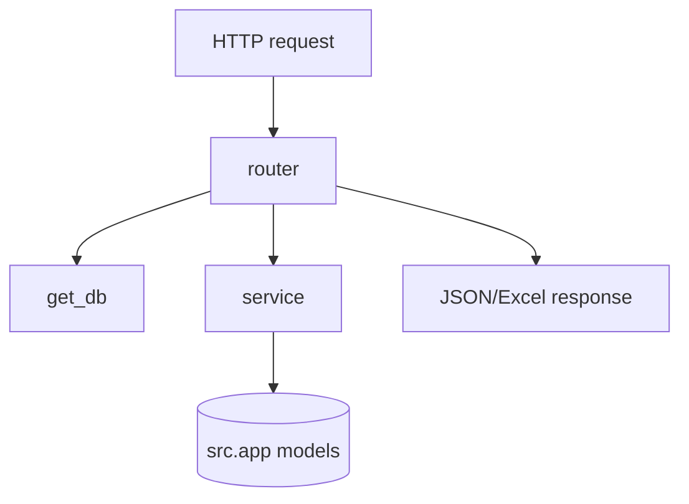

# WEB / OVERVIEW

## Структура backend

- `main.py` — app bootstrap + CORS + router include
- `dependencies.py` — DB dependency
- `schemas.py` — Pydantic request/response models
- `routers/*` — users / operations / reports endpoints
- `services/*` — import + excel builders

## Ключевые точки в коде

```python
# web/backend/main.py
app.include_router(operations.router)
app.include_router(users.router)
app.include_router(reports.router)
```

```python
# web/backend/routers/operations.py
@router.get("/{tab_name}")
def get_operations(tab_name: str, db: Session = Depends(get_db)):
    ...
```

```python
# web/backend/services/api_import_web.py
def run_api_import_sync(db) -> Dict[str, Any]: ...
```

## Путь запроса



## Технически: жизненный цикл запроса

1. **`web/backend/main.py`** поднимает `FastAPI`, подключает CORS и монтирует роутеры с префиксом `/api/...`. Это отдельный процесс от Telegram-бота, но **та же ORM-модель** (`src.app.models`), что и у бота.

2. **Роутер** (`routers/*.py`) объявляет путь и HTTP-метод, объявляет зависимость `db: Session = Depends(get_db)`. `get_db` в `dependencies.py` выдаёт сессию SQLAlchemy и гарантирует закрытие после ответа — типичный паттерн FastAPI.

3. **Сервисный слой** (`services/*`) вызывается, когда нужна не тривиальная выборка, а сценарий: например, `run_api_import_sync` повторяет логику импорта из боевого кода, `build_full_fuel_report_excel` собирает книгу из тех же сущностей, что и `excel_export.py` в боте, но форматом под HTTP (байты в памяти).

4. **Ответ** — либо Pydantic-схемы из `schemas.py` (JSON), либо `StreamingResponse` / скачивание файла для Excel. Ошибки вроде «неизвестная вкладка» или «пустая БД» мапятся на **HTTP 404** там, где это зафиксировано в роутерах — это же поведение проверяют N-сценарии прототипирования (`S32…S36`).

Итого: **web** — тонкий HTTP-слой над **общей** доменной моделью из `src/app`; дублирование бизнес-правил сведено к вызовам сервисов и тем же функциям импорта/моделям.

## Жизненный цикл БД в web

### Слой зависимостей

- `web/backend/dependencies.py:get_db` отдает `yield db` из `with get_db_session() as db:`.
- Это означает "одна SQLAlchemy session на один HTTP-запрос".

Эффект:
- если роутер/сервис завершился без исключения -> commit в конце запроса;
- если внутри поднят `HTTPException`/другая ошибка -> rollback;
- соединение гарантированно закрывается после ответа.

### Пути чтения и записи

- Read endpoints (`GET /users`, `GET /operations/{tab}`) делают только `query(...).all()/first()` и не требуют явного commit.
- Write endpoints (`PUT/POST/DELETE`) меняют ORM-объекты (`status`, `role_id`, `presumed_user_id`, удаление записи) и опираются на commit жизненного цикла запроса.

### Переиспользование данных между слоями

- Web-слой не хранит отдельные таблицы: использует `src.app.models` напрямую.
- Отчеты (`/api/reports/excel`) и операции (`/api/operations/*`) читают те же `FuelOperation/User`, что и бот.

## Связанные документы

- [backend endpoints](BACKEND_API.md)
- [service layer](SERVICES.md)
- [frontend contract](FRONTEND_INTEGRATION.md)
