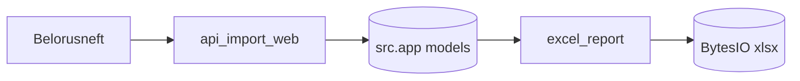

# WEB / SERVICES

## Файлы

- `web/backend/services/api_import_web.py`
- `web/backend/services/excel_report.py`

## Ответственность сервисов

- `run_api_import_sync(db)`:
  - тянет операции из Belorusneft API,
  - применяет дедуп/маппинг,
  - пишет в БД,
  - возвращает сервисный результат `ok/new_count/error`.
- `build_full_fuel_report_excel(db)`:
  - строит xlsx буфер из `FuelOperation`.

## Поведение БД по сервисам

### `run_api_import_sync(db)`

Как работает с БД пошагово:
- читает существующие записи для дедупликации `FuelOperation` (`source + doc/date`);
- при необходимости создает связанные `User/FuelCard/Car` и фиксирует их `flush()` внутри транзакции;
- обновляет JSON-поля связей (`cards/cars/owners`);
- добавляет новые `FuelOperation` со статусом `loaded`.

Транзакционный принцип:
- сервис возвращает `{"ok": False, ...}` при бизнес-ошибках;
- фактический `commit/rollback` выполняется контекстом request-session (`get_db_session`).

### `build_full_fuel_report_excel(db)`

DB-паттерн:
- один bulk-read операций: `query(FuelOperation).order_by(...).all()`;
- дополнительные lookup'и пользователей по `presumed_user_id`/`confirmed_user_id`;
- в БД ничего не пишет, формирует `BytesIO` в памяти.

Важный контракт:
- если операций нет -> `(None, 0)`; роутер мапит это в HTTP 404.
- если операции есть -> возвращается бинарный Excel-файл и количество записей.

## Примеры реализации

```python
# web/backend/services/api_import_web.py
def run_api_import_sync(db) -> Dict[str, Any]:
    raw = fetch_operational_raw(date)
    ...
    ops = parse_operations(json_payload)
```

```python
# web/backend/services/excel_report.py
def build_full_fuel_report_excel(db: Session):
    wb = Workbook()
    ws_cards = wb.create_sheet("Заправки_по_картам")
    ...
```

## Диаграмма интеграции



## Связанные документы

- [backend endpoints](BACKEND_API.md)
- [src import layer](../../BOT_SRC/MODULES/IMPORT_AND_REPORTS.md)
- [web module overview](OVERVIEW.md)
