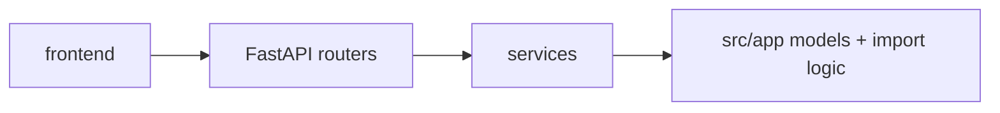

# WEB

Документация по web-части (`web/backend`, `web/frontend`) и ее связи с `src/app`.

## Область

- backend: FastAPI (`web/backend/*`)
- frontend: SPA (`web/frontend/*`, ключевой API-слой в `web/frontend/src/api.ts`)

## Архитектура



## Быстрый код-ориентированный старт

```python
# web/backend/main.py
app = FastAPI(title="Fuel Tracker API")
app.include_router(operations.router)
app.include_router(users.router)
app.include_router(reports.router)
```

```python
# web/backend/dependencies.py
def get_db():
    with get_db_session() as db:
        yield db
```

```python
# web/backend/routers/operations.py
@router.get("/{tab_name}")
def get_operations(tab_name: str, db: Session = Depends(get_db)):
    ...
```

## Документация модулей

- [OVERVIEW](MODULES/OVERVIEW.md)
- [BACKEND_API](MODULES/BACKEND_API.md)
- [SERVICES](MODULES/SERVICES.md)
- [FRONTEND_INTEGRATION](MODULES/FRONTEND_INTEGRATION.md)

## Связанные документы

- [Project map](../README.md)
- [BOT_SRC import/reports](../BOT_SRC/MODULES/IMPORT_AND_REPORTS.md)
