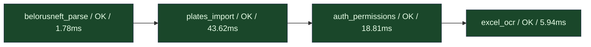
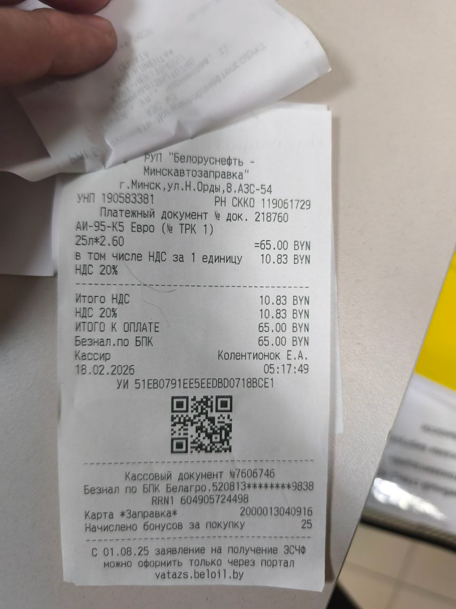
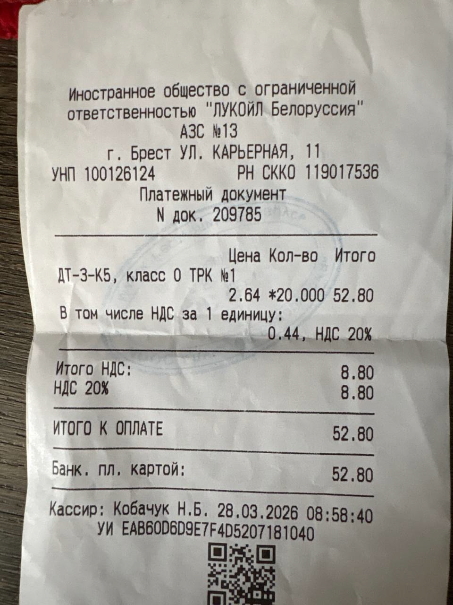

# Отчёт прототипирования: fuel-tracker-bot

**Дата генерации:** 2026-04-05 17:14 UTC


*Граф:* `fuel_tracker_prototype` — итог прогона: **успех** (15 OK / 0 FAIL по проверкам).


## 1. Сводка

| Показатель | Значение |
|------------|----------|
| Всего сценариев | 15 |
| Результат **корректен** | 15 |
| Результат **с ошибкой** | 0 |

Трассировка (LangSmith): при `LANGCHAIN_TRACING_V2=true` и заданном `LANGCHAIN_API_KEY` прогоны LangGraph и узлов с `@traceable` попадают в проект LangSmith.

---

## 2. Граф сценариев

Ниже: **таблица узлов**, цепочка в одну строку, **ASCII-схема** (читается в любом просмотрщике), компактный Mermaid и ссылка на HTML-preview.

Граф **`fuel_tracker_prototype`**: узлы выполняются **сверху вниз** (как в LangGraph). Сырая диаграмма Mermaid ниже в части просмотрщиков показывается как текст — тогда откройте сгенерированный **HTML** (команда в конце раздела) или IDE с Mermaid.

### Таблица узлов

| № | ID узла | Описание | Проверок OK | Всего проверок | мс | Узел |
|---|---------|----------|-------------|----------------|-----|------|
| 1 | `belorusneft_parse` | Парсинг API / даты (Belorusneft) | 6 | 6 | 1.78 | **да** |
| 2 | `plates_import` | Номера, импорт API, дедупликация | 5 | 5 | 43.62 | **да** |
| 3 | `auth_permissions` | Права и токены привязки | 2 | 2 | 18.81 | **да** |
| 4 | `excel_ocr` | Схема чека и строка Excel | 2 | 2 | 5.94 | **да** |

### Цепочка (одна строка)

`belorusneft_parse` ✓ (1.78 ms) → `plates_import` ✓ (43.62 ms) → `auth_permissions` ✓ (18.81 ms) → `excel_ocr` ✓ (5.94 ms)

### Порядок выполнения

1. **belorusneft_parse** — успех (1.78 ms): _Парсинг API / даты (Belorusneft)_
2. **plates_import** — успех (43.62 ms): _Номера, импорт API, дедупликация_
3. **auth_permissions** — успех (18.81 ms): _Права и токены привязки_
4. **excel_ocr** — успех (5.94 ms): _Схема чека и строка Excel_

### Схема (ASCII)

```text
  [старт]
      |
      v
  +-- belorusneft_parse  [OK]  1.78 ms
      |
      v
  +-- plates_import  [OK]  43.62 ms
      |
      v
  +-- auth_permissions  [OK]  18.81 ms
      |
      v
  +-- excel_ocr  [OK]  5.94 ms
      |
      v
  [конец]
```

### Диаграмма Mermaid (компактная)



### Интерактивная диаграмма

Сгенерируйте HTML с корректным рендером:

```bash
PYTHONPATH=. python -m prototiping.tools.graph_preview
```

Файл: `prototiping/output/graph_preview.html` (откройте в браузере).


---

## 3. Сценарии: проверяемый код и статус

**№** — порядок прогона в графе (узлы сверху вниз, проверки внутри узла как в `graph/spec.py`). **Код** — стабильный идентификатор в `checks/scenarios.py` (S01…).

| № | Код | Узел графа | Сценарий | Проверяемый код | Корректно | При ошибке |
|---|-----|------------|----------|-----------------|-----------|------------|
| 1 | S01 | `belorusneft_parse` | Парсинг ответа API: ветка items/data | `src/app/belorusneft_api.py` → `parse_operations()` | да | — |
| 2 | S02 | `belorusneft_parse` | Парсинг ответа API: cardList / issueRows | `src/app/belorusneft_api.py` → `parse_operations()` | да | — |
| 3 | S03 | `belorusneft_parse` | Разбор даты/времени из строки API | `src/app/import_logic.py` → `parse_api_datetime()` | да | — |
| 4 | S04 | `belorusneft_parse` | Календарное «вчера» в зоне UTC+3 | `src/app/import_logic.py` → `api_local_yesterday_datetime()` | да | — |
| 5 | S05 | `belorusneft_parse` | Пустой `items` и при этом рабочий `cardList` | `src/app/belorusneft_api.py` → `parse_operations()` | да | — |
| 6 | S06 | `belorusneft_parse` | Некорректные входы `parse_api_datetime` | `src/app/import_logic.py` → `parse_api_datetime()` | да | — |
| 7 | S07 | `plates_import` | Нормализация госномеров | `src/app/plate_util.py` → `normalize_plate()`, `plates_equal()` | да | — |
| 8 | S08 | `plates_import` | Плоские поля и дедупликация импорта API | `src/app/import_logic.py` → `extract_flat_fields()`, `is_duplicate_api_operation()` | да | — |
| 9 | S09 | `plates_import` | `raw.row` не объект (список/мусор) | `src/app/import_logic.py` → `extract_flat_fields()` | да | — |
| 10 | S10 | `plates_import` | Импорт операций из JSON (dry_run) | `src/app/import_logic.py` → `import_api_operations(..., dry_run=True)` | да | — |
| 11 | S11 | `plates_import` | Пропуск строки без даты и без чека | `src/app/import_logic.py` → `import_api_operations()` | да | — |
| 12 | S12 | `auth_permissions` | Проверка прав по роли | `src/app/permissions.py` → `user_has_permission()` | да | — |
| 13 | S13 | `auth_permissions` | Коды привязки Telegram | `src/app/tokens.py` → `create_bulk_codes()`, `verify_and_consume_code()` | да | — |
| 14 | S14 | `excel_ocr` | Схема данных чека (OCR) | `src/ocr/schemas.py` → модель `ReceiptData` | да | — |
| 15 | S15 | `excel_ocr` | Строка отчёта для Excel | `src/app/excel_export.py` → `_operation_row()` | да | — |

---

## 4. Детали по сценариям

Нумерация заголовков совпадает с колонкой **№** в таблице выше.

### 1. Парсинг ответа API: ветка items/data

- **Код (scenarios):** `S01`
- **Узел графа:** `belorusneft_parse`
- **Проверяемый код:** `src/app/belorusneft_api.py` → `parse_operations()`
- **Что проверяется:** Проверка разбора JSON с массивом `items`: дата, продукт, чек, карта, госномер.
- **Результат:** **Корректно**
- **Комментарий / детали:** items branch OK

### 2. Парсинг ответа API: cardList / issueRows

- **Код (scenarios):** `S02`
- **Узел графа:** `belorusneft_parse`
- **Проверяемый код:** `src/app/belorusneft_api.py` → `parse_operations()`
- **Что проверяется:** Текущая структура ответа Белоруснефти: вложенные `issueRows`, номер карты с уровня `cardList`.
- **Результат:** **Корректно**
- **Комментарий / детали:** cardList/issueRows OK

### 3. Разбор даты/времени из строки API

- **Код (scenarios):** `S03`
- **Узел графа:** `belorusneft_parse`
- **Проверяемый код:** `src/app/import_logic.py` → `parse_api_datetime()`
- **Что проверяется:** ISO-строка с суффиксом `Z` корректно превращается в `datetime` с timezone.
- **Результат:** **Корректно**
- **Комментарий / детали:** 2020-01-15 10:20:30+00:00

### 4. Календарное «вчера» в зоне UTC+3

- **Код (scenarios):** `S04`
- **Узел графа:** `belorusneft_parse`
- **Проверяемый код:** `src/app/import_logic.py` → `api_local_yesterday_datetime()`
- **Что проверяется:** Дата для запросов к API в локальной зоне контракта (смещение +3 ч от UTC).
- **Результат:** **Корректно**
- **Комментарий / детали:** 2026-04-04T00:00:00

### 5. Пустой `items` и при этом рабочий `cardList`

- **Код (scenarios):** `S05`
- **Узел графа:** `belorusneft_parse`
- **Проверяемый код:** `src/app/belorusneft_api.py` → `parse_operations()`
- **Что проверяется:** Выражение `items or data` даёт «пусто»; парсер должен перейти к `cardList`. Иначе реальный ответ API с пустым массивом и данными в картах молча теряется.
- **Результат:** **Корректно**
- **Комментарий / детали:** cardList used

### 6. Некорректные входы `parse_api_datetime`

- **Код (scenarios):** `S06`
- **Узел графа:** `belorusneft_parse`
- **Проверяемый код:** `src/app/import_logic.py` → `parse_api_datetime()`
- **Что проверяется:** Пустые строки, не-даты, числа, нестроковые объекты — только `None`, без исключений; иначе один битый атрибут в JSON валит весь импорт.
- **Результат:** **Корректно**
- **Комментарий / детали:** garbage → None, no exception

### 7. Нормализация госномеров

- **Код (scenarios):** `S07`
- **Узел графа:** `plates_import`
- **Проверяемый код:** `src/app/plate_util.py` → `normalize_plate()`, `plates_equal()`
- **Что проверяется:** Удаление пробелов и дефисов, сравнение номеров без учёта форматирования.
- **Результат:** **Корректно**
- **Комментарий / детали:** normalize + plates_equal OK

### 8. Плоские поля и дедупликация импорта API

- **Код (scenarios):** `S08`
- **Узел графа:** `plates_import`
- **Проверяемый код:** `src/app/import_logic.py` → `extract_flat_fields()`, `is_duplicate_api_operation()`
- **Что проверяется:** Извлечение карты/АЗС/продукт/кол-ва и обнаружение уже сохранённой операции с тем же составным ключом.
- **Результат:** **Корректно**
- **Комментарий / детали:** dedup key OK

### 9. `raw.row` не объект (список/мусор)

- **Код (scenarios):** `S09`
- **Узел графа:** `plates_import`
- **Проверяемый код:** `src/app/import_logic.py` → `extract_flat_fields()`
- **Что проверяется:** Если `issueRows` когда-то придёт не тем типом в `raw`, доступ к полям через `row` не должен падать: верхний уровень операции остаётся источником правды.
- **Результат:** **Корректно**
- **Комментарий / детали:** list row ignored

### 10. Импорт операций из JSON (dry_run)

- **Код (scenarios):** `S10`
- **Узел графа:** `plates_import`
- **Проверяемый код:** `src/app/import_logic.py` → `import_api_operations(..., dry_run=True)`
- **Что проверяется:** Создание операции, привязка пользователя по карте, список уведомлений в Telegram без commit в БД.
- **Результат:** **Корректно**
- **Комментарий / детали:** 1 op, telegram notify

### 11. Пропуск строки без даты и без чека

- **Код (scenarios):** `S11`
- **Узел графа:** `plates_import`
- **Проверяемый код:** `src/app/import_logic.py` → `import_api_operations()`
- **Что проверяется:** Строка только с продуктом/АЗС без `dateTimeIssue` и `docNumber` должна пропускаться; следующая валидная строка в том же `issueRows` всё равно импортируется (`new_count` не обнуляется целиком).
- **Результат:** **Корректно**
- **Комментарий / детали:** 1 row skipped, 1 imported

### 12. Проверка прав по роли

- **Код (scenarios):** `S12`
- **Узел графа:** `auth_permissions`
- **Проверяемый код:** `src/app/permissions.py` → `user_has_permission()`
- **Что проверяется:** Администратор с ролью и permission `admin:manage`; отказ для несуществующего права и неизвестного пользователя.
- **Результат:** **Корректно**
- **Комментарий / детали:** admin OK, unknown denied

### 13. Коды привязки Telegram

- **Код (scenarios):** `S13`
- **Узел графа:** `auth_permissions`
- **Проверяемый код:** `src/app/tokens.py` → `create_bulk_codes()`, `verify_and_consume_code()`
- **Что проверяется:** Выпуск кода, проверка хэша, пометка токена использованным, запись `telegram_id` у пользователя.
- **Результат:** **Корректно**
- **Комментарий / детали:** bulk + verify + bind OK

### 14. Схема данных чека (OCR)

- **Код (scenarios):** `S14`
- **Узел графа:** `excel_ocr`
- **Проверяемый код:** `src/ocr/schemas.py` → модель `ReceiptData`
- **Что проверяется:** Валидация и сериализация типичного набора полей после распознавания чека.
- **Результат:** **Корректно**
- **Комментарий / детали:** schema OK

### 15. Строка отчёта для Excel

- **Код (scenarios):** `S15`
- **Узел графа:** `excel_ocr`
- **Проверяемый код:** `src/app/excel_export.py` → `_operation_row()`
- **Что проверяется:** Сборка строки по ширине `HEADERS`, подстановка пользователя и типа заправки для операции из API.
- **Результат:** **Корректно**
- **Комментарий / детали:** row built


---

## 5. Эволюция локальной БД (динамика)

Одна сессия SQLite in-memory: на каждом шаге добавляются сущности; в таблице — число строк по таблицам после шага. Ниже — JSON-снимки счётчиков.

Динамика числа строк по основным таблицам (одна сессия SQLite in-memory, последовательные изменения как при типичном сценарии использования бота).

| Шаг | cars | fuel_cards | fuel_operations | link_tokens | permissions | roles | users |
|-----|---|---|---|---|---|---|---|
| Пустая схема (таблицы созданы) | 0 | 0 | 0 | 0 | 0 | 0 | 0 |
| + роли и права (admin:manage) | 0 | 0 | 0 | 0 | 1 | 1 | 0 |
| + пользователь с картой в JSON | 0 | 0 | 0 | 0 | 1 | 1 | 1 |
| + авто и привязанная топливная карта | 1 | 1 | 0 | 0 | 1 | 1 | 1 |
| + операция из API (ожидание подтверждения) | 1 | 1 | 1 | 0 | 1 | 1 | 1 |
| + личная заправка (OCR-ветка) | 1 | 1 | 2 | 0 | 1 | 1 | 1 |
| + токен привязки / финальное состояние | 1 | 1 | 2 | 1 | 1 | 1 | 1 |

### Детализация шагов

#### Пустая схема (таблицы созданы)

```json
{
  "permissions": 0,
  "roles": 0,
  "users": 0,
  "cars": 0,
  "fuel_cards": 0,
  "fuel_operations": 0,
  "link_tokens": 0
}
```

#### + роли и права (admin:manage)

```json
{
  "permissions": 1,
  "roles": 1,
  "users": 0,
  "cars": 0,
  "fuel_cards": 0,
  "fuel_operations": 0,
  "link_tokens": 0
}
```

#### + пользователь с картой в JSON

```json
{
  "permissions": 1,
  "roles": 1,
  "users": 1,
  "cars": 0,
  "fuel_cards": 0,
  "fuel_operations": 0,
  "link_tokens": 0
}
```

#### + авто и привязанная топливная карта

```json
{
  "permissions": 1,
  "roles": 1,
  "users": 1,
  "cars": 1,
  "fuel_cards": 1,
  "fuel_operations": 0,
  "link_tokens": 0
}
```

#### + операция из API (ожидание подтверждения)

```json
{
  "permissions": 1,
  "roles": 1,
  "users": 1,
  "cars": 1,
  "fuel_cards": 1,
  "fuel_operations": 1,
  "link_tokens": 0
}
```

#### + личная заправка (OCR-ветка)

```json
{
  "permissions": 1,
  "roles": 1,
  "users": 1,
  "cars": 1,
  "fuel_cards": 1,
  "fuel_operations": 2,
  "link_tokens": 0
}
```

#### + токен привязки / финальное состояние

```json
{
  "permissions": 1,
  "roles": 1,
  "users": 1,
  "cars": 1,
  "fuel_cards": 1,
  "fuel_operations": 2,
  "link_tokens": 1
}
```


---

## 6. Снимок демо-БД (примеры строк)

Отдельное наполнение с примерами записей в JSON (как в прошлых отчётах).

### Таблица `permissions`

*Строк:* **1**

```json
[
  {
    "id": 1,
    "name": "admin:manage",
    "description": "demo"
  }
]
```

### Таблица `roles`

*Строк:* **1**

```json
[
  {
    "id": 1,
    "role_name": "admin",
    "description": "demo"
  }
]
```

### Таблица `users`

*Строк:* **1**

```json
[
  {
    "id": 1,
    "telegram_id": 100001002,
    "full_name": "Петров П.П.",
    "short_name": null,
    "active": true,
    "role_id": 1,
    "cars": [
      "1234AA7"
    ],
    "cards": [
      "DEMO-CARD-01"
    ],
    "extra_ids": {}
  }
]
```

### Таблица `cars`

*Строк:* **1**

```json
[
  {
    "id": 1,
    "plate": "1234AA7",
    "model": "Lada",
    "owners": [
      1
    ]
  }
]
```

### Таблица `fuel_cards`

*Строк:* **1**

```json
[
  {
    "id": 1,
    "card_number": "DEMO-CARD-01",
    "user_id": 1,
    "car_id": 1,
    "active": true
  }
]
```

### Таблица `fuel_operations`

*Строк:* **2**

```json
[
  {
    "id": 1,
    "source": "api",
    "api_data": {
      "cardNumber": "DEMO-CARD-01",
      "row": {
        "productName": "АИ-95",
        "productQuantity": 42.5,
        "azsNumber": "101"
      }
    },
    "ocr_data": null,
    "presumed_user_id": 1,
    "confirmed_user_id": 1,
    "car_from_api": "1234AA7",
    "actual_car": null,
    "doc_number": "API-DEMO-001",
    "date_time": "2026-04-05T17:12:24.106574",
    "imported_at": "2026-04-05T17:12:24.107586",
    "confirmed_at": null,
    "exported_to_excel": false,
    "ready_for_waybill": false,
    "status": "confirmed"
  },
  {
    "id": 2,
    "source": "personal_receipt",
    "api_data": null,
    "ocr_data": {
      "fuel_type": "ДТ",
      "quantity": 35.0,
      "doc_number": "OCR-DEMO-001",
      "raw_text": "Демо-строка OCR для отчёта (не из реального чека).",
      "image_hash": "demo_hash_report"
    },
    "presumed_user_id": 1,
    "confirmed_user_id": null,
    "car_from_api": null,
    "actual_car": null,
    "doc_number": "OCR-DEMO-001",
    "date_time": "2026-04-05T17:12:24.106574",
    "imported_at": "2026-04-05T17:12:24.107967",
    "confirmed_at": null,
    "exported_to_excel": false,
    "ready_for_waybill": false,
    "status": "new"
  }
]
```

### Таблица `link_tokens`

*Строк:* **1**

```json
[
  {
    "id": 1,
    "user_id": 1,
    "code_hash": "0000000000000000000000000000000000000000000000000000000000000000",
    "created_by": null,
    "created_at": "2026-04-05T17:12:24.108367",
    "expires_at": "2026-04-05T17:12:24.106574",
    "status": "new",
    "telegram_id": null,
    "used_at": null,
    "note": null
  }
]
```


---

## 7. OCR: образцы изображений

Ищутся файлы в **`prototiping/export/`** и **`exports/`** (корень репозитория). Копии для отчёта: `prototiping/report_assets/`. Для каждого файла вызывается **`SmartFuelOCR.run_pipeline(path)`** из `src/ocr/engine.py` (тот же пайплайн, что в приложении: Tesseract, LLM, дубликаты, запись в демо-БД сессии). В отчёте — превью и результат пайплайна; при сбое — блок **❌** или пояснение, если `run_pipeline` вернул `None`.

Переменные в `prototiping/.env` (пример):

- `OPENROUTER_API_KEY` — обязательно для шага LLM
- `TESSERACT_CMD` — путь к `tesseract`, если не находится в `PATH`
- `OCR_MODEL_NAME` — опционально, иначе модель по умолчанию в `SmartFuelOCR`

*Источники:* `prototiping/export/`, `exports/` — в отчёте файлов: **2**

*Обработка:* публичный метод приложения **`SmartFuelOCR.run_pipeline(path)`** (Tesseract → LLM → проверка дубликатов → запись в БД текущей сессии prototiping).

*Tesseract:* `/usr/bin/tesseract`

*Модель LLM (OpenRouter):* `nvidia/nemotron-3-super-120b-a12b:free`

### 1. `01_Вставленное изображение.png`

*Источник:* `export` (`/home/eq/techlb/fuel-tracker-bot/prototiping/export/`)  
*Файл в отчёте:* `01_export_01___d829fa.png` (копия в `report_assets/`)  
*Полный путь (вход в пайплайн):* `/home/eq/techlb/fuel-tracker-bot/prototiping/export/01_Вставленное изображение.png`




#### Результат `run_pipeline`: успех

**Сырой текст (Tesseract), из ответа пайплайна:**

```text
П "Велоруснефть -
Минскавтозагправка"
г.Минск, ул.Н,Орды ‚8436-54
УНП 190583381 РН CKKO 119061729
Платежный документ № док. 218760
AW-95-K5 Евро (№ ТРК 1)
251*2 .60 =65.00 BYN
в том числе НДС за 1 единицу 10.83 BYN A
HAC 20%
ен. ee i
Итого НАС 10.83 BYN
HAC 20% т 10.83 BYN
me TOOK ОПЛАТЕ < = 65.00 BYN
Безнал.по БПК 65.00 BYN .
| Кассир Колентионок Е.А.
18.02.2026 05:17:49
ae УИ 51EB0791EESEEDBDO7 16BCE1
Be rei
roy, >, re —.,
^ ооо ----- 37-79949 °
ld Кассовый документ №7606748 ~-}-
Ap: RRN1 50. :
Mf - Карта #3anpasks¥ 2000013040916 mm ~
13a Начислано бонусов за покупку 25
: С 01.08,25 заявление He получение ЭС4®
A можно оформить только через портал ..
“7 vatazs .beloil.by ,
Ba (^.
«14 {9
```

**JSON (как вернул пайплайн, включая поля чека):**

```json
{
  "fuel_type": "АИ-95 К5",
  "quantity": 25.12,
  "price_per_liter": 2.6,
  "doc_number": "7606748",
  "azs_number": "190583381",
  "date": "18.02.2026",
  "time": "05:17:49",
  "total_sum": "65.00",
  "pump_no": "1",
  "azs_address": "г. Минск, ул. Н. Орды, 84/36-54",
  "additional_info": "Кассир: Колентионок Е.А.; Начислено бонусов: 25; Карта: 2000013040916",
  "image_hash": "7a97a3720ba4f379da9e4d18e32e8e78",
  "raw_text_debug": "П \"Велоруснефть -\nМинскавтозагправка\"\nг.Минск, ул.Н,Орды ‚8436-54\nУНП 190583381 РН CKKO 119061729\nПлатежный документ № док. 218760\nAW-95-K5 Евро (№ ТРК 1)\n251*2 .60 =65.00 BYN\nв том числе НДС за 1 единицу 10.83 BYN A\nHAC 20%\nен. ee i\nИтого НАС 10.83 BYN\nHAC 20% т 10.83 BYN\nme TOOK ОПЛАТЕ < = 65.00 BYN\nБезнал.по БПК 65.00 BYN .\n| Кассир Колентионок Е.А.\n18.02.2026 05:17:49\nae УИ 51EB0791EESEEDBDO7 16BCE1\nBe rei\nroy, >, re —.,\n^ ооо ----- 37-79949 °\nld Кассовый документ №7606748 ~-}-\nAp: RRN1 50. :\nMf - Карта #3anpasks¥ 2000013040916 mm ~\n13a Начислано бонусов за покупку 25\n: С 01.08,25 заявление He получение ЭС4®\nA можно оформить только через портал ..\n“7 vatazs .beloil.by ,\nBa (^.\n«14 {9\n"
}
```


### 2. `02_Вставленное изображение (2).png`

*Источник:* `export` (`/home/eq/techlb/fuel-tracker-bot/prototiping/export/`)  
*Файл в отчёте:* `02_export_02__2__52a2ea.png` (копия в `report_assets/`)  
*Полный путь (вход в пайплайн):* `/home/eq/techlb/fuel-tracker-bot/prototiping/export/02_Вставленное изображение (2).png`




#### Результат `run_pipeline`: успех

**Сырой текст (Tesseract), из ответа пайплайна:**

```text
4
Иностранное общество с ограниченной |
ответственностью "ЛУКОЙЛ Белоруссия" |
АЗС №13 |
г, брест УЛ. КАРЬЕРНАЯ, 11 $
УНП 100126124 РН СККО 119017536 |
Платежный документ +
- № док, 209785 “sy |
. Цена Кол-во Итого |
ША = ПТ-Э-КБ, класс 0 ТРК №1
7 2.64 *20.000 52.80
mee В том числе НДС за | единицу:
7 orogHIC: та ^^ ar
me HAC 2% 8 80
ee SHE пл. Картой: 52.80
: Кассир: Кобачук Н.Б. 28.03.2026 08:58:40
`; УИ ЕАВВО009ЕТЕ405207181040 |
‘| Sal:
```

**JSON (как вернул пайплайн, включая поля чека):**

```json
{
  "fuel_type": "ПТ-Э-КБ",
  "quantity": 20.0,
  "price_per_liter": 2.64,
  "doc_number": "209785",
  "azs_number": "13",
  "date": "28.03.2026",
  "time": "08:58:40",
  "total_sum": "52.80",
  "pump_no": "1",
  "azs_address": "г. Brest, ул. Карьерная, 11",
  "additional_info": "УНП 100126124 РН СККО 119017536; Кассир: Кобачук Н.Б.; УИ ЕАВВО009ЕТЕ405207181040",
  "image_hash": "7e79b77500da88817e9fe012bc79bb68",
  "raw_text_debug": "4\nИностранное общество с ограниченной |\nответственностью \"ЛУКОЙЛ Белоруссия\" |\nАЗС №13 |\nг, брест УЛ. КАРЬЕРНАЯ, 11 $\nУНП 100126124 РН СККО 119017536 |\nПлатежный документ +\n- № док, 209785 “sy |\n. Цена Кол-во Итого |\nША = ПТ-Э-КБ, класс 0 ТРК №1\n7 2.64 *20.000 52.80\nmee В том числе НДС за | единицу:\n7 orogHIC: та ^^ ar\nme HAC 2% 8 80\nee SHE пл. Картой: 52.80\n: Кассир: Кобачук Н.Б. 28.03.2026 08:58:40\n`; УИ ЕАВВО009ЕТЕ405207181040 |\n‘| Sal:\n"
}
```


---

*Файл сформирован автоматически.*

- Шаблон: `prototiping/reporting/template.md`
- Сборка: `PYTHONPATH=. python -m prototiping`
- HTML-граф: `PYTHONPATH=. python -m prototiping.tools.graph_preview` → `prototiping/output/graph_preview.html`
- Тесты: `PYTHONPATH=. pytest prototiping` (отчёт в конце сессии; отключить: `--no-prototype-report`)

**Структура каталога `prototiping/`:** `graph/` — LangGraph и трассировка; `checks/` — сценарии; `db/` — SQLite-хелперы и снимки; `reporting/` — шаблон и сборка отчёта; `lib/` — пути и `.env`; `tools/` — вспомогательные скрипты; `tests/` — pytest; `export/`, `report_assets/` — данные и картинки для отчёта.
